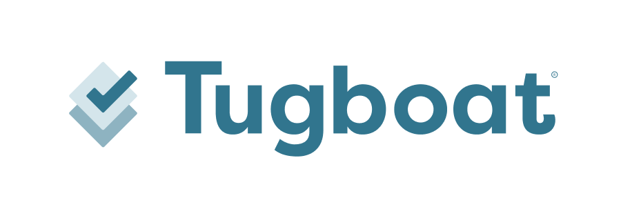

# Welcome to Tugboat!

Tugboat is a system that builds a working preview of a website for any branch, tag, commit, or pull request in a git
repository. It can automatically create these previews for pull requests by integrating with GitHub, GitLab, or
Bitbucket git repositories.

This document aims to provide the information required to use Tugboat. It includes tutorials, examples, and references
for all experience levels.

## Contributing

This document is open-source, and is available on [GitHub](https://github.com/TugboatQA/docs). If you have any
suggestions or other feedback about this document, we are happy to hear it!
[Open a GitHub issue](https://github.com/TugboatQA/docs/issues/new) or email us at
[support@tugboatqa.com](mailto:support@tugboatqa.com).

## Theme

The [Hugo Relearn Theme](https://github.com/matcornic/hugo-theme-learn) is included in this repo as a git submodule. To populate the _themes/hugo-theme-relearn_ directory, run the following:

```sh
git submodule update --init --recursive
```

## Redirects

Redirects for historic URLs are maintained in `static/.htaccess`. These can be tested using
[Smolder](https://github.com/sky-shiny/smolder) config file in `test/smolder.yaml`. The tests need to be run against a
live instance, like a Tugboat preview.

```sh
cat test/smolder.yaml | docker run -i mcameron/smolder pr125-mcktkhcj8krhxo5oaa7emgv5gcnf5e5l.tugboatqa.com
```

## License Information

This document is licensed as
[Creative Commons Attribution-NonCommercial-ShareAlike CC BY-NC-SA](http://creativecommons.org/licenses/by-nc-sa/4.0/legalcode).

Everything not covered above is licensed under the [MIT license](https://choosealicense.com/licenses/mit/).
