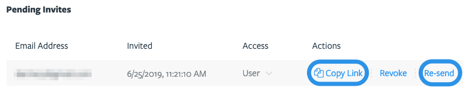

# Administering your Tugboat crew

Every ship captain needs a crew - even a tugboat! Want to add, remove or make
changes to your Tugboat team?

- [Add a user to a project](#add-a-user-to-a-project)
- [Remove a user from a project](#remove-a-user-from-a-project)
- [Change user permissions](#change-user-permissions)
- [Add a Tugboat bot to your team](#add-a-tugboat-bot-to-your-team)
- [User permission levels explained](#user-permission-levels-explained)

> #### Info::Permissions and organizing projects
>
> User permissions in Tugboat are handled on a per-project basis. When users
> have access to a project, they have access to all the repositories within that
> project. When inviting users to your project, consider whether any of your
> repos contain sensitive data; you may want to split those repos out into a
> different project, where only a subset of users get access.

## Add a user to a project

1. Go to username -> [My Projects](https://dashboard.tugboat.qa/projects) at the
   upper-right of the Tugboat screen.
2. Select the project where you want to add the user.
3. Click the **Project Settings** link to the right of the project's title.
4. In the **Invite a User to This Project** section, add the recipient's email
   address, and select the appropriate
   [user type](#user-permission-levels-explained) from the drop-down.
5. Press the big blue **Invite** button!

The user you've invited will get an email from `support@tugboat.qa` with a link
to accept the invitation. If the user doesn't see the invite:

- Have them check Inboxes and Spam for this email address, or;
- **Copy Link** and share it another way from the Pending Invites section of the
  Project Settings, or;
- Hit the **Re-send** link from the Pending Invites section of the Project
  Settings.

## Remove a user from a project

1. Go to username -> [My Projects](https://dashboard.tugboat.qa/projects) at the
   upper-right of the Tugboat screen.
2. Select the project where you want to remove the user.
3. Click the **Project Settings** link to the right of the project's title.
4. In the **Manage Users** section, look for the user you want to remove, and
   click the Remove link.

## Change user permissions

1. Go to username -> [My Projects](https://dashboard.tugboat.qa/projects) at the
   upper-right of the Tugboat screen.
2. Select the project where you want to remove the user.
3. Click the **Project Settings** link to the right of the project's title.
4. In the **Manage Users** section, look for the user whose permissions you want
   to change, and select the appropriate
   [user type](#user-permission-levels-explained) from the **Access** drop-down.

## Add a Tugboat bot to your team

When Tugboat posts comments to a pull request, those comments show as being made
by the user who linked Tugboat to the git repository. In practice, this means
that the person who sets up the Tugboat account will get the git provider's
notifications on pull requests; not because they're intentionally watching or
commenting on the pull requests, but because of the automated comments that
Tugboat posts as that person.

If you'd instead like those comments to show as coming from Tugboat - and free
the user who links the account from a barrage of notifications - you can add a
Tugboat bot to your team:

1. Create an account for your Tugboat bot at your preferred git provider; i.e.
   GitHub, GitLab, BitBucket.
2. Optional:
   [Download the tugboat avatar](https://dashboard.tugboat.qa/static/Tugboat_AvatarLarge.zip)
   to use for your Tugboat bot account.
3. Go to username -> [My Projects](https://dashboard.tugboat.qa/projects) at the
   upper-right of the Tugboat screen.
4. Select the project where you want to switch to the Tugboat bot.
5. Click the **Repository Settings** link next to the repo where you want to
   switch to the Tugboat bot.
6. Scroll down to the **Provider Comments** section (GitHub Comments, GitLab
   Comments or BitBucket Comments).
7. Press the big blue **Change** button.
8. Enter the authentication details for the Tugboat bot user you created at the
   git provider.
9. Press the **OK** button.

Now, whenever Tugboat adds comments to a pull request, the comments will display
from the Tugboat bot, and the Tugboat bot's account will get any subsequent
notifications from the provider.

### User permission levels explained

Tugboat has three different types of users:

- [Admin](#admin-permissions)
- [User](#user-permissions)
- [Read-only](#read-only-permissions)

#### Admin permissions

Admin users can:

- Manage billing information. This information is disabled if company is paying
  with a purchase order.
- Manage other users, including removing other admins, though they cannot remove
  themselves.
- Add repositories to the project.
- Change repository settings.
- Delete repositories.
- Delete the entire project.
- Rename the project.

#### User permissions

Tugboat's generic User's permissions include:

- Manage the repository configuration interface. This includes things like
  [changing repository settings](../setting-up-tugboat/index.md#repository-settings-optional),
  environment variables and SSH keys.
- Manage Previews. Create, remove, rebuild or lock Previews.
- Manage Base Previews.
- Shell access to previews. Manage visual diff screenshots. View build logs.

#### Read-only permissions

Tugboat users with Read-only permissions can:

- View a list of all Previews, see build logs and visual diff screenshots.
- Read-only users may create additional visual diff screenshots.

These users have no access to anything else.
