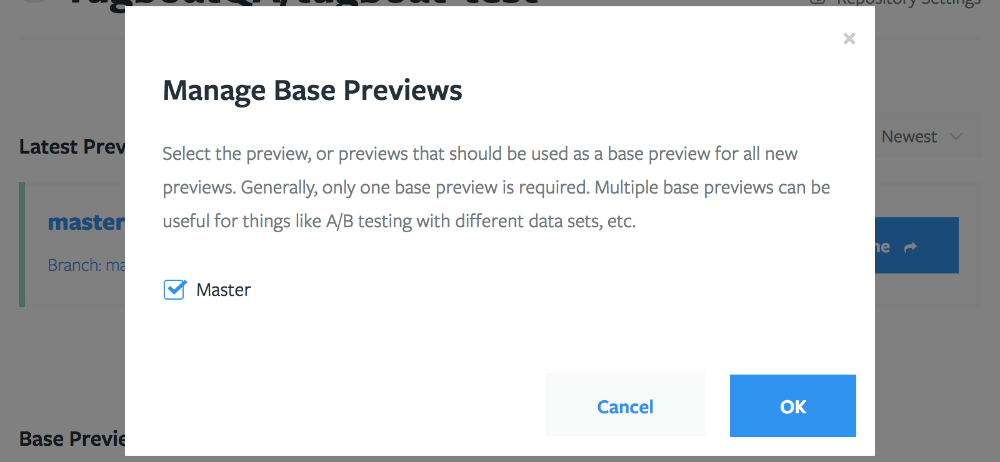

# Base Previews

Briefly, base previews provide Tugboat with a starting point, from where it can
build new previews. This typically has the side effect of drastically reducing
the preview build time as well as the amount of space a preview occupies on
disk.

## How Base Previews Work

When a normal preview is built, the [build script](/build-script/index.md) will
often be used to pull in a database, image files, or other assets. This process
can take a while. When the preview has finished building, Tugboat takes a
point-in-time snapshot of its disk image, so that it has a point of reference
of where it can do things like let you quickly reset a preview back to its
original build state. It can also leverage this snapshot to create a base
preview.

When a preview is flagged as a Base Preview, it is automatically used as a
starting point for newly created previews. This means that none of these new
previews need to re-download a copy of your database, image files, or other
assets. This generally drastically reduces the amount of time required to
generate a working preview.

Another side effect of using a Base Preview is that any previews built from it
use considerably less disk space, allowing you to stretch your disk quota
significantly. Tugboat accomplishes this by only storing a binary difference
between the base preview and the new preview. So, the new preview only uses
whatever space it needs that differs from its Base Preview. Often times, this
means that a base preview might use 2-3GB of space, and a preview built from it
might only use 100-200MB.

## How to use a Base Preview

To create a Base Preview, choose a preview that you want to use. This is
typically a preview built from the master branch, or whichever branch in your
repo corresponds with what you release to production. If your subscription
allows the use of Base Previews, you will see a `Manage Base Previews` link on
your [Repository Dashboard](/tugboat-dashboard/repositories/index.md).

From there, select the preview that you want to use as a Base Preview.

Then, that preview will be moved to the "Base Preview" section of the
Repository Dashboard.

That's it! From now on, new previews will build from the image created when the
base preview was built.

## Keeping Base Previews Updated

You will normally want to keep your base preview up to date with your latest
codebase, and probably a fresh copy of your database, image files, or other
assets. By default, Tugboat does this every night at 12am ET. To change this,
check the Repository Settings.

Tugboat performs the update by pulling the latest code from git for the branch
the preview was built from. If it was built from a tag, this has no effect, but
it is done anyway. Then, the `tugboat-update` target of your [build
script](/build-script/index.md) is called to provide an opportunity to script
the update of our database, etc.

## Advanced Use Cases

Tugboat allows multiple Base Previews to be defined. The effect of doing this
is that for every preview built, one will be built from each of the Base
Previews. So, if you have three Base Previews defined, and submit a pull
request for Tugboat to build, you will end up with three previews for that pull
request, each starting from a different base preview.

This feature would allow you to test code against different PHP versions, or
different database contents, etc.
