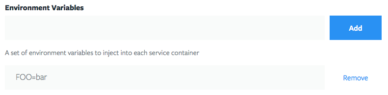

# Build Script

Tugboat provides a handful of hooks that allow customizations to how it acts at
various points during a preview's life cycle. It does this by providing a
number of environment variables, and by making calls to a build script.

The build script is a very powerful tool. It provides a framework to allow
developers to customize a stock Tugboat preview environment in order to make a
site work. For example, pulling a database, or installing an uncommon software
package, etc.

> **Tip** - Save a bunch of disk space by cleaning up after apt at the end of
> the build script.
>
>    `apt-get clean && rm -rf /var/lib/apt/lists/* /tmp/* /var/tmp/*`

## Makefile

[GNU Make](https://www.gnu.org/software/make/) is how Tugboat provides its
hooks. The following targets can be added to a file named `Makefile` in the
root of a tugboat repository. If a `Makefile` already exists, these can be
added to it.

The target names have some legacy ties, and are still what they are for
backwards compatibility. This just means that their use is not exactly
intuitive.

* **tugboat-init** - This is called when a preview is built from scratch, after
  all of the services have been built, and the git repository has been cloned.
  This can be used for things like installing libraries or packages that are
  not present in the stock Tugboat containers, or modifying service
  configurations.

* **tugboat-build** - This is called when a preview is created from a base
  preview. The assumption is that things like a database or other assets are
  already present and just need to be updated. So, not all of the steps from
  _tugboat-init_ are required.

* **tugboat-update** - This is called when a preview is refreshed. This falls
  somewhere between `tugboat-init` and `tugboat-build`, in that there is
  already data present, and services are already configured. They just need to
  be updated

The use of a Makefile, or any of the targets listed above is entirely
**optional**.  Tugboat will gracefully skip over these steps if the Makefile,
or one of the targets does not exist.

Deployments *can* be done by using the Makefile natively, but chances are, you
probably just want to call out to another script that does the heavy lifting.
This is actually a very common pattern, as it lends well to cascading the
different build types.

[Check out some examples](examples/index.md)

## Environment Variables

Tugboat injects the following environment variables into every container, which
you can use for anything from build scripts to application configuration, etc.
These variables are available for the entire lifetime of a Preview's containers.
This includes both build-time as well as run-time. So, they can be used in build
scripts as well as run-time configuration files, etc.

* **`$TUGBOAT_DASHBOARD`** - The domain where the Tugboat Dashboard can be found.

* **`$TUGBOAT_DOMAIN`** - The root domain of the current Tugboat Preview

* **`$TUGBOAT_IMAGE`** - DEPRECATED. Use `$TUGBOAT_SERVICE` instead.

* **`$TUGBOAT_PREVIEW_ID`** - The ID of the current preview.

* **`$TUGBOAT_PREVIEW`** - The friendly name of the current preview.

* **`$TUGBOAT_PROJECT_ID`** - The ID of the project that the current preview
  belongs to.

* **`$TUGBOAT_PROJECT`** - The friendly name of the project that the current
  preview belongs to.

* **`$TUGBOAT_PROXY_URL`** - One of `subdomain` or `subpath`. This specifies what
  the URL looks like for the current preview.

* **`$TUGBOAT_REPO_ID`** - The ID of the repo that the current preview belongs to.

* **`$TUGBOAT_REPO`** - The friendly name of the repo that the current preview
  belongs to.

* **`$TUGBOAT_ROOT`** - The filesystem location where the git repository is
  cloned.

* **`$TUGBOAT_SERVICE_ID`** - The ID of the current service.

* **`$TUGBOAT_SERVICE`** - The friendly name of the current service. This is also
  the host name used to reference this service container from other services.

* **`$TUGBOAT_SMTP`** - The host name of a Tugboat SMTP server that can be used
  to capture outbound email from the preview.

* **`$TUGBOAT_TAG`** - DEPRECATED. Use `$TUGBOAT_PREVIEW` instead.

* **`$TUGBOAT_TOKEN`** - The authentication token for the current Tugboat
  Preview.  This is used by the Tugboat HTTP proxy to grant access to a preview,
  and is passed through mostly as an informational value. Additional
  verification could be done in the application if necessary.

* **`$TUGBOAT_URL`** - The URL for the Tugboat Preview.

## Base Preview Environment Variables

If a preview was built from a base preview, the following variables are also
available with information about the base preview.

* **`TUGBOAT_BASE_PREVIEW`** - The friendly name of the base preview.

* **`TUGBOAT_BASE_PREVIEW_ID`** - The ID of the base preview.

* **`TUGBOAT_BASE_PREVIEW_TOKEN`** - The authentication token for the base
  preview.

* **`TUGBOAT_BASE_PREVIEW_URL`** - The public URL for the base preview.

## Provider-specific Environment Variables

### Bitbucket

These variables are injected into Tugboat Previews that are built from a
Bitbucket repository.

* **`$TUGBOAT_BITBUCKET_OWNER`** - The owner of the Bitbucket repository.

* **`$TUGBOAT_BITBUCKET_SLUG`** - The URL-friendly name of the Bitbucket
  repository. See https://confluence.atlassian.com/bitbucket/what-is-a-slug-224395839.html

These variables are only injected into Tugboat Previews that are built from a
Bitbucket pull request.

* **`$TUGBOAT_BITBUCKET_TITLE`** - The title of the Bitbucket pull request.

* **`$TUGBOAT_BITBUCKET_SOURCE`** - The name of the pull request source branch.

* **`$TUGBOAT_BITBUCKET_DESTINATION`** - The name of the pull request
  destination branch.

### Git

These variables are injected into Tugboat Previews that are built from a raw
git repository.

* **`$TUGBOAT_GIT_REPO`** - The address of the git repository.

### Github

These variables are injected into Tugboat Previews that are built from a Github
repository.

* **`$TUGBOAT_GITHUB_OWNER`** - The owner of the Github repository.

* **`$TUGBOAT_GITHUB_REPO`** - The name of the Github repository.

These variables are only injected into Tugboat Previews that are built from a
Github pull request.

* **`$TUGBOAT_GITHUB_TITLE`** - The title of the Github pull request.

* **`$TUGBOAT_GITHUB_HEAD`** - The name of the pull request head branch.

* **`$TUGBOAT_GITHUB_BASE'** - The name of the pull request base branch.

### Gitlab

These variables are injected into Tugboat Previews that are built from a Gitlab
repository.

* **`$TUGBOAT_GITLAB_NAMESPACE`** - The namespace of the Gitlab repository.

* **`$TUGBOAT_GITLAB_PROJECT`** - The project name of the Gitlab repository.

These variables are only injected into Tugboat Previews that are built from a
Gitlab merge request.

* **`$TUGBOAT_GITLAB_TITLE`** - The title of the Gitlab merge request.

* **`$TUGBOAT_GITLAB_SOURCE`** - The name of the merge request source branch.

* **`$TUGBOAT_GITLAB_TARGET`** - The name of the merge request target branch.

### Stash / Bitbucket Server

These variables are injected into a Tugboat Previews that are built from a
Stash or Bitbucket Server repository.

* **`$TUGBOAT_STASH_PROJECT`** - The project where the repository lives.

* **`$TUGBOAT_STASH_SLUG`** - The URL-friendly name of the repository. See
  https://confluence.atlassian.com/bitbucket/what-is-a-slug-224395839.html

These variables are only injected into Tugboat Previews that are built from a
Stash or Bitbucket Server pull request.

* **`$TUGBOAT_STASH_TITLE`** - The title of the pull request.

* **`$TUGBOAT_STASH_SOURCE`** - The name of the pull request source branch.

* **`$TUGBOAT_STASH_DESTINATION`** - The name of the pull request destination
  branch.

## Custom Environment Variables

In addition to the above environment variables, custom variables can also be
injected into Tugboat Previews through the Tugboat Repository configuration.

## Notes

Tugboat previews are not built with an interactive bash session. This means
that .bashrc or any included files, such as .bash_aliases, are not loaded.
This also means that global environment variables cannot be set inside any
scripts that are run during the build. The only environment variables that are
globally accessible are those set explicitly by Tugboat.
