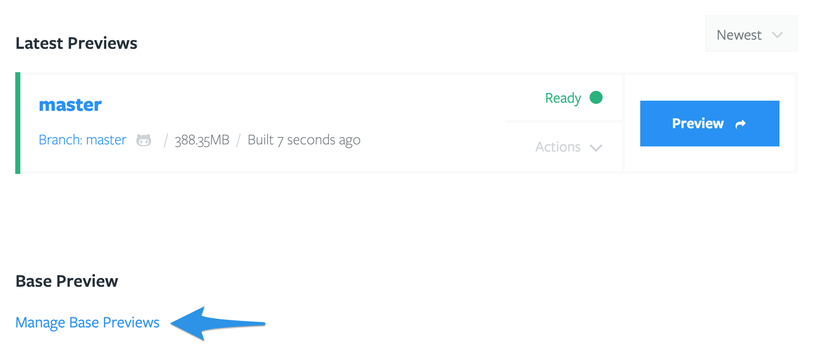
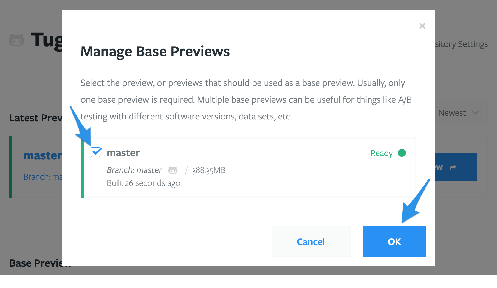
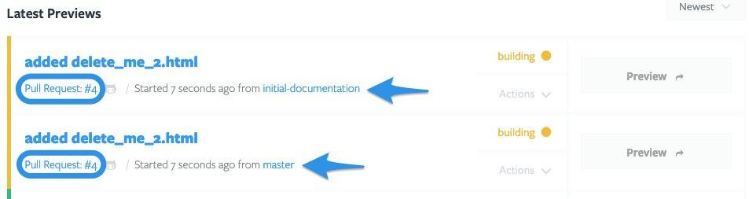
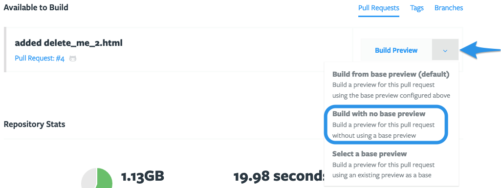

# Building a Preview

- [Build a Preview](#build-a-preview)
- [Share your Preview](#share-your-preview)
- [Preview Actions](#preview-actions)
- [Preview status](#preview-status)
- [Set a Base Preview](#set-a-base-preview)
- [Administer Base Previews](#administer-base-previews)
- [Auto-generate Previews](#auto-generate-previews)
- [Auto-delete Previews](#auto-delete-previews)
- [Optimize your Preview builds](#optimize-your-preview-builds)
- [Preview size explained](#preview-size-explained)

## Build a Preview

Once you've
[set up your Tugboat project](../setting-up-tugboat/index.md#create-a-project),
[linked a repo](../setting-up-tugboat/index.md#add-repos-to-the-project), and
[put your Config file in the linked repo](../setting-up-tugboat/index.md#create-a-tugboat-config-file),
it's time to build a Preview!

- [How to build a Preview](#how-to-build-a-preview)
- [The build process: explained](#the-build-process-explained)

### How to build a Preview

To build a Preview:

1. Click your username in the upper right-hand corner, and go to Projects;
2. Click the **My Projects** link;
3. Select the project where you want to build a Preview;
4. Click the name of the repo that contains the code you want to use to build
   the Preview;
5. Scroll down to the **Available to Build** section; by default, you'll see
   _Branches_, but you can switch to view Tags or Pull Requests that are
   available to Preview;
6. Press the **Build Preview** button to begin the build.

While the Preview is building, you'll see the Preview appear in the **Latest
Previews** section, with a yellow status indicator _building_.

When the Preview is ready, the Preview button will turn blue, and you'll see a
green status indicator _ready_. Simply press the Preview button to view the
Preview. While you're at it, go ahead and
[share your Preview](#share-your-preview) - we know you're proud of your work!

> #### Note:: Preview size
>
> When you look at your new Preview, you'll see the size of the Preview next to
> the branch/tag/PR that the Preview was built from. In the example above, the
> Preview size is 385.49MB.
>
> Because
> [billing for Tugboat projects is](../tugboat-billing/index.md#how-does-tugboat-pricing-work),
> in part, based on the total size of all the Previews contained within a
> project, Preview size becomes an important factor when building out multiple
> Previews.
>
> Check out our section on
> [Optimizing Preview builds](#optimize-your-preview-builds) for tips on
> [reducing Preview size](#optimizing-preview-size).

### The build process: explained

When you kick off a Preview build, the
[Service Commands](../setting-up-services/index.md#service-commands) in your
[config file](../setting-up-tugboat/index.md#create-a-tugboat-config-file) are
executed in three phases:

1. `init`
2. `update`
3. `build`

During the `init` phase, you might use commands that set up the basic preview
infrastructure. This might include things like installing required packages or
tools, or overriding default configuration files.

During the `update` phase, you might use commands that import data or other
assets into a service. This might include things like importing a database, or
syncing image files into a service.

During the `build` phase, you might use commands that build or generate the
actual site. This might include things like compiling Sass files, updating 3rd
party libraries, or running database updates that the current code in the
preview depends on.

When using various [Preview Actions](#preview-actions), the build process may
bypass phases:

- [Preview Actions that start at `init`](#preview-actions-that-start-at-init)
- [Preview Actions that start at `update`](#preview-actions-that-start-at-update)
- [Preview Actions that start at `build`](#preview-actions-that-start-at-build)

#### Preview Actions that start at init

Three types of Preview builds start from the very beginning of the process, at
the `init` phase:

- [Building a new Preview](#how-to-build-a-preview) from scratch (without a Base
  Preview)
- [Rebuilding](#rebuild) a Preview without a Base Preview
- [Rebuilding](#rebuild) a Base Preview

> #### Note::Rebuilding a Preview from a Base Preview
>
> If you're
> [Rebuilding a Preview that was built from a Base Preview](#preview-actions-that-start-at-build),
> the build starts at the `build` phase - not the `init` phase.

#### Preview Actions that start at update

Two types of Preview builds start from the `update` phase, bypassing `init`:

- [Refreshing](#refresh) a Preview that has no Base Preview
- [Refreshing](#refresh) a Base Preview

#### Preview Actions that start at build

Two types of Preview builds start from the `build` phase, bypassing `init` and
`update`:

- Building a new Preview from a Base Preview
- Rebuilding a Preview that was built from a Base Preview

## Share your Preview

After you've built your Preview, there are a few ways you can share it:

- [Manually share the URL of your Preview](#manually-share-the-url-of-your-preview)
- [Configure Tugboat to automatically post Preview links in pull requests](#configure-tugboat-to-auto-post-preview-links)

### Manually share the URL of your Preview

Want to share a Preview link manually with Lisa in Product, or Al the client? It
couldn't be easier. Just go to the Preview you want to share, and open the
Preview and copy the URL from the browser's address bar, or use the browser
options to Copy Link on the **Preview** button.

Send that link to the person who needs to look at the Preview, and they'll be
able to view it. Tugboat links are hard-to-guess secure URLs that are accessible
to anyone with the link; that person doesn't need to be a member of your
[Tugboat crew](../administering-tugboat-crew/index.md), or able to view the git
repo where the code is hosted.

### Configure Tugboat to auto-post Preview links

When you're using the Tugboat integration with
[GitHub](../setting-up-tugboat/index.md#github),
[GitLab](../setting-up-tugboat/index.md#gitlab) or
[BitBucket](../setting-up-tugboat/index.md#bitbucket), you can configure your
Tugboat to automatically post links to Previews as comments on pull requests.
Configure this option in
[Repository Settings](../setting-up-tugboat/index.md#modify-settings-for-your-github-gitlab-or-bitbucket-integration).

## Preview Actions

After you've built a Preview, you'll see an **Actions** drop-down menu just to
the left of the Preview button. From here, you can:

- [Clone](#clone)
- [Cancel](#cancel)
- [Delete](#delete)
- [Lock](#lock)
- [Rebuild](#rebuild)
- [Refresh](#refresh)
- [Reset](#reset)
- [Start](#start)
- [Stop](#stop)
- [Unlock](#unlock)

#### Clone

Quickly duplicate a Preview from the snapshot created when the original finished
building. This is a great option if you want to generate multiple Previews from
the same code so multiple folks can QA or tinker simultaneously. You could also
use this feature to create a demo sandbox, or do limited a/b testing.

#### Cancel

Cancels the currently running operation.

#### Delete

Delete a Preview.

#### Lock

Lock a Preview. A locked Preview stays in its current state, and will not be
updated by Tugboat - which means it won't auto-update the Preview from updated
pull requests or [Preview Actions](#preview-actions). This overrides any
repo-specific settings for things like _Rebuild Updated Pull Requests
Automatically_, _Rebuild Orphaned Previews Automatically_, _Rebuild Stale
Previews Automatically_, _Refresh Base Previews Automatically_.

Lock Previews for longer reviews or to avoid interruptions during a demo.

#### Rebuild

Rebuild an existing Tugboat Preview from scratch. This kicks off a new Preview  
build from the beginning of [the build process](#the-build-process-explained),
starting with `init`.

> #### Note::Rebuilding a Preview from a Base Preview
>
> If you're
> [Rebuilding a Preview that was built from a Base Preview](#preview-actions-that-start-at-build),
> the build starts at the `build` phase - not the `init` phase.

#### Refresh

1. Pull the latest code from git;
2. Run commands from the `update` section of the
   [configuration](../setting-up-tugboat/index.md#create-a-tugboat-config-file/);
3. Run commands from the `build` section of the
   [configuration](../setting-up-tugboat/index.md#create-a-tugboat-config-file).

#### Reset

Reset a Preview to the state it was in when it finished building. This allows
you to quickly undo any changes you made for testing, etc.

#### Start

Start a stopped or suspended Tugboat Preview.

#### Stop

Stop a running Tugboat preview. Stopping a preview stops all of its
[services](../setting-up-services/index.md), taking it offline.

#### Unlock

Unlock a [locked](#lock) Tugboat Preview.

## Preview status

Preview status is indicated in a couple of different ways:

- [Color](#color)
- [Status message](#status-message)

### Color

- **Green:** Preview has built successfully and is ready to view.
- **Yellow:** A [Preview action](#preview-actions) is in progress.
- **Red:** Preview build has failed, or has been stopped.

### Status message

- **Ready (and active):** When your Preview finishes building successfully,
  you'll see a green `ready` status, with a green dot to indicate that the
  Preview is active and ready to view. When you click the link, you'll go
  directly to your site Preview.
- **Ready (and inactive):** After your Preview has built and some time has
  passed, you'll see a green `ready` status, with a green half-moon to indicate
  that the Preview is available, but is currently suspended. When you go to the
  Preview link, you'll see a splash page while the Preview starts running again,
  and then you'll be taken to your Preview. If you don't want to wait through
  the splash page, you can go to the **Actions** drop-down next to the Preview
  button, and select **Start**; this will restart the Preview. When the
  half-moon switches to a green dot, you'll be able to go directly to the
  Preview, bypassing the splash screen.
- **Building:** While your Preview build is in-progress, you'll see a `building`
  status in yellow. If your Preview build is taking significantly longer than
  your average build time, displayed in the Repository Stats section lower on
  the Project -> Repo page, you may want to start
  [troubleshooting](../troubleshooting/index.md).
- **Rebuilding:** When a rebuild has been kicked off, you'll see a `rebuilding`
  status in yellow. This indicates a complete Preview rebuild from the beginning
  of the build process, so it should take as long as a typical build.
- **Refreshing:** When a refresh has been kicked off, you'll see a `refreshing`
  status in yellow. This indicates a Preview that is pulling in the latest code
  from git, and then running any commands in the `update` section, followed by
  the `build` section of the
  [Configuration file](../setting-up-services/index.md#create-a-tugboat-config-file).
- **Resuming:** When you've used the Action -> Start option, you'll see a
  `resuming` status in yellow while the Preview starts spinning up
  [services](../setting-up-services/index.md) again.
- **Stopping:** When you've used the Action -> Stop option, you'll see a
  `stopping` status in yellow while the Preview goes through the process of
  stopping [services](../setting-up-services/index.md).
- **Stopped:** When you've used the Action -> Stop option, you'll see a
  `stopped` status in red to indicate that the Preview has successfully stopped
  [services](../setting-up-services/index.md).
- **Suspended** - When Previews have been inactive for a period of time, you'll
  see a `suspended` status. Any incoming HTTP request to the preview will
  automatically start it again.
- **Failed:** When something goes wrong during the the last action that was
  taken on the Preview, you'll see a `failed` status in red. Details should be
  available in the Preview's activity logs. Sometimes a failed Preview can be
  recovered by resetting it. For more help with a `failed` preview, take a look
  at our [troubleshooting](../setting-up-services/index.md) docs, or go to our
  [Help and Support](../help-and-support/index.md) page to join our Slack
  support channel or email us.
- **Unavailable** - When something goes wrong trying to load the Preview, you
  may see an `unavailable` status. This usually indicates an internal Tugboat
  error. [Resetting](#reset) a Preview often fixes this.
- **Canceled** - When you cancel a Preview while it's building, you'll see a
  `canceled` status in red.

### Service states

A Service could be in any of the above states, as well as:

- **Committing** - Tugboat is currently taking a snapshot of the current state
  of the Service.
- **Waiting** - Tugboat is performing some operation on the Service's repo, and
  the Service is waiting for its turn.

## Set a Base Preview

If you want to speed up your Preview builds, and make subsequent Preview builds
smaller files, you can set a Base Preview as a starting point for subsequent
Previews.

- [How Base Previews work](#how-base-previews-work)
- [How to set a Base Preview](#how-to-set-a-base-preview)
- [Using multiple Base Previews](#using-multiple-base-previews)
- [Building a Preview from scratch after you've set a Base Preview](#building-a-preview-from-scratch-after-youve-set-a-base-preview)

### How Base Previews work

When you build a regular Preview, the
[configuration file](../setting-up-services/index.md#create-a-tugboat-config-file)
typically instructs Tugboat to pull in databases, image files, or other assets.
This process can take a while; the larger the assets, the longer the build.

After your Preview has finished building, Tugboat automatically takes a
point-in-time snapshot of its disk image, so it has a point of reference of
where it can do things like let you quickly [reset](#reset) a Preview back to
its original build state. You can leverage this snapshot to create a Base
Preview.

When you mark a Preview as a Base Preview, Tugboat can use this as a starting
point for all subsequent newly-created Previews. None of the new Previews need
to re-download copies of databases, image files, or other assets. Base Previews
can dramatically reduce the amount of time required to generate a working
Preview.

In addition to speeding up your Preview builds, Tugboat saves disk space by
storing only a binary difference between the Base Preview and Previews built
from that Base Preview. A new Preview only uses whatever space it needs that
differs from the Base Preview. Often, this means a Base Preview might use 2-3GB
of space, and a Preview built from it might only use 100-200MB.

### How to set a Base Preview

To create a Base Preview, you'll first need to have a
[Preview build](#build-a-preview) to serve as your starting point.

1. Go to the **Manage Base Previews** link on the Repository Dashboard;
2. Click the checkbox next to the Preview you want to use as a Base Preview;
3. Press the **OK** button.

That preview will be moved to the **Base Preview** section of the Repository
Dashboard. From now on, Previews will build from the snapshot created when the
Base Preview was built.

1. Go to the **Manage Base Previews** link on the Repository Dashboard.

2. Click the checkbox next to the Preview you want to use as a Base Preview.
3. Press the **OK** button.

That preview will be moved to the **Base Preview** section of the Repository
Dashboard.

That's it! From now on, Previews will build from the snapshot created when the
Base Preview was built.

If you're ever wondering which Base Preview was used when generating a Preview,
just look under the name of the Preview, at the "from _Base Preview Name_":

### Keeping Base Previews updated

You'll generally want to keep your Base Preview up to date with your latest
codebase, and a fresh copy of your database, image files, and other assets. By
default, Tugboat automatically checks for updates every night at 12 am ET, and
[refreshes](#refresh) your Base Preview with these updates. To change this,
check the Repository Settings.

Tugboat performs this update by pulling the latest code from git for the branch
or Tag the preview was built from. During the update, Tugboat runs any commands
in the `update` and `build` sections for services in the
[configuration](../setting-up-services/index.md#create-a-tugboat-config-file)
file.

### Using multiple Base Previews

Tugboat allows multiple Base Previews to be defined. The effect of doing this is
that every preview will generate the corresponding number of Base Preview
derivatives. So, if you have three Base Previews defined, and submit a pull
request for Tugboat to build a preview, you will end up with three previews for
that pull request, each starting from a different Base Preview.

This feature allows you to test code, for instance, against different PHP
versions, database content, etc.

### Building a Preview from scratch after you've set a Base Preview

Once you've set a Base Preview, new Previews build on that Base Preview by
default. If you want a Preview to build from scratch, instead of a Base Preview:

1. Go to the **Available to Build** section of the Repository Dashboard;
2. Click into the drop-down next to the **Build Preview** button for the Preview
   you'd like to build from scratch;
3. Select the **Build with no base preview** option.

Now your Preview will build from scratch!

## Administer Base Previews

- [Add a new Base Preview](#add-a-new-base-preview)
- [Add multiple Base Previews](#add-multiple-base-previews)
- [Stop using a Base Preview](#stop-using-a-base-preview)
- [Keeping Base Previews up-to-date](#keeping-base-previews-up-to-date)
- [Using Preview Actions on a Base Preview](#using-preview-actions-on-a-base-preview)

### Add a new Base Preview

Adding a new Base Preview can mean a few different things:

- [Set a Base Preview for the first time](#set-a-base-preview-for-the-first-time)
- [Add additional/multiple Base Previews](#add-additionalmultiple-base-previews)
- [Stop using the current Base Preview and set a new Base Preview](#stop-using-the-current-base-preview-and-set-a-new-base-preview)

#### Set a Base Preview for the first time

Ready to get started with your first Base Preview? Check out:
[How to set a Base Preview](#how-to-set-a-base-preview).

#### Add additional/multiple Base Previews

Want to use more than one Base Preview? Take a look at:
[Add multiple Base Previews](#add-multiple-base-previews).

#### Stop using the current Base Preview and set a new Base Preview

Want to change the Base Preview you're using? First, you'll need to have a
[Preview build](#build-a-preview) ready to set as your new Base Preview. Then:

1. Go to the **Manage Base Previews** link on the Repository Dashboard;
2. Click the checkbox next to the Base Preview you want to stop using to
   deselect it;
3. Click the checkbox next to the Preview you want to set as your new Base
   Preview;
4. Press the **OK** button.

The Preview you've deselected will move out of the Base Previews section of the
dashboard, and the new Base Preview will appear here, instead.

### Add multiple Base Previews

Want to use more than one Base Preview? No problem! Simply follow the
instructions in [How to set a Base Preview](#how-to-set-a-base-preview), and
check the checkboxes next to all of the Previews that you want to use as Base
Previews.

Keep in mind that when you've selected multiple Base Previews, every new Preview
build (including automated builds from pull requests) will create a build from
_each_ Base Preview. In my sample project, I've set two base Previews, and
building a Preview from a new PR automatically created two Previews.

### Stop using a Base Preview

If you want to stop using a Base Preview, simply:

1. Go to the **Manage Base Previews** link on the Repository Dashboard;
2. Click the checkbox next to the Base Preview you want to stop using;
3. Press the **OK** button.

The deselected Preview will disappear from the Base Preview section of the
dashboard, and subsequent Preview builds - including automated builds from git
provider integrations - will no longer start from that Base Preview.

### Keeping Base Previews up-to-date

If you want to keep your Base Previews up-to-date, there are two ways you can do
it:

- [Automatically update Base Previews](#automatically-update-base-previews)
- [Manually update Base Previews](#manually-update-base-previews)

#### Automatically update Base Previews

You'll generally want to keep your Base Preview up to date with your latest
codebase, and a fresh copy of your database, image files, and other assets. By
default, Tugboat automatically checks for updates every night at 12 am ET, and
[refreshes](#refresh) your Base Preview with these updates. You can go to the
Repository Settings to change this.

During this update, Tugboat:

1. Pulls the latest code from git for the branch or Tag the preview was built
   from;
2. Runs commands in the `update` section of the
   [configuration](../setting-up-services/index.md#create-a-tugboat-config-file)
   file;
3. Runs commands in the `build` section of the
   [config](../setting-up-services/index.md#create-a-tugboat-config-file) file.

#### Manually update Base Previews

You can also update a Base Preview manually.

From the Repository Dashboard, click into the **Actions** drop-down next to the
Preview button for the Base Preview you want to update. From there, you can
simply [Refresh](#refresh) the Base Preview to update it, or [Rebuild](#rebuild)
if you want to build it fresh from scratch.

### Using Preview Actions on a Base Preview

You can use all the normal [Preview Actions](#preview-actions) on a Base Preview
just like you would on a regular Preview build - but there are a couple of
things to keep in mind:

- If you're using the options to
  [Rebuild Orphaned Previews Automatically](..setting-up-tugboat/index.md#rebuild-orphaned-previews-automatically)
  and/or
  [Rebuild Stale Previews Automatically](..setting-up-tugboat/index.md#rebuild-stale-previews-automatically),
  [Rebuilding](#rebuild) or [Refreshing](#refresh) a Base Preview will also kick
  off processes to Rebuild or Refresh Previews that were generated from the Base
  Preview.
- If you've stopped using a Base Preview, but it was previously used to generate
  subsequent Previews, the above settings still apply; you'll get a dialogue box
  detailing the potential pitfalls of doing this, and asking you to confirm
  whether you want to rebuild the Preview - and separately, whether you want to
  rebuild subsequent Previews.

## Auto-generate Previews

We love automatically generating Previews from new pull requests - we think it's
one of Tugboat's best features!

- [What are the options for auto-generating Previews?](#options-for-auto-generating-previews)
- [How to configure Tugboat to auto-generate Previews](#how-to-configure-tugboat-to-auto-generate-previews)

### Options for auto-generating Previews

If you're using a
[git provider integration](../setting-up-tugboat/index.md#connect-with-your-provider),
you'll be able to auto-generate Previews in a few different ways:

- **Build Pull Requests Automatically**  
  Tugboat automatically creates a Preview when a pull request is opened.
- **Rebuild Updated Pull Requests Automatically**  
  Tugboat automatically rebuilds a Preview when the corresponding pull request
  is updated.
- **Build Previews for Forked Pull Requests**  
  Tugboat builds Previews for pull requests made to the primary repo from forked
  repositories. \***\*There are security implications from using this
  setting:\*\*** any secrets in your Preview will be accessible by the owner of
  the forked repository.

Besides auto-generating Previews from pull requests, you can also auto-generate
Previews when you make changes to a [Base Preview](#set-a-base-preview). If
you've [set a Base Preview](#how-to-set-a-base-preview), you can have Tugboat:

- Rebuild Orphaned Previews Automatically Automatically rebuild Previews when
  the Base Preview they were built from is [rebuilt](#rebuild).
- Rebuild Stale Previews Automatically Automatically rebuild Previews when the
  Base Preview they were built from is [refreshed](#refresh).

### How to configure Tugboat to auto-generate Previews

To configure Tugboat to auto-generate Previews, you'll need to:

1. Go to username -> My Projects at the upper-right of the Tugboat screen;
2. Select the project where you want to configure auto-generate settings for
   Previews;
3. Click into Settings for the repository;
4. Click the checkboxes for the auto-generate features you'd like to turn
   on/off.

> ####Hint::Missing auto-generate from PR options?
>
> Don't see the options to auto-generate Previews from pull requests? You'll
> need to
> [connect your preferred git provider to Tugboat](../setting-up-tugboat/index.md#connect-with-your-provider),
> and then [delete](../setting-up-tugboat/index.md#delete-the-repo) and
> [re-add the provider-specific version of the repository](../setting-up-tugboat/index.md#add-repos-to-the-project)
> to your Tugboat project.

## Auto-delete Previews

Each of the Previews in your Tugboat project count toward the total storage
space available in your project's billing tier. By default, Tugboat is
configured to automatically delete Previews when their corresponding git pull
requests are merged or closed.

If you want to manually change the setting to automatically delete Previews when
their PRs are merged or closed:

1. Go to username -> My Projects at the upper-right of the Tugboat screen;
2. Select the project where you want to configure auto-delete settings for
   Previews;
3. Click into Settings for the repository;
4. Click the checkbox to change the setting.

## Optimize your Preview builds

Do your Previews take a long time to build? Some things, like importing large
assets, are just going to take time - but there are some things you can do to
speed up your Preview builds:

- [Use Service Commands to create a Base Preview that does the heavy lifting](#use-service-commands-to-create-a-base-preview-that-does-the-heavy-lifting)
- [Use the Auto Refresh Base Preview functionality to update large assets](#use-the-auto-refresh-base-preview-functionality-to-update-large-assets)
- [Optimizing Preview size](#optimizing-preview-size)
- [Contact Tugboat support for help optimizing your Config file](#contact-tugboat-support-for-help-optimizing-your-config-file)
- [Upgrade your project tier to a higher-performance tier](#upgrade-your-project-tier-to-a-higher-performance-tier)

### Use Service Commands to create a Base Preview that does the heavy lifting

The big value of using a Base Preview is that you can front-load the work into a
time-consuming Preview you only have to build once, and then use that as a base
to iterate on with smaller, faster-building Previews.

You can do this by using
[Service Commands](../setting-up-services/index.md#service-commands) in the
`init` stage of the Preview build to do the resource-intensive, time-intensive
processes - and then [set that as your Base Preview](#set-a-base-preview) so you
don't have to complete those steps in every single build. This is the perfect
time to install a large database that you won't have to update in subsequent
Previews, or download and configure the host of
[services](../setting-up-services/index.md#services-in-the-context-of-tugboat)
that power your Tugboat.

### Use the Auto Refresh Base Preview functionality to update large assets

If you're updating large assets as part of the `update` stage of your Tugboat
build, you can configure Tugboat to
[automatically refresh your Base Preview](#keeping-base-previews-updated) while
your crew isn't working. By default, Tugboat automatically refreshes Base
Previews daily at 12am UTC (8pm EDT). You can set this for a time and frequency
that works best for your team, and then you won't have to manually update your
Base Preview when you're about to test an important build - it will already have
the latest database, or any large assets you need, whenever you're ready.

### Optimizing Preview size

If you want to make your Previews smaller, there are a couple of tricks you can
use to reduce Preview size:

- [Use a Base Preview](#work-from-base-previews)
- [Use dummy data](#use-dummy-data)

Looking for more info about Preview size? Check out:

- [Preview size explained](#preview-size-explained)

#### Work From Base Previews

In addition to speeding up Preview builds, Base Previews can help you
dramatically reduce the size of Previews built from that Base Preview. This is
because the Base Preview contains everything Tugboat needs to run your Preview,
while subsequent Previews only contain the differences between the Base Preview
and the new Preview build.

In practice, this means that a Base Preview might be 3GB in size, but subsequent
Previews might be only 100MB.

Ready to set up a Base Preview? Check out:
[Set a Base Preview](#set-a-base-preview).

#### Use dummy data

Are you pulling in a large production database? You can save Preview space -
_and_ speed up your Preview builds at the same time - by switching to a small
dummy database that contains enough data for testing, but doesn't mirror your
large production behemoth.

### Contact Tugboat support for help optimizing your Config file

Sometimes, speeding up your Preview builds can be as simple as having a second
set of eyes take a look at your Config file and make recommendations to help you
optimize it. This might include something like running a command in `init`
instead of `update`, or scripting a few simple commands. The team at Tugboat is
happy to help; our [Support](../support/index.md) page can direct you to our
Tugboat support Slack, or an email address where you can reach us.

### Upgrade your project tier to a higher-performance tier

If it's not a simple question of optimizing your Config file - for example, if
you're building a complex or resource-intensive sequence of code in every
Tugboat Preview - you might want to consider upgrading your Tugboat Project to a
higher-performance tier. A higher-performance tier gives you more CPU power and
RAM to build your Previews, which can mildly or dramatically speed up your build
times. When build times matter, keep this option in mind.

You can change your Tugboat plan in **Project Settings**.

## Preview size explained

What Tugboat calls "Preview size" is actually the size of the container in which
the Preview lives. When a Preview is done building, Tugboat takes a snapshot of
the container at that moment in time, and that's what you're seeing in your
Tugboat Dashboard.

When you [set up Services](../setting-up-services/index.md) in your Preview,
Tugboat pulls those
[Service images](../setting-up-services/index.md#specify-a-service-image) into
the Preview container. Each of these Service images contributes to the total
size of the Preview when it is fully built.

For example, say I'm building a Preview that uses Tugboat's Service images for
`apache`, `mysql` and `redis`; those Service images are 154MB, 226MB, and 147MB
at the time of this writing. That's over 500MB for just these Services; by the
time you add a database file, the container's operating system and other assets,
you'll likely be looking at 800MB to 1GB for a Preview that's only pulling in
100MB of code from your linked git repo.

This is why working from a [Base Preview](#how-base-previews-work) is so helpful
in reducing Preview size; all of those assets are contained in the Base Preview.
When you build a new Preview from the Base Preview, the new Preview only
contains what's different in the PR, Branch or Tag you're building. In my
example above, a new Preview built from the Base Preview was only 20KB.
