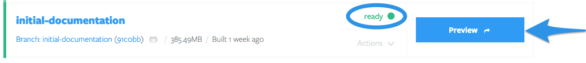

# Building a Preview

- [Build a Preview](#build-a-preview)
- [Share your Preview](#share-your-preview)
- [Administer Previews](#administer-previews)
- [Set a Base Preview](#set-a-base-preview)
- [Administer Base Previews](#administer-base-previews)
- [Auto-generate Previews](#auto-generate-previews)
- [Auto-delete Previews](#auto-delete-previews)
- [Optimize your Preview builds](#optimize-your-preview-builds)

## Build a Preview

Once you've [set up your Tugboat project](../setting-up-tugboat/create-a-project/index.md), [linked a repo](../setting-up-tugboat/add-repos-to-the-project/index.md), and [put your Config file in the linked repo](../setting-up-tugboat/create-a-config-file/index.md), it's time to build a Preview!

To build a Preview:

Click your username in the upper right-hand corner, and go to Projects;
2) Click the **My Projects** link;
3) Select the project where you want to build a Preview;
4) Click the name of the repo that contains the code you want to use to build the Preview;
5) Scroll down to the **Available to Build** section; by default, you'll see _Branches_, but you can switch to view Tags or Pull Requests that are available to Preview;
6) Press the **Build Preview** button to begin the build.

While the Preview is building, you'll see the Preview appear in the **Latest Previews** section, with a yellow status indicator _building_.

When the Preview is ready, the Preview button will turn blue, and you'll see a green status indicator _ready_. Simply press the Preview button to view the Preview. While you're at it, go ahead and [share your Preview](#share-your-preview) - we know you're proud of your work!

## Share your Preview

After you've built your Preview, there are a few ways you can share it:

- Manually share the URL of your Preview
- Configure Tugboat to automatically post Preview links in pull requests

### Manually share the URL of your Preview

Want to share a Preview link manually with Lisa in Product, or Al the client? It couldn't be easier. Just go to the Preview you want to share, and either open it and copy the URL from the browser's address bar, or use the browser options to Copy Link on the Preview button.

If your 

### Configure Tugboat to auto-post Preview links

## Administer Previews

## Set a Base Preview

## Administer Base Previews

## Auto-generate Previews

## Auto-delete Previews

## Optimize your Preview builds
