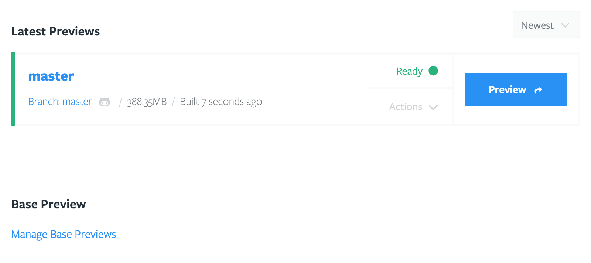
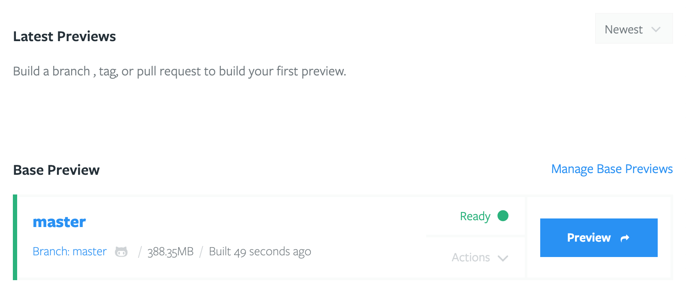

# Base Previews

Briefly, Base Previews provide Tugboat with a starting point, from where it can
build new previews. The advantage of Base Previews is they drastically reduce
preview build times as well as the amount of space a preview occupies on disk.

## How Base Previews Work

When a regular preview is built, the
[configuration](../../configuring-tugboat/index.md) will often instruct Tugboat
to pull in a database, image files, or other assets. This process can take a
while. When the preview has finished building, Tugboat automatically takes a
point-in-time snapshot of its disk image, so that it has a point of reference of
where it can do things like let you quickly reset a preview back to its original
build state. It can also leverage this snapshot to create a Base Preview if
instructed.

When a preview is marked as a Base Preview, it is automatically used as a
starting point for all newly created previews. None of the new previews need to
re-download a copy of the database, image files, or other assets. Base Previews
can dramatically reduce the amount of time required to generate a working
preview.

Another benefit of using a Base Preview is that any previews built from it use
considerably less disk space, allowing you to stretch your disk quota
significantly. Tugboat accomplishes this by only storing a binary difference
between the Base Preview and the new previews. A new preview only uses whatever
space it needs that differs from its Base Preview. Often, this means a Base
Preview might use 2-3GB of space, and a preview built from it might only use
100-200MB.

## How to use a Base Preview

To create a Base Preview, choose a preview that you want to use. The selected
preview is typically built from the `master` branch, or whichever branch in your
repo corresponds with what you release to production. You will find the
`Manage Base Previews` link on the Repository Dashboard.

From there, select the preview you want to use as a Base Preview.

That preview will be moved to the "Base Preview" section of the Repository
Dashboard.

That's it! From now on, new previews will build from the snapshot created when
the Base Preview was built.

## Keeping Base Previews Updated

You will generally want to keep your Base Preview up to date with your latest
codebase, and a fresh copy of your database, image files, and other assets. By
default, Tugboat does this every night at 12 am ET. To change this, check the
Repository Settings.

Tugboat performs the update by pulling the latest code from git for the branch
or Tag the preview was built from. During the update, Tugboat runs any commands
in the `update` section of the
[configuration](../../configuring-tugboat/index.md)

> #### Info::Previews created from Base Previews are not automatically updated.
>
> **If my Base Preview is updated, will previews built from it automatically
> update with those changes?**
>
> No. If a Base Preview is updated, previews built from it are left alone, and
> must be rebuilt manually.

## Advanced Use Cases

Tugboat allows multiple Base Previews to be defined. The effect of doing this is
that every preview will generate the corresponding number of Base Preview
derivatives. So, if you have three Base Previews defined, and submit a pull
request for Tugboat to build a preview, you will end up with three previews for
that pull request, each starting from a different Base Preview.

This feature allows you to test code, for instance, against different PHP
versions, database content, etc.
