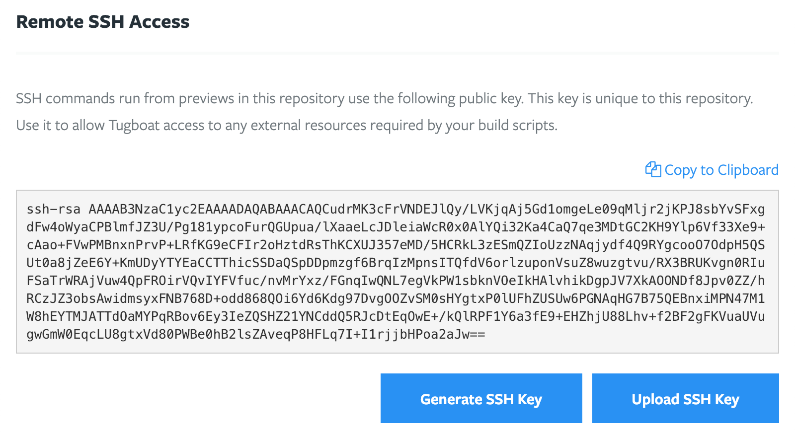

# Tugboat Repositories

## SSH Keys

Every Tugboat Repository has two SSH keys. These keys are unique to each
repository, and are used by Tugboat to access remote resources. One key is the
repository's deploy key, and is used by Tugboat directly. This key is managed by
Tugboat and cannot be modified.

The other key is available for use by your build script. It can be changed or
regenerated at any time through the Tugboat Repository settings.

