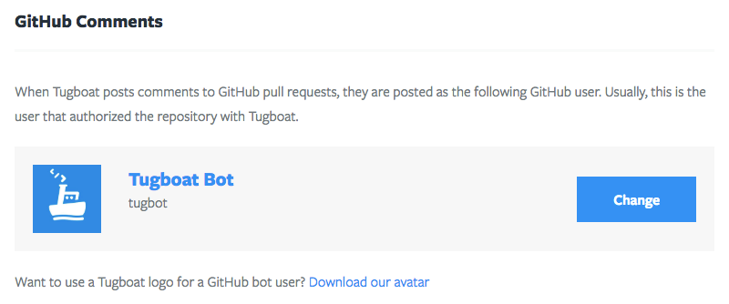

# Tugboat Repositories

A Tugboat Repository is linked to a git repository hosted by a supported git
provider. A Tugboat Repository can contain any number of
[previews](../previews/index.md), given they stay within the quota of the parent
[project](../projects/index.md).

Repository permissions are inherited from the parent
[project](../projects/index.md). If a user has access to a
[project](../projects/index.md), they have access to all of the repositories in
that [project](../projects/index.md).

Configuring a Tugboat Repository has a few parts. One part can be managed
through the web interface, which includes things like scheduling and provider
integration. The other part is managed by a
[configuration file](../../configuring-tugboat/index.md) committed to the git
repository, which includes things like how to build
[previews](../previews/index.md) for the repository.

## SSH Keys

Every Tugboat Repository has two SSH keys. These keys are unique to each
repository, and are used by Tugboat to access remote resources. One key is the
repository's deploy key, and is used by Tugboat directly to perform git
operations in a [service](../services/index.md). This key is managed by Tugboat
and cannot be modified.

The other key is available for use by a
[configuration file command](../../configuring-tugboat/index.md). It can be
changed or regenerated at any time through the Tugboat Repository settings.

## Provider Integrations

A Tugboat Repository is able to integrate with many features provided by GitHub,
GitLab, and Bitbucket. It can automatically build previews from new pull
requests, or delete previews when pull requests are merged or closed. It can
also post comments to a pull request with information about a preview.

In order to provide this functionality, the user authenticating a repository to
Tugboat must have admin access to that repository at the provider. Tugboat never
touches the data in the git repository, but needs to be able to create a webhook
and upload an SSH deploy key on the git repository. Each of the above providers
require admin privileges to do this.

When a comment is posted to a pull request, it is posted as the user that
authenticated the repository to Tugboat. This is an OAuth restriction imposed by
each of these providers. Tugboat provides a method of linking a different user
to a repository to post these comments. This is especially useful when working
with a team of developers on a project. The user that authenticated Tugboat
might not want to get notifications from the provider about every pull request,
yet by default, they would.

