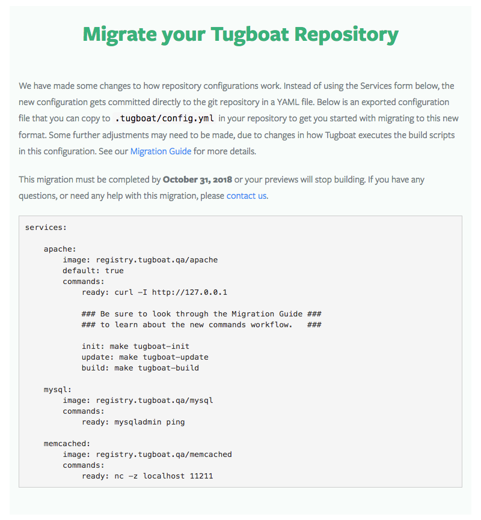

# Configuring Tugboat: Migration Guide

Tugboat Repositories created before the release of the YAML configuration
feature will continue to work using the legacy `Makefile` workflow. This guide
will walk through the steps required to migrate a legacy Tugboat repository to
use a YAML configuration file.

> #### Warning::Repository Migration Timeline
>
> The legacy `Makefile` workflow is deprecated and will no longer work after
> **October 31, 2018**.

## Export a Repository Configuration

First, visit your repository's configuration page, where you will be presented
with a message explaining the migration along with a YAML export of the
repository's existing configuration. Copy and paste this into a file in a new
branch in your git repository at `.tugboat/config.yml`



## New Command Workflow

Tugboat will no longer automatically run the commands in your `Makefile`, but
you can still leverage an existing Tugboat `Makefile` in the new configuration
format.

There are three optional targets that Tugboat looks for in a `Makefile`:
`tugboat-init`, `tugboat-build`, and `tugboat-update`. These targets roughly map
to the new configuration command stages `init`, `build`, and `update`,
respectively. The primary difference is that these three stages are no longer
independent. Tugboat uses different combinations of these stages for different
types of preview operations.

* When a new preview is created from scratch, the commands in `init` are run
  first, then the commands in `update`, and finally the commands in `build`

* When a preview is created from a base preview, only the commands in `build`
  are run

* When a preview is refreshed, the commands in `update` are run, followed by the
  commands in `build`

While this workflow is technically new, it was heavily used by many legacy
repositories already. It just had to be coded into the Makefile. Now, it's
automatic. So, a little shuffling of an existing `Makefile` may be required if
each of these targets was implemented in a cascading fashion.

## Link a Document Root

Tugboat no longer tries to guess where your actual content lives in your git
repository. This was an old feature that worked some of the time, but mostly did
not. It also posed some technical challenges that were better left out. So, if
you do not already have a command to link your git repository's docroot to the
location that your web server expects, you will need to add a command somewhere
in your build process like this

```sh
ln -snf "${TUGBOAT_ROOT}" "${DOCROOT}"
```

Note, the `${DOCROOT}` variable is not present on legacy images, so use an
absolute path there unless you are also upgrading your image selection. For a
legacy Apache image, use a command like this

```bash
ln -snf "${TUGBOAT_ROOT}" /var/www/html
```

## Complete the Migration

Test the new configuration by building a preview for the new branch. If all goes
well, you are ready to complete the migration. Go back to the repository
configuration, and you should now be presented with a new message. Click the
"Migrate" button, and you are done.


