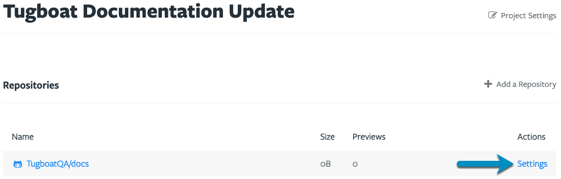

When Tugboat posts comments to a pull request, those comments show as being made by the user who linked Tugboat to the
git repository. In practice, this means that the person who sets up the Tugboat account will get the git provider's
notifications on pull requests; not because they're intentionally watching or commenting on the pull requests, but
because of the automated comments that Tugboat posts as that person.

If you'd instead like those comments to show as coming from Tugboat - and free the user who links the account from a
barrage of notifications - you can add a Tugboat bot to your team.

## To add a Tugboat bot to your team

1. Create an account for your Tugboat bot at your preferred git provider; i.e. GitHub, GitLab, BitBucket. and invite
   that user to the repository as an administrator.
2. Optional: [Download the tugboat avatar](https://dashboard.tugboatqa.com/tugboat-avatar.png) to use for your Tugboat
   bot account.
3. Go to username -> [My Projects](https://dashboard.tugboatqa.com/projects) at the upper-right of the Tugboat screen.
4. Select the project where you want to switch to the Tugboat bot.
5. Click the {}Repository Settings{} link next to the repo where you want to switch to the
   Tugboat bot.
6. Scroll down to the {}API Authentication{} section (GitHub API Authentication, GitLab API
   Authentication or BitBucket API Authentication).
7. Press the big blue {}Change{} button.
8. Choose {}Personal Access Token{} from the drop-down.
9. Carefully read the help text on this next modal window. You will need to go back to your git provider (GitHub,
   GitLab, Bitbucket) and create a personal access token (or App password, as Bitbucket calls it), being sure to grant
   the permissions to the token that are described in the help text on our modal window.
10. Once created, enter the access token for the Tugboat bot user you created at the git provider.
11. Press the {}OK{} button.

Now, whenever Tugboat adds comments to a pull request, the comments will display from the Tugboat bot, and the Tugboat
bot's account will get any subsequent notifications from the provider.

{}

Create an account for your Tugboat bot at your preferred git provider; i.e. GitHub, GitLab, BitBucket.

Optional: [Download the Tugboat avatar](https://dashboard.tugboatqa.com/tugboat-avatar.png) to use for your Tugboat bot
account.

Go to username -> [My Projects](https://dashboard.tugboatqa.com/projects) at the upper-right of the Tugboat screen.

Select the project where you want to switch to the Tugboat bot.

Click the {}Repository Settings{} link next to the repo where you want to switch to the
Tugboat bot.

Scroll down to the {}API Authentication{} section (GitHub API Authentication, GitLab API
Authentication or BitBucket API Authentication).

Press the big blue {}Change{} button.

Choose {}Personal Access Token{} from the drop-down.

Carefully read the help text on this next modal window. You will need to go back to your git provider (GitHub, GitLab,
Bitbucket) and create a personal access token (or App password, as Bitbucket calls it), being sure to grant the
permissions to the token that are described in the help text on our modal window.

Once created, enter the access token for the Tugboat bot user you created at the git provider.

Press the {}OK{} button.

{}
