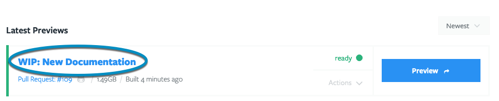
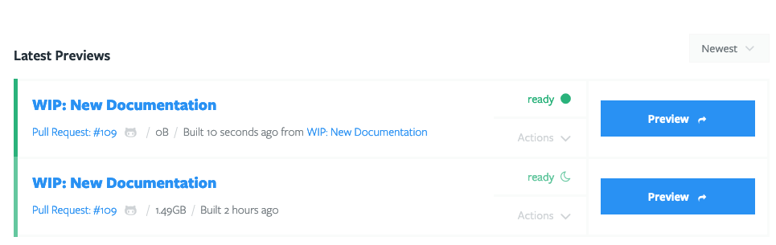

- [Build Previews](#build-previews)
- [Change or update Previews](#change-or-update-previews)
- [Delete Previews](#delete-previews)
- [Change Preview states](#change-preview-states)

## Build Previews

You can build a Preview in a few different ways:

- [Manually build a Preview](#manually-build-a-preview)
- [Auto-generate Previews](#auto-generate-a-preview)

You can also duplicate a Preview using the [Clone Preview](#duplicate-a-preview)
option. This is a great option if you want a few copies of a Preview so QA and
Product can both poke a Preview simultaneously, without worrying about what the
other person is doing.

### Manually build a Preview

To build a Preview:

1. Go to username -> [My Projects](https://dashboard.tugboat.qa/projects) at the
   upper-right of the Tugboat screen.
2. Select the project where you want to build a Preview.
3. Click the name of the repo that contains the code you want to use to build
   the Preview.
4. Scroll down to the **Available to Build** section; by default, you'll see
   _Pull Requests_, but you can switch to view Branches or Tags that are
   available to Preview.
5. Press the **Build Preview** button to begin the build.

While the Preview is building, you'll see the Preview appear in the **Latest
Previews** section, with a yellow status indicator _building_.

When the Preview is ready, the Preview button will turn blue, and you'll see a
green status indicator _ready_. Press the Preview button to view the Preview.
While you're at it, go ahead and
[share your Preview](../share-a-preview/index.md) - we know you're proud of your
work!

{} When you go to build a Preview, you may see an arrow
indicating a drop-down menu next to the **Build Preview** button. This menu
contains additional options to build your Preview from a Base Preview, or build
with no Base Preview. For more info on these options, see:
[Building Previews when you're using a Base Preview](../work-with-base-previews/index.md#building-and-rebuilding-previews-when-youre-using-a-base-preview).
{}

#### Visual Walkthrough

Go to username -> [My Projects](https://dashboard.tugboat.qa/projects) at the
upper-right of the Tugboat screen.

Select the project where you want to build a Preview.

Click the name of the repo that contains the code you want to use to build the
Preview.

Scroll down to the **Available to Build** section; by default, you'll see _Pull
Requests_, but you can switch to view Branches or Tags that are available to
Preview.

Press the **Build Preview** button to begin the build.

While the Preview is building, you'll see the Preview appear in the **Latest
Previews** section, with a yellow status indicator _building_.

When the Preview is ready, the Preview button will turn blue, and you'll see a
green status indicator _ready_. Press the Preview button to view the Preview.
While you're at it, go ahead and
[share your Preview](../share-a-preview/index.md) - we know you're proud of your
work!

{} When you look at your new Preview, you'll see the size of
the Preview next to the branch/tag/PR that the Preview was built from. In the
example above, the Preview size is 385.49MB. Because
[billing for Tugboat projects is](../../tugboat-billing/index.md#how-does-tugboat-pricing-work),
in part, based on the total size of all the Previews contained within a project,
Preview size becomes an important factor when building out multiple Previews.
Check out our section on
[Optimizing Preview builds](../optimize-preview-builds/index.md) for tips on
[reducing Preview size](../optimize-preview-builds/index.md#optimizing-preview-size).
{}

### Auto-generate a Preview

In addition to manually building a Preview when you've got an update, you can
configure Tugboat to automatically build a Preview when a pull request is
opened, or when a PR is updated with new code. For more info on this option,
see:
[Auto-generate Previews](../automate-previews/index.md#auto-generate-previews).

### Duplicate a Preview

When Tugboat successfully completes a Preview build, it takes a snapshot of the
container at that moment in time. Tugboat uses this snapshot when you **Clone**
a Preview, making a near-instantaneous copy of that Preview with its own
container ID and URL. This enables you to share a Tugboat Preview build with
multiple people - for example, Joe in QA and Lisa in Product - who can then
interact with their own version of that Preview without interfering with what
the other folks are doing.

To create a copy of a Preview:

1. Go to username -> [My Projects](https://dashboard.tugboat.qa/projects) at the
   upper-right of the Tugboat screen.
2. Select the project where you want to duplicate a Preview.
3. Click the name of the repo that contains the code you want to use for the
   duplicate Preview.
4. Select the Preview build you want to duplicate.
5. Click the **Actions** drop-down menu for that Preview, and select **Clone**.

You'll now see a new Preview with the same name as the Preview you cloned.

#### Visual Walkthrough

Go to username -> [My Projects](https://dashboard.tugboat.qa/projects) at the
upper-right of the Tugboat screen.

Select the project where you want to duplicate a Preview.

Click the name of the repo that contains the code you want to use for the
duplicate Preview.

Select the Preview build you want to duplicate.

Click the **Actions** drop-down menu for that Preview, and select **Clone**.

You'll now see a new Preview with the same name as the Preview you cloned.

## Change or update Previews

Want to update or change a Preview build? Tugboat offers a few different ways to
do that:

- To update a Preview with your latest code, you can
  [Refresh](#refresh-previews) it. Refreshing a Preview pulls in the latest code
  from the connected Git repo, and run commands from the from the Tugboat config
  file's `update` and `build` phases.
- To change a Preview's Docker images, or the make changes to Services' `init`
  commands, you can [Rebuild](#rebuild-previews) it. Rebuilding a Preview pulls
  fresh Docker images, pulls in the latest code from the connected Git repo, and
  runs all of the Tugboat config file's `init`, `update` and `build` commands.

On a basic level, you can think of it as the difference between updating the
code (Refresh) and making more substantial changes to the way a Service is
configured (Rebuild). For more info on what exactly is happening under the
covers, take a look at
[the Preview build process: explained](../how-previews-work/index.md#the-build-process-explained).

{} When you're updating a Preview that was built from a Base
Preview, Rebuild does not pull fresh Docker images and run commands from `init`
and `update` - child Previews jump directly to the `build` phase. For more info,
see:
[rebuild Previews when working with a Base Preview](../work-with-base-previews/index.md#building-and-rebuilding-previews-when-youre-using-a-base-preview).
{}

### Refresh Previews

When you Refresh a Preview, Tugboat:

1. Pulls the latest code from git.
2. Runs commands from the `update` section of the config file.
3. Runs commands from the `build` section of the config file.

In general, this is a faster process than building the entire container again,
as Tugboat doesn't have to set up Services and complete all the `init` processes
again.

For more info about build phases, see:
[the build process: explained](../how-previews-work/index.md#the-build-process-explained).

To Refresh a Preview:

1. Go to username -> [My Projects](https://dashboard.tugboat.qa/projects) at the
   upper-right of the Tugboat screen.
2. Select the project where you want to update a Preview.
3. Click the name of the repo that contains the code you want to use for the
   Preview update.
4. Select the Preview build you want to update.
5. Click the **Actions** drop-down menu for that Preview, and select
   **Refresh**.
6. Press the **Yes** button to confirm and start the Refresh process.

You'll see a yellow _refreshing_ status while Tugboat is running the update,
which will change to a green _ready_ once the update is complete.

#### Visual Walkthrough

Go to username -> [My Projects](https://dashboard.tugboat.qa/projects) at the
upper-right of the Tugboat screen.

Select the project where you want to update a Preview.

Click the name of the repo that contains the code you want to use for the
Preview update.

Select the Preview build you want to update.

Click the **Actions** drop-down menu for that Preview, and select **Refresh**.

Press the **Yes** button to confirm and start the Refresh process.

You'll see a yellow _refreshing_ status while Tugboat is running the update,
which will change to a green _ready_ once the update is complete.

### Rebuild Previews

When you Rebuild a Preview (that was not built using a Base Preview), Tugboat:

1. Pulls the latest code from git.
2. Pulls fresh Docker images.
3. Runs commands from the `init` section of the configuration.
4. Runs commands from the `update` section of the configuration.
5. Runs commands from the `build` section of the configuration.

This process takes longer than a [Refresh](#refresh-previews), so you should
mainly use this if you need to pull new Docker images, or run commands from
`init` in your config.yml.

For more info about build phases, see:
[the build process: explained](../how-previews-work/index.md#the-build-process-explained).

To Rebuild a Preview:

1. Go to username -> [My Projects](https://dashboard.tugboat.qa/projects) at the
   upper-right of the Tugboat screen.
2. Select the project where you want to rebuild a Preview.
3. Click the name of the repo that contains the code you want to use for the
   Preview rebuild.
4. Select the Preview you want to rebuild.
5. Click the **Actions** drop-down menu for that Preview, and select
   **Rebuild**.
6. Press the **Yes** button to confirm and start the Rebuild process.

You'll see a yellow _building_ status while Tugboat is rebuilding the Preview,
which will change to a green _ready_ once the build is complete.

{} When you Rebuild a Preview that was built from a Base
Preview, Rebuild does not pull fresh Docker images and run commands from `init`
and `update`. Instead, child Previews jump directly to the `build` phase. For
more info, see:
[updating Previews when working with a Base Preview](../work-with-base-previews/index.md#building-and-rebuilding-previews-when-youre-using-a-base-preview).
{}

#### Visual Walkthrough

To Rebuild a Preview:

Go to username -> [My Projects](https://dashboard.tugboat.qa/projects) at the
upper-right of the Tugboat screen.

Select the project where you want to rebuild a Preview.

Click the name of the repo that contains the code you want to use for the
Preview rebuild.

Select the Preview you want to rebuild.

Click the **Actions** drop-down menu for that Preview, and select **Rebuild**.

Press the **Yes** button to confirm and start the Rebuild process.

You'll see a yellow _building_ status while Tugboat is rebuilding the Preview,
which will change to a green _ready_ once the build is complete.

## Delete Previews

Need to get rid of a Preview you're not using anymore? Each Preview in your
Tugboat project counts toward the total
[storage size for Tugboat billing](../../tugboat-billing/index.md#how-does-tugboat-pricing-work),
so it's a good idea to get rid of Previews you don't need.

To delete a Preview:

1. Go to username -> [My Projects](https://dashboard.tugboat.qa/projects) at the
   upper-right of the Tugboat screen.
2. Select the project where you want to delete a Preview.
3. Click into the repo where you want to delete a Preview.
4. Select the Preview you want to delete.
5. Click the **Actions** drop-down menu for that Preview, and select **Delete**.
6. Press the **Yes** button to confirm.

#### Visual Walkthrough

Go to username -> [My Projects](https://dashboard.tugboat.qa/projects) at the
upper-right of the Tugboat screen.

Select the project where you want to delete a Preview.

Click into the repo where you want to delete a Preview.

Select the Preview you want to delete.

Click the **Actions** drop-down menu for that Preview, and select **Delete**.

Press the **Yes** button to confirm.

## Change Preview States

When working with Previews, there are a few handy things you can do in the
**Actions** menu beyond updating and deleting your Previews. You can change the
states of your Previews in a few different ways:

- [Start, Stop](#start-stop)
- [Lock, Unlock](#lock-unlock)
- [Reset](#reset)

### Start, Stop

Sometimes, you might want to stop all of a Preview's Services and take it
offline. You can use the **Stop** option in the **Actions** drop-down menu to
take the Preview offline. This is different from a suspended Preview, in that a
suspended Preview will start again automatically if someone visits the Preview
link, while a Stopped Preview remains stopped until someone manually Starts it.

On the flip side, Starting a Preview resumes all Services. You can Start a
Preview that is suspended or Stopped.

To Start or Stop a Preview:

1. Go to username -> [My Projects](https://dashboard.tugboat.qa/projects) at the
   upper-right of the Tugboat screen.
2. Select the project where you want to Stop or Start a Preview.
3. Click into the repo where you want to Stop/Start a Preview.
4. Select the Preview you want to Stop or Start.
5. Click the **Actions** drop-down menu for that Preview, and select **Stop** or
   **Start**.

When the Preview is successfully stopped, you'll see a red _stopped_ status.
When a Preview is Starting, you'll see a yellow _starting_ or _resuming_
(depending on whether the Preview was Stopped or Suspended), and then the
Preview will go to a green _ready_ status.

#### Visual Walkthrough

Go to username -> [My Projects](https://dashboard.tugboat.qa/projects) at the
upper-right of the Tugboat screen.

Select the project where you want to Stop or Start a Preview.

Click into the repo where you want to Stop/Start a Preview.

Select the Preview you want to Stop or Start.

Click the **Actions** drop-down menu for that Preview, and select **Stop** or
**Start**.

When the Preview is successfully stopped, you'll see a red _stopped_ status.
When a Preview is Starting, you'll see a yellow _starting_ or _resuming_
(depending on whether the Preview was Stopped or Suspended), and then the
Preview will go to a green _ready_ status.

### Lock, Unlock

If you want a Preview to remain in its current state without being updated, you
can Lock the Preview. Locking a Preview prevents Tugboat from making updates,
including things like automated updates from new pull request commits, until the
Preview is Unlocked again. You might want to Lock a Preview to preserve its
state for a longer review, or to avoid interruptions during a demo.

When you're ready to make updates to the Preview again, whether manually or
automated updates, Unlock the Preview.

To Lock or Unlock a Preview:

1. Go to username -> [My Projects](https://dashboard.tugboat.qa/projects) at the
   upper-right of the Tugboat screen.
2. Select the project where you want to Lock or Unlock a Preview.
3. Click into the repo where you want to Lock/Unlock a Preview.
4. Select the Preview you want to Lock or Unlock.
5. Click the **Actions** drop-down menu for that Preview, and select **Lock** or
   **Unlock**.

When the Preview is successfully locked, you'll see a closed padlock icon next
to its status - in this example, it's a green icon next to the _ready_ status.
When the Preview is unlocked, the padlock icon turns into the regular state
indicator.

#### Visual Walkthrough

Go to username -> [My Projects](https://dashboard.tugboat.qa/projects) at the
upper-right of the Tugboat screen.

Select the project where you want to Lock or Unlock a Preview.

Click into the repo where you want to Lock/Unlock a Preview.

Select the Preview you want to Lock or Unlock.

Click the **Actions** drop-down menu for that Preview, and select **Lock** or
**Unlock**.

When the Preview is successfully locked, you'll see a closed padlock icon next
to its status - in this example, it's a green icon next to the _ready_ status.
When the Preview is unlocked, the padlock icon turns into the regular state
indicator.

### Reset

When a Preview build completes, Tugboat takes a
[snapshot of the completed build](../how-previews-work/index.md#the-build-snapshot).
If you want to go back to that state - for example, if you want to undo any
changes that were made during testing or a demo - you can Reset a Preview to go
back to that post-build snapshot.

To Reset a Preview:

1. Go to username -> [My Projects](https://dashboard.tugboat.qa/projects) at the
   upper-right of the Tugboat screen.
2. Select the project where you want to Reset a Preview.
3. Click into the repo where you want to Reset a Preview.
4. Select the Preview you want to Reset.
5. Click the **Actions** drop-down menu for that Preview, and select **Reset**.
6. Press the **Yes** button to confirm.

You'll see a yellow _resetting_ status for a moment while the Preview is
returned to its snapshot state, and then the Preview will become _ready_ again.

#### Visual Walkthrough

Go to username -> [My Projects](https://dashboard.tugboat.qa/projects) at the
upper-right of the Tugboat screen.

Select the project where you want to Reset a Preview.

Click into the repo where you want to Reset a Preview.

Select the Preview you want to Reset.

Click the **Actions** drop-down menu for that Preview, and select **Reset**.

Press the **Yes** button to confirm.

You'll see a yellow _resetting_ status for a moment while the Preview is
returned to its snapshot state, and then the Preview will become _ready_ again.
