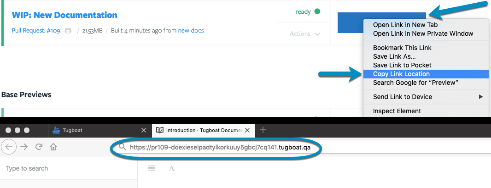

After you've built your Preview, there are a few ways you can share it:

- [Manually share the URL of your Preview](#manually-share-the-url-of-your-preview)
- [Configure Tugboat to automatically post Preview links in pull requests](#configure-tugboat-to-auto-post-preview-links)

## Manually share the URL of your Preview

Want to share a Preview link manually with Lisa in Product, or Dan the client?

To get the link to a Preview you want to share:

1. Go to username -> [My Projects](https://dashboard.tugboat.qa/projects) at the
   upper-right of the Tugboat screen.
2. Select the project that contains the Preview you want to share.
3. Click the name of the repo that contains the Preview you want to share.
4. Go to the Preview you want to share, and either open the Preview and copy the
   URL from the browser's address bar, or use the browser options to Copy Link
   on the **Preview** button.

Send that link to the person who needs to look at the Preview, and they'll be
able to view it. Tugboat links are hard-to-guess secure URLs that are accessible
to anyone with the link; that person doesn't need to be a member of your
[Tugboat crew](../../administering-tugboat-crew/index.md), or able to view the
git repo where the code is hosted.

#### Visual Walkthrough

Go to username -> [My Projects](https://dashboard.tugboat.qa/projects) at the
upper-right of the Tugboat screen.

Select the project that contains the Preview you want to share.

Click the name of the repo that contains the Preview you want to share.

Go to the Preview you want to share, and either open the Preview and copy the
URL from the browser's address bar, or use the browser options to Copy Link on
the **Preview** button.

## Configure Tugboat to auto-post Preview links

When you're using the Tugboat integration with
[GitHub](../../setting-up-tugboat/index.md#github),
[GitLab](../../setting-up-tugboat/index.md#gitlab) or
[BitBucket](../../setting-up-tugboat/index.md#bitbucket), you can configure
Tugboat to automatically post links to Previews as comments on pull requests.

To configure Tugboat to automatically post Preview links:

1. Go to username -> [My Projects](https://dashboard.tugboat.qa/projects) at the
   upper-right of the Tugboat screen.
2. Select the project where you want Tugboat to auto-post Preview links.
3. Click into **Settings** for the repository.
4. Click the checkbox for **Post Preview Links in Pull Request Comments**.
5. Press the Save Configuration button to save your changes.

{} By default, Tugboat's comments to a linked git provider
display as the person who linked the provider to Tugboat. That means the person
who linked the repo will get notifications for every PR where Tugboat
automatically posts a comment. If this person does not wish to receive
notifications, you can
[configure a Tugboat bot](../../administering-tugboat-crew/index.md#add-a-tugboat-bot-to-your-team)
to post the comments and receive those notifications. {}

#### Visual Walkthrough

Go to username -> [My Projects](https://dashboard.tugboat.qa/projects) at the
upper-right of the Tugboat screen.

Select the project where you want Tugboat to auto-post Preview links.

Click into **Settings** for the repository.

Click the checkbox for **Post Preview Links in Pull Request Comments**.

Press the Save Configuration button to save your changes.

