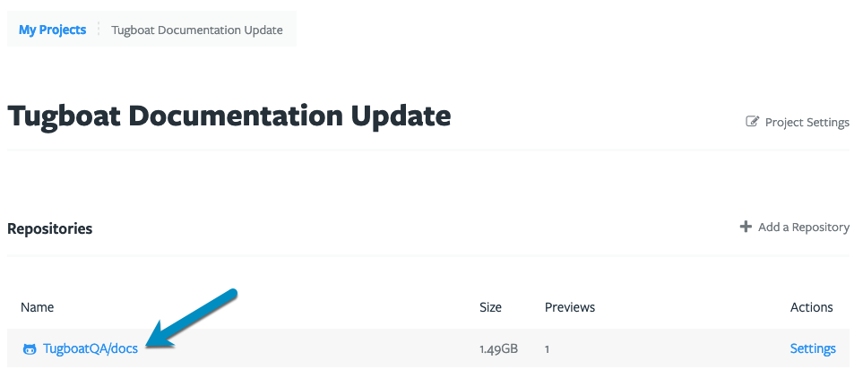
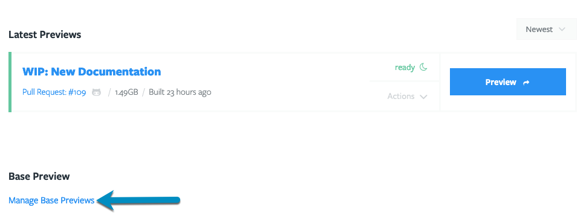
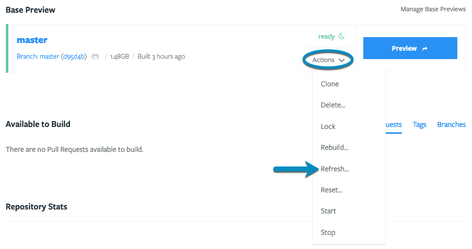
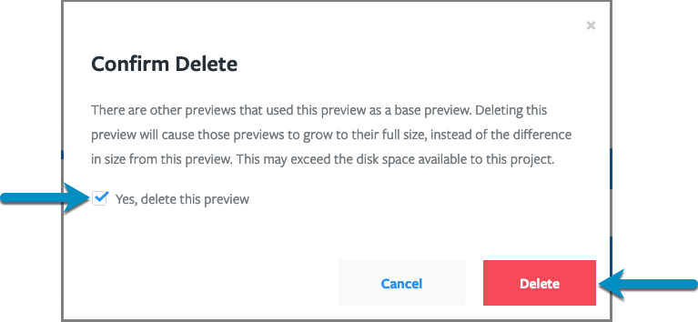

If you want to speed up your Preview builds, and make subsequent Preview builds
smaller files, you can set a Base Preview as a starting point for subsequent
Previews.

Here's everything you need to know about administering Base Previews:

- [Set a Base Preview](#how-to-set-a-base-preview)
- [Use multiple Base Previews](#add-multiple-base-previews)
- [Change or update Base Previews](#change-or-update-base-previews)
- [Stop using a Base Preview](#stop-using-a-base-preview)
- [Delete a Base Preview](#delete-a-base-preview)

You should also know a few things about working with Previews when you're using
a Base Preview:
[Building and Rebuilding Previews when you're using a Base Preview](#building-and-rebuilding-previews-when-youre-using-a-base-preview)

Want to learn more about Base Previews under the cover? Check out:
[How Base Previews work](../how-previews-work/index.md#how-base-previews-work).

## How to set a Base Preview

To create a Base Preview, you'll first need to have a
[Preview build](../administer-previews/index.md#build-previews) to serve as your
starting point.

1. Go to username -> [My Projects](https://dashboard.tugboat.qa/projects) at the
   upper-right of the Tugboat screen.
2. Select the project where you want to set a Base Preview.
3. Click the name of the repo that contains Preview you want to use as a Base
   Preview.
4. Go to the **Manage Base Previews** link on the Repository Dashboard.
5. Click the checkbox next to the Preview you want to use as a Base Preview.
6. Press the **OK** button.

That preview will be moved to the **Base Preview** section of the Repository
Dashboard. From now on, Previews will build from the snapshot created when the
Base Preview was built.

#### Visual Walkthrough

Go to username -> [My Projects](https://dashboard.tugboat.qa/projects) at the
upper-right of the Tugboat screen.

Select the project where you want to set a Base Preview.

Click the name of the repo that contains Preview you want to use as a Base
Preview.

Go to the **Manage Base Previews** link on the Repository Dashboard.

Click the checkbox next to the Preview you want to use as a Base Preview.

Press the **OK** button.

That preview will be moved to the **Base Preview** section of the Repository
Dashboard.

If you're ever wondering which Base Preview was used when generating a Preview,
check under the name of the Preview; you're looking for the "from _Base Preview
Name_":

## Add multiple Base Previews

Want to use more than one Base Preview? Follow the instructions in
[How to set a Base Preview](#how-to-set-a-base-preview), and check the
checkboxes next to all of the Previews that you want to use as Base Previews.

When you've selected multiple Base Previews, every new Preview build (including
automated builds from pull requests) will create a build from _each_ Base
Preview. In my sample project, I've set two base Previews, and building a
Preview from a new PR automatically created two Previews - one for each Base
Preview.

## Change or update Base Previews

There are a few different ways you can change or update your Base Previews:

- [Change a Base Preview](#change-a-base-preview)
- [Update a Base Preview](#update-a-base-preview)

### Change a Base Preview

If you want to change a Docker image that a Base Preview is using, or make
changes to something that happens during the `init` phase of the Preview build
process, you'll need to Rebuild your Base Preview. Rebuilding a Base Preview
kicks off a fresh build process from the beginning, in effect replacing your
current Base Preview with a new one that contains all of your changes.

Want to know more about build phases? Check out:
[the build process: explained](../how-previews-work/index.md#the-build-process-explained).

{} If you've checked the
[Repository Setting](../../setting-up-tugboat/index.md#repository-settings-optional)
to **Rebuild Orphaned Previews Automatically**, a successful Rebuild of a Base
Preview will kick off Rebuilds of any child Previews that were built from your
Base Preview. {}

To Rebuild a Base Preview:

1. Go to username -> [My Projects](https://dashboard.tugboat.qa/projects) at the
   upper-right of the Tugboat screen.
2. Select the project where you want to change the Base Preview.
3. Click the name of the repo that contains Base Preview you want to change.
4. Click the **Actions** drop-down menu for the Base Preview, and select
   **Rebuild**.
5. To confirm that you actually want to change the Base Preview, rather than
   just updating it, click the checkbox next to **Yes, rebuild this preview**.
   You may also want to **Rebuild previews built from this one when finished**.
6. Press the **Rebuild** button.

#### Visual Walkthrough

Go to username -> [My Projects](https://dashboard.tugboat.qa/projects) at the
upper-right of the Tugboat screen.

Select the project where you want to change the Base Preview.

Click the name of the repo that contains Base Preview you want to change.

Click the **Actions** drop-down menu for the Base Preview, and select
**Rebuild**.

To confirm that you actually want to change the Base Preview, rather than just
updating it, click the checkbox next to **Yes, rebuild this preview**. You may
also want to **Rebuild previews built from this one when finished**.

Press the **Rebuild** button.

### Update a Base Preview

If you don't need to pull a new Docker image or make changes to the `init` phase
in your
[config file](../../setting-up-tugboat/index.md#create-a-tugboat-config-file),
you can do a smaller, faster update of your Base Preview using Refresh.
Refreshing a Base Preview:

1. Pulls the latest code from git.
2. Runs commands from the `update` section of the config.yml.
3. Run commands from the `build` section of the config.yml.

Want to know more about build phases? Check out:
[the build process: explained](../how-previews-work/index.md#the-build-process-explained).

{} If you want to pull a fresh Docker image, or if you've made
changes to the config.yml's `init` phase, you'll need to
[rebuild the Base Preview](#change-a-base-preview) in order to see those
changes. {}

Tugboat provides a couple of ways to Refresh a Base Preview:

- [Manually Refresh a Base Preview](#manually-refresh-a-base-preview)
- [Automatically Refresh Base Previews](#automatically-refresh-a-base-preview)

{} If you've checked the
[Repository Setting](../../setting-up-tugboat/index.md#repository-settings-optional)
to **Rebuild Stale Previews Automatically**, a successful Refresh of a Base
Preview will kick off Rebuilds of any child Previews that were built from your
Base Preview. {}

#### Manually Refresh a Base Preview

To manually kick off a Base Preview update:

1. Go to username -> [My Projects](https://dashboard.tugboat.qa/projects) at the
   upper-right of the Tugboat screen.
2. Select the project where you want to update the Base Preview.
3. Click the name of the repo that contains Base Preview you want to update.
4. Click the **Actions** drop-down menu for the Base Preview, and select
   **Refresh**.
5. If you want to
   [Rebuild Previews that were built from this Base Preview](#building-and-rebuilding-previews-when-youre-using-a-base-preview)
   after the update, click the checkbox next to **Rebuild Previews built from
   this one when finished**.
6. Press the **Refresh** button.

#### Visual Walkthrough

Go to username -> [My Projects](https://dashboard.tugboat.qa/projects) at the
upper-right of the Tugboat screen.

Select the project where you want to update the Base Preview.

Click the name of the repo that contains Base Preview you want to update.

Click the **Actions** drop-down menu for the Base Preview, and select
**Refresh**.

If you want to
[Rebuild Previews that were built from this Base Preview](#building-and-rebuilding-previews-when-youre-using-a-base-preview)
after the update, click the checkbox next to **Rebuild Previews built from this
one when finished**.

Press the **Refresh** button.

#### Automatically Refresh a Base Preview

You'll generally want to keep your Base Preview up to date with your latest
codebase, and a fresh copy of your database, image files, and other assets. By
default, Tugboat automatically checks for updates every night at 12 am UTC, and
refreshes your Base Preview with these updates. You can toggle this feature, or
change the time and interval at which Tugboat does an automated Refresh of your
Base Previews.

To change Tugboat's settings to automatically Refresh Base Previews:

1. Go to username -> [My Projects](https://dashboard.tugboat.qa/projects) at the
   upper-right of the Tugboat screen.
2. Select the project where you want to configure auto-update settings for Base
   Previews.
3. Click into **Settings** for the repository.
4. Go to **Refresh Base Previews Automatically**. Toggle the checkbox and/or
   adjust the frequency and timing of these automatic updates.
5. Press the Save Configuration button to save your changes.

#### Visual Walkthrough

Go to username -> [My Projects](https://dashboard.tugboat.qa/projects) at the
upper-right of the Tugboat screen.

Select the project where you want to configure auto-update settings for Base
Previews.

Click into **Settings** for the repository.

Go to **Refresh Base Previews Automatically**. Toggle the checkbox and/or adjust
the frequency and timing of these automatic updates.

Press the Save Configuration button to save your changes.

## Stop using a Base Preview

When you no longer want new Preview Builds to use a Base Preview; for example,
if you've moved to a new concept, want to switch to a development branch or
otherwise want to stop using a Base Preview; you can remove that Base Preview.
This keeps the Base Preview and child Previews in your Tugboat project, but new
builds will no longer start with this Base Preview. If you want to delete a Base
Preview, instead, see: [Delete a Base Preview](#delete-a-base-preview).

To stop using a Base Preview:

1. Go to username -> [My Projects](https://dashboard.tugboat.qa/projects) at the
   upper-right of the Tugboat screen.
2. Select the project where you want to stop using a Base Preview.
3. Click into the repo where you want to stop using a Base Preview.
4. Go to the **Manage Base Previews** link on the Repository Dashboard.
5. Click the checkbox next to the Base Preview you want to stop using.
6. Press the **OK** button.

The deselected Preview will disappear from the Base Preview section of the
dashboard, and subsequent Preview builds - including automated builds from git
provider integrations - will no longer start from that Base Preview.

#### Visual Walkthrough

Go to username -> [My Projects](https://dashboard.tugboat.qa/projects) at the
upper-right of the Tugboat screen.

Select the project where you want to stop using a Base Preview.

Click into the repo where you want to stop using a Base Preview.

Go to the **Manage Base Previews** link on the Repository Dashboard.

Click the checkbox next to the Base Preview you want to stop using.

Press the **OK** button.

## Delete a Base Preview

Want to delete a Base Preview you're not using anymore? Keep in mind that if you
delete a Base Preview that was used to generate child Previews, those child
Previews will grow to their full size, which could put your project over the
[limit of disk space](../../tugboat-billing/index.md#how-does-tugboat-pricing-work)
available to the project. If you don't want this, you can
[stop using a Base Preview](#stop-using-a-base-preview) to stop building new
child Previews from this Preview, but preserve the current size of existing
child Previews.

{} When you exceed the disk space limit in your project, you
won't be able to build new Previews until you are under the project's disk space
limit again. You can get under the project's space limit by
[deleting Previews](../administer-previews/index.md#delete-previews), or
[increasing your project's billing tier](../../tugboat-billing/index.md#change-your-tugboat-plan).
{}

To delete a Base Preview:

1. Go to username -> [My Projects](https://dashboard.tugboat.qa/projects) at the
   upper-right of the Tugboat screen.
2. Select the project where you want to delete a Base Preview.
3. Click into the repo where you want to delete a Base Preview.
4. Click the **Actions** drop-down menu for the Base Preview you want to delete,
   and select **Delete**.
5. Click the checkbox next to **Yes, delete this preview** and then press the
   **Delete** button to confirm.

#### Visual Walkthrough

Go to username -> [My Projects](https://dashboard.tugboat.qa/projects) at the
upper-right of the Tugboat screen.

Select the project where you want to delete a Base Preview.

Click into the repo where you want to delete a Base Preview.

Click the **Actions** drop-down menu for the Base Preview you want to delete,
and select **Delete**.

Click the checkbox next to **Yes, delete this preview** and then press the
**Delete** button to confirm.

## Building and Rebuilding Previews when you're using a Base Preview

When you're building Previews after you've set a Base Preview, those Preview
builds are child builds of the Base Preview. They use the Base Preview's
[build snapshot](../how-previews-work/index.md#the-build-snapshot) for things
like setting up Services, including pulling Docker images, and pulling in any
assets that are imported during the `init` or `update` phase of the Base Preview
build.

When you're working with Previews that are child Previews of a Base Preview,
Build and Rebuild start from the `build` phase, bypassing the `init` and
`refresh` phases of a build. This includes:

- [Manual Preview Builds](../administer-previews/index.md#manually-build-a-preview)
  (when you do not specify building from scratch)
- [Previews that are automatically built from pull requests](../automate-previews/index.md#auto-generate-previews).
- [Rebuilding child Previews](../administer-previews/index.md#rebuild-previews)
- [Rebuild orphaned Previews automatically](../../setting-up-tugboat/index.md#rebuild-orphaned-previews-automatically)

For more info on build phases, see:
[the build process: explained](../how-previews-work/index.md#the-build-process-explained).

After you've set a Base Preview, you do have one option to build new Previews
that do not use the Base Preview: manually build a Preview from scratch. A
Preview built this way is not a child Preview, and behaves like a typical
Preview when Building or Rebuilding.

### Build a Preview with no Base Preview

To manually build a Preview with no Base Preview:

1. Go to username -> [My Projects](https://dashboard.tugboat.qa/projects) at the
   upper-right of the Tugboat screen.
2. Select the project where you want to build a Preview.
3. Click into the repo where you want to build a Preview.
4. Go to the **Available to Build** section of the Repository Dashboard.
5. Click into the drop-down next to the **Build Preview** button for the Preview
   you'd like to build from scratch.
6. Select the **Build with no base preview** option.

#### Visual Walkthrough

Go to username -> [My Projects](https://dashboard.tugboat.qa/projects) at the
upper-right of the Tugboat screen.

Select the project where you want to build a Preview.

Click into the repo where you want to build a Preview.

Go to the **Available to Build** section of the Repository Dashboard.

Click into the drop-down next to the **Build Preview** button for the Preview
you'd like to build from scratch.

Select the **Build with no base preview** option.

