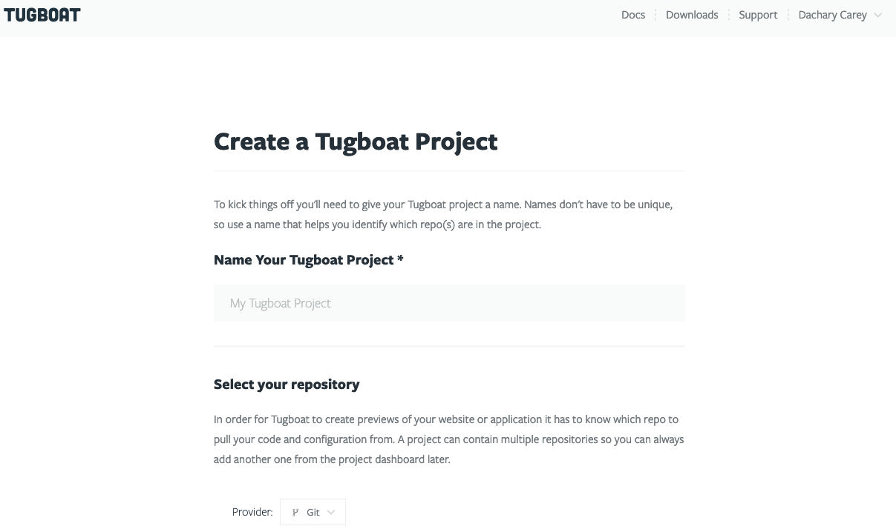
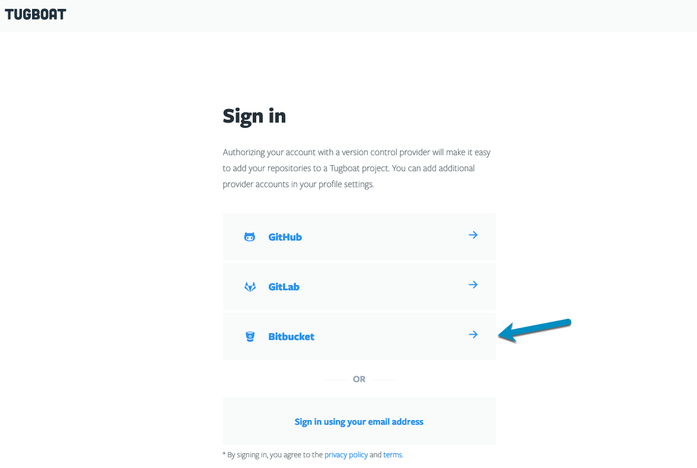
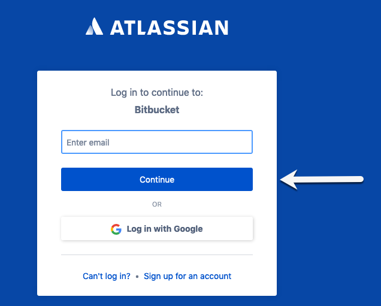
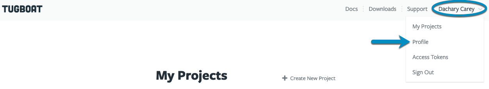
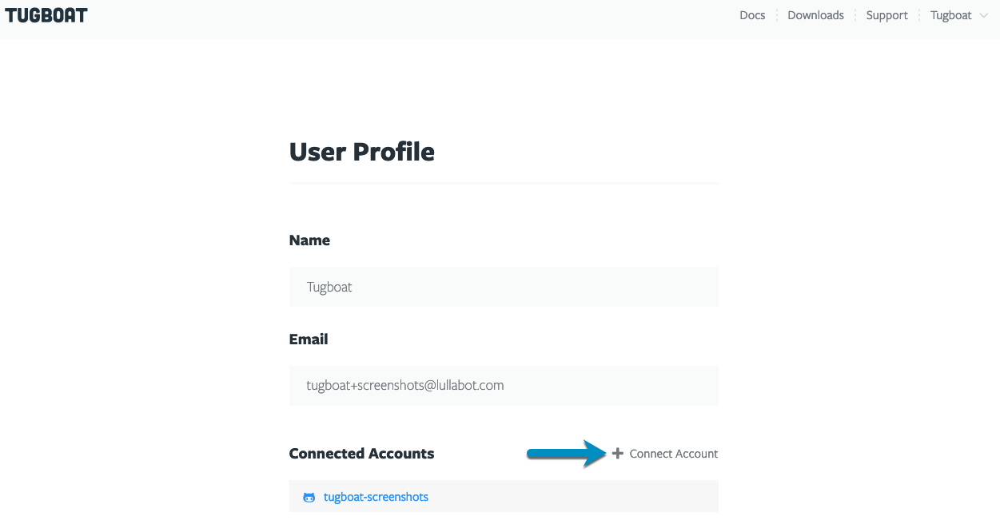
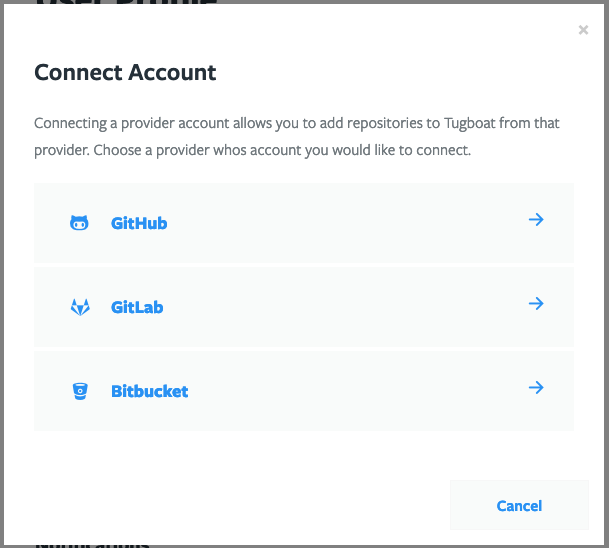

- [GitHub](#github)
- [GitLab](#gitlab)
- [Bitbucket](#bitbucket)
- [Generic git server](#generic-git-server)
- [Add a link to an additional git provider](#adding-a-link-to-a-git-provider)
- [Disconnect a linked git provider](#disconnect-a-linked-git-provider)
- [Authenticating using an API access token](#authenticating-using-an-api-access-token)

## GitHub

- [How to connect Tugboat to GitHub](#how-do-i-link-tugboat-to-github)
- [Using the GitHub integration](#using-the-github-integration)

### How do I link Tugboat to GitHub?

1. Go to [Sign In](https://dashboard.tugboatqa.com/) and select GitHub.
2. Enter your GitHub Username and Password (or Create an Account), complete Two-Factor Authentication.
3. Authorize Tugboat.

Once you complete GitHub authorization, you'll be redirected to the [Create a Tugboat Project](../create-a-new-project/)
screen.

{}

Go to [Sign In](https://dashboard.tugboatqa.com/) and select GitHub.


Enter your GitHub Username and Password (or Create an Account), complete Two-Factor Authentication.


Authorize Tugboat.


Once you complete GitHub authorization, you'll be redirected to the [Create a Tugboat Project](../create-a-new-project/)
screen.



{}

### Using the GitHub integration

The GitHub integration gives Tugboat the following features, which you can access in your Project -> Repository
Settings:

- {}Build Pull Requests automatically{} On by default; Tugboat automatically creates a
  Preview when a GitHub pull request is opened.
- {}Rebuild updated Pull Requests automatically{} On by default; Tugboat automatically
  rebuilds a Preview when the corresponding pull request is updated.
- {}Delete Pull Request Previews automatically{} On by default; Tugboat automatically deletes
  a Preview when its pull request is merged or closed.
- {}Set Pull Request status{} On by default; Tugboat updates the pull request status to
  reflect the state of its Preview.
- {}Set Pull Request deployment status{} Off by default; Tugboat adds a deployment update to
  the pull request when a Preview is built.
- {}Post Preview links in Pull Request comments{} Off by default; Tugboat adds a comment to a
  pull request with links to its Preview. The comment author is the person who authenticated the git repo to Tugboat; to
  change this, see: [Add a Tugboat Bot to your team](../../administer-tugboat-crew/add-tugboat-bot-to-team).
- {}Build Previews for forked Pull Requests{} Off by default; Tugboat builds Previews for
  pull requests made to the primary repo from forked repositories. **There are security implications from using this
  setting:** any secrets in your Preview will be accessible by the owner of the forked repository. When this feature is
  not enabled, forked pull requests show as available to build (or will attempt to build automatically if you have
  {}Build Pull Requests Automatically{} enabled) but the Preview build will fail.

You can also specify the account from which comments are posted to GitHub in this section. For info on customizing this,
see: [Add a Tugboat Bot to your team](../../administer-tugboat-crew/add-tugboat-bot-to-team).

## GitLab

- [How to connect Tugboat to GitLab](#how-do-i-link-tugboat-to-gitlab)
- [Using the GitLab integration](#using-the-gitlab-integration)

### How do I link Tugboat to GitLab?

1. Go to [Sign In](https://dashboard.tugboatqa.com/) and select GitLab.
2. Enter your GitLab Username and Password (or Register).
3. Authorize Tugboat.

Once you complete GitLab authorization, you'll be redirected to the [Create a Tugboat Project](../create-a-new-project/)
screen.

{}

Go to [Sign In](https://dashboard.tugboatqa.com/) and select GitLab.


Enter your GitLab Username and Password (or Register).


Authorize Tugboat.


Once you complete GitLab authorization, you'll be redirected to the [Create a Tugboat Project](../create-a-new-project/)
screen.


{}

### Using the GitLab integration

The GitLab integration gives your Tugboat the following features, which you can access in your Project -> Repository
Settings:

- {}Build Merge Requests automatically{} On by default; Tugboat automatically creates a
  Preview when a GitLab merge request is opened.
- {}Rebuild updated Merge Requests automatically{} On by default; Tugboat automatically
  creates a Preview when the corresponding merge request is updated.
- {}Delete Merge Request Previews automatically{} On by default; Tugboat automatically
  deletes a Preview when its merge request is merged or closed.
- {}Set Merge Request build status{} On by default; Tugboat updates the merge request build
  status to reflect the state of its Preview.
- {}Post Preview links in Merge Request comments{} Off by default; Tugboat adds a comment to
  a merge request with links to its Preview. The comment author is the person who authenticated the git repo to Tugboat;
  to change this, see: [Add a Tugboat Bot to your team](../../administer-tugboat-crew/add-tugboat-bot-to-team).
- {}Build Previews for forked Merge Requests{} Off by default; Tugboat builds Previews for
  merge requests made to the primary repo from forked repositories. **There are security implications from using this
  setting:** any secrets in your Preview will be accessible by the owner of the forked repository. When this feature is
  not enabled, forked merge requests show as available to build (or will attempt to build automatically if you have
  {}Build Merge Requests Automatically{} enabled) but the Preview build will fail.

You can also specify the account from which comments are posted to GitLab in this section. For info on customizing this,
see: [Add a Tugboat Bot to your team](../../administer-tugboat-crew/add-tugboat-bot-to-team).

## Bitbucket

- [How to connect your Tugboat to Bitbucket](#how-do-i-link-tugboat-to-bitbucket)
- [Using the Bitbucket integration](#using-the-bitbucket-integration)

### How do I link Tugboat to Bitbucket?

1. Go to [Sign In](https://dashboard.tugboatqa.com/) and select Bitbucket.
2. Enter your Bitbucket Email and Password (or Sign up for an account).
3. Grant Access to Tugboat.

Once you complete Bitbucket authorization, you'll be redirected to the
[Create a Tugboat Project](../create-a-new-project/) screen.

{}

Go to [Sign In](https://dashboard.tugboatqa.com/) and select Bitbucket.



Enter your Bitbucket Email and Password (or Sign up for an account).



Grant Access to Tugboat.


Once you complete Bitbucket authorization, you'll be redirected to the
[Create a Tugboat Project](../create-a-new-project/) screen.


{}

### Using the Bitbucket integration

The BitBucket integration gives Tugboat the following features, which you can access in your Project -> Repository
Settings:

- {}Build Pull Requests automatically{} On by default; Tugboat automatically creates a
  Preview when a Bitbucket pull request is opened.
- {}Rebuild updated Pull Requests automatically{} On by default; Tugboat automatically
  rebuilds a Preview when the corresponding pull request is updated.
- {}Delete Pull Request Previews automatically{} On by default; Tugboat automatically deletes
  a Preview when its pull request is merged or closed.
- {}Set Pull Request status{} On by default; Tugboat updates the pull request status to
  reflect the state of its Preview.
- {}Post Preview links in Pull Request comments{} Off by default; Tugboat adds a comment to a
  pull request with links to its Preview. The comment author is the person who authenticated the git repo to Tugboat; to
  change this, see: [Add a Tugboat Bot to your team](../../administer-tugboat-crew/add-tugboat-bot-to-team).
- {}Build Previews for forked Pull Requests{} Off by default; Tugboat builds Previews for
  pull requests made to the primary repo from forked repositories. **There are security implications from using this
  setting:** any secrets in your Preview will be accessible by the owner of the forked repository. When this feature is
  not enabled, forked pull requests show as available to build (or will attempt to build automatically if you have
  {}Build Pull Requests Automatically{} enabled) but the Preview build will fail.

You can also specify the account from which comments are posted to Bitbucket in this section. For info on customizing
this, see: [Add a Tugboat Bot to your team](../../administer-tugboat-crew/add-tugboat-bot-to-team).

## Generic Git Server

If you're not using GitHub, GitLab, or Bitbucket, you can use a generic git server with Tugboat. You'll
[sign in to Tugboat](https://dashboard.tugboatqa.com/) using an email address, and when you go to add a repo to your
Tugboat project, you can link to a Git URL.

{} If your repo isn't connected via Tugboat's GitHub, GitLab, or Bitbucket authentication, you won't
have the integration features to automatically build Previews from Pull Requests, and other related functionality. If
you add GitHub, GitLab, or Bitbucket authentication later, you'll need to delete your generic git server from your
project, and add it again to use it. {}

## Adding a link to a git provider

Need to add a git provider to your Tugboat account? Whether you created your initial Tugboat account with an email and
now want to add a git provider, or whether you're adding your second or third git provider, here's how to connect your
Tugboat account with additional git providers:

1. Click the {}User{} drop-down in the upper right-hand corner of the Tugboat dashboard, and
   select {}Profile{}.
2. Click the {}+ Connect Account{} link.
3. Select the git provider whose account you'd like to connect.
4. Follow the instructions to connect to [GitHub](#how-do-i-link-tugboat-to-github),
   [GitLab](#how-do-i-link-tugboat-to-gitlab) or [Bitbucket](#how-do-i-link-tugboat-to-bitbucket).

{}

Click the {}User{} drop-down in the upper right-hand corner of the Tugboat dashboard, and
select {}Profile{}.



Click the {}+ Connect Account{} link.



Select the git provider whose account you'd like to connect.



Follow the instructions to connect to  
 [GitHub](#how-do-i-link-tugboat-to-github), [GitLab](#how-do-i-link-tugboat-to-gitlab) or [Bitbucket](#how-do-i-link-tugboat-to-bitbucket).

{}

## Disconnect a linked git provider

If you leave an organization or close a git provider account, you may want to disconnect a linked git provider from your
Tugboat account. To do this:

1. Click the {}User{} drop-down in the upper right-hand corner of the Tugboat dashboard, and
   select {}Profile{}.
2. Select the git provider whose account you'd like to disconnect.
3. Click the {}Disconnect{} link.
4. You'll see a dialog box explaining what happens if you disconnect a linked account; if you want to continue, press
   the {}Disconnect{} button.

{}

Click the {}User{} drop-down in the upper right-hand corner of the Tugboat dashboard, and
select {}Profile{}.


Select the git provider whose account you'd like to disconnect.


Click the {}Disconnect{} link.


You'll see a dialog box explaining what happens if you disconnect a linked account; if you want to continue, press the
{}Disconnect{} button.


{}

## Authenticating using an API access token

By default, Tugboat uses OAuth to authenticate to git hosting providers. However, there may be times when organization
administrators can't or won't approve Tugboat as an organization-level OAuth application. As a workaround, you can use a
git provider's API access token to add a GitHub, GitLab, or Bitbucket repo to Tugboat.

You'll need to use the [Tugboat API](https://api.tugboatqa.com/) to pass an alternate authentication method.

This example shows how to implement this workaround for a GitHub repository, but you can do the same thing using a
slightly different syntax for GitLab or Bitbucket repositories. If you need help with the syntax for GitLab or
Bitbucket, take a look at
[the API documentation for the `Create a Repository` endpoint](https://api.tugboatqa.com/v3#tag/Repositories/paths/~1repos/post).
If you have other questions about this workaround, feel free to reach out to us for [support](/support).

### Prerequisites

1. You must have administrator permissions on GitHub for the repo you would like to add to Tugboat.
2. You must already have an account on Tugboat and have created a Tugboat project. More on this below.
3. You must be an Admin or Owner on Tugboat for the aforementioned project in #2.

### Implementation Instructions

#### Open a command-line shell / terminal on your local computer

You'll need some environment variables to make this API call.

First, export the Tugboat Project ID for the Project that you'd like to add this GitHub repo to. To find the project ID,
see [How to find Tugboat IDs -> Project ID](/faq/find-tugboat-ids). Then run the following command in your shell,
replacing `[tugboat-project-id]` with this ID.

```
export PROJECT=[tugboat-project-id]
```

If you don't have a Tugboat project, you'll need to create one by connecting any other repository to Tugboat. You can
then remove the repo from the Tugboat Project afterward.

#### Create a Tugboat API access token

Generate an access token in order to use the Tugboat API. Follow the instructions at
[Set an Access Token](/tugboat-cli/set-an-access-token/) to generate your access token.

Once you have the access token, switch back to your terminal and paste in the following line, replacing
`[your-tugboat-token]` with this access token.

```
export TUGBOAT_TOKEN=[your-tugboat-token]
```

#### Create a GitHub personal access token

1. Go to [GitHub -> Personal access tokens](https://github.com/settings/tokens) and click Generate new token.
2. Name your token something recognizable, such as "Tugboat for ExampleOrg/ExampleRepo"
3. Under _Select scopes_, check the checkbox next to _repo_.
4. Save the token, switch back to your terminal, and export the token as an environment variable, replacing
   `[github-api-token]` with your new token.

```
export GH_TOKEN=[github-api-token]
```

#### Export additional environment variables

Export the GitHub organization that owns the repository as an environment variable, replacing `[github-organization]`
with your organization.

```
export GH_ORG=[github-organization]
```

Export the Repo name as an environment variable, replacing `[github-repo-name]` with the name of the repository you want
to connect to Tugboat.

```
export GH_REPO=[github-repo-name]
```

Once you've done all the above, you can create an environment variable to integrate a few of these into a JSON payload
that will be sent to the Tugboat API. Copy and paste this directly into your shell:

```
export PAYLOAD=`printf '{ \
  "project": "%s",\
  "provider": { "name": "github" },\
  "repository": { "name": "%s", "group": "%s" },\
  "auth": { "token": "%s" },\
  "name": "%s/%s"\
}' "$PROJECT" "$GH_REPO" "$GH_ORG" "$GH_TOKEN" "$GH_ORG" "$GH_REPO"`
```

#### Make cURL request to the Tugboat API

Once that is complete, you are ready to make the cURL request to the [Tugboat API](https://api.tugboatqa.com/) to
connect the GitHub Repo to Tugboat. Copy and paste this directly into your shell:

```
curl -H "Authorization: Bearer $TUGBOAT_TOKEN" \
     -H "Content-Type: application/json" \
     -X POST -d "$PAYLOAD" \
     https://api.tugboatqa.com/v3/repos
```
