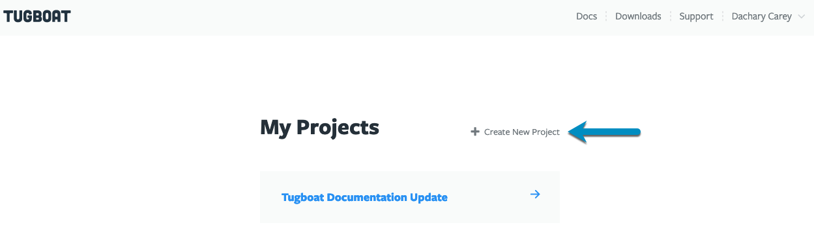

Once you've connected Tugboat to your preferred git provider, it's time to
create a new project!

- [How to create a project](#how-to-create-a-project)
- [Things to know about Tugboat projects](#things-to-know-about-tugboat-projects)

Once you hit the {}Create Project{} button, it's
anchors away!

### How to create a project

The first time you sign into Tugboat, you'll go directly to the Create New
Project screen.

After you've already got a project, you can add more by going to the Tugboat
Dashboard and selecting {}Create New Project{}.

### Things to know about Tugboat projects

When you're creating a project, there are a few things to keep in mind:

- A Tugboat project is a collection of any number of repos across git providers
- Tugboat's pricing tiers and billing are specified on the project level, not
  based on the number of repositories
- Users are managed on a per project basis

Deciding which users need to be able to access which projects can help you
figure out how you want to organize, too. For example, let's say you are
building a recipe site that consists of a backend Drupal repository and a
frontend React repository. If the entire development team should have access to
both repositories within Tugboat, you should probably create a single project
for both repositories in Tugboat.

On the other hand, let's say you have a WordPress blog that is managed by an
outside vendor. Also, you have a separate and unrelated Node.js application that
is a "top secret" internal project your company is working on. It may be best to
create two separate projects so that you can manage permissions for each of the
projects independently.
