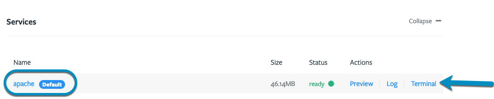
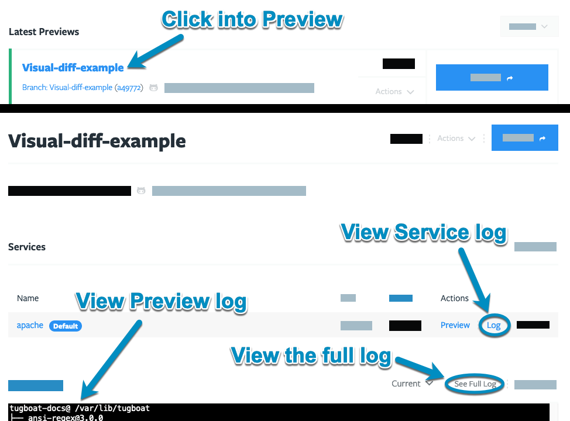

- [Process for debugging Tugboat config files](#process-for-debugging-tugboat-config-files)
- [Tools for debugging Tugboat config files](#tools-for-debugging-tugboat-config-files)

### Process for debugging Tugboat config files

When you're not getting the Tugboat Preview Build you're looking for, there are
a few ways you might approach debugging your config files:

- [Debugging your first Tugboat build config file](#debugging-your-first-tugboat-build-config-file)
- [Debugging changes to your Tugboat config file](#debugging-changes-to-your-tugboat-config-file)

#### Debugging your first Tugboat build config file

When you're first getting Tugboat set up, here's how we recommend getting
started and debugging your initial config file:

1. Create a branch within your git repository for adding Tugboat, and put your
   [config file there](../setting-up-tugboat/index.md#create-a-tugboat-config-file).
2. [Build a Preview](../building-a-preview/administer-previews/index.md#build-previews)
   from that branch.
3. If you get an error while building the Preview, take a
   [look at the Preview log](#how-to-check-the-preview-logs).
4. Click **Full Log** to make sure you're viewing the entire log.
5. Review the log until you see where the Preview build failed.

In some cases, you'll be able to see the specific command where the Preview
build failed. When that's the case, click the **Terminal** link next to the
Service where the command error occurred, and you'll get a terminal directly
into that Service.



From here, you can go line-by-line through the commands in your config file to
see what happens when you're running them directly in the terminal. You may want
to pass a verbose flag to see more context about what's going on.

Common problems here include:

- Parse errors, missing quotes, incorrect escapes, etc.
- Missing apps
- Installs that didn't execute as expected

If you can't see the exact command where the Preview build failed, or if you're
not having any luck manually debugging your config file, reach out to us via
[Help and Support](../support/index.md) - we're happy to help!

#### Debugging changes to your Tugboat config file

If you're making changes to your Tugboat config file, the debugging process is
mostly the same as when you first set it up, but there are a few things you want
to do to make sure Tugboat is getting the changes as expected:

1. Create a branch within your git repository for your changes, and put your new
   [config file there](../setting-up-tugboat/index.md#create-a-tugboat-config-file).
2. Push the branch with your config file changes.
3. Go into Tugboat, and manually
   [build your Preview without a Base Preview](../building-a-preview/work-with-base-previews/index.md#build-a-preview-with-no-base-preview).

{} If you're using a Base Preview in your Tugboat project,
subsequent Previews that are built from that Base Preview start with the
commands in `build`, bypassing `init` and `update`. Changes you make to a config
file's `init` or `update` commands won't be applied when automatically building
a Preview from a PR. You'll need to manually rebuild a Preview from scratch if
you're using a Base Preview in order to apply config file changes. For more
info, see:
[The build process: explained](../building-a-preview/how-previews-work/index.md#the-build-process-explained).
{}

From here, if your Preview build is failing, the process is the same as above:

1. Take a [look at the Preview log](#how-to-check-the-preview-logs).
2. Click **Full Log** to make sure you're viewing the entire log.
3. Review the log until you see where the Preview build failed.

In some cases, you'll be able to see the specific command where the Preview
build failed. When that's the case, click the **Terminal** link next to the
Service where the command error occurred, and you'll get a terminal directly
into that Service.


From here, you can go line-by-line through the commands in your config file to
see what happens when you're running them directly in the terminal. You may want
to pass a verbose flag to see more context about what's going on.

Common problems here include:

- Parse errors, missing quotes, incorrect escapes, etc.
- Missing apps
- Installs that didn't execute as expected

If you can't see the exact command where the Preview build failed, or if you're
not having any luck manually debugging your config file, reach out to us via
[Help and Support](../support/index.md) - we're happy to help!

### Tools for debugging Tugboat config files

In terms of tools, there are three ways to debug configuration files:

- [Terminal in Tugboat's Web UI](#debug-by-terminal-in-tugboats-web-ui)
- [Tugboat's CLI](#debug-via-tugboats-cli)
- [Push changes to git](#debug-via-pushing-changes-to-git)

And you'll definitely want to know
[how to check the Preview logs](#how-to-check-the-preview-logs).

#### Debug by terminal in Tugboat's web UI

When you're viewing a Preview in Tugboat's web UI, you'll have the option to
open a terminal directly into a Preview's Services:


From here, you can manually execute lines from your config file in order to
figure out exactly where the error is occurring. For more context when you're
viewing the results of the commands directly in the terminal, you may want to
pass the verbose flag.

#### Debug via Tugboat's CLI

If you've installed [Tugboat's CLI](../tugboat-cli/index.md), you can debug your
Preview build from the comfort of your own terminal. Type `tugboat help` for a
list of commands and options. Following our debug process above, you might:

```shell
tugboat log 5b04c7d14c3dad00016a2e80
tugboat ls services preview=5b04c7d14c3dad00016a2e80
tugboat shell 5d26155195433d189bdf9307
```

And once you've got a shell into the Service, you can go line-by-line debugging
your config file, the same as if you'd used the web UI to terminal into a
Service.

#### Debug via pushing changes to git

If you think you know where the problem is in your config file, you can always
make the changes, make a PR or push a branch to your git repo, and try again to
[build the Preview](../building-a-preview/administer-previews/index.md#build-previews).

The same caveats apply as in
[Debugging changes to your Tugboat config file](#debugging-changes-to-your-tugboat-config-file)
above; if you're making changes when a Tugboat project has a Base Preview,
you'll need to manually rebuild a Preview from scratch if you're using a Base
Preview in order to apply config file changes. For more info, see:
[The build process: explained](../building-a-preview/how-previews-work/index.md#the-build-process-explained).

## How to check the Preview logs

You can click into the Preview's name to view the Preview's logs _and_ logs for
individual Services you're running on a Preview. Alternately, you could use the
[Tugboat CLI](../tugboat-cli/index.md) to view
[Preview logs](../tugboat-cli/index.md#view-preview-logs) and
[Service logs](../tugboat-cli/index.md#view-services-logs).


