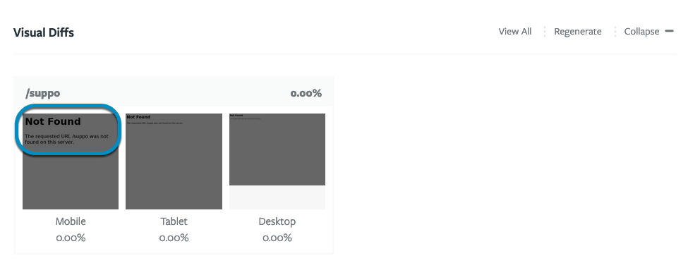

- [A Preview says it is "ready", but shows a blank page](#a-preview-says-it-is-ready-but-shows-a-blank-page)
- [A Preview is pulling the wrong Docker image](#a-preview-is-pulling-the-wrong-docker-image)
- [Something in my Preview isn't right](#something-in-my-preview-isnt-right)
- [Troubleshooting Visual Diffs](#troubleshooting-visual-diffs)

### A Preview says it is "ready", but shows a blank page

When a Preview says it is "ready", that means that it successfully ran the
[commands](../setting-up-services/how-to-set-up-services/index.md#leverage-service-commands-optional)
in your
[configuration file](../setting-up-tugboat/index.md#create-a-tugboat-config-file),
and none of those commands returned an error. It does not necessarily mean that
those commands did what you expected them to do. For example, your configuration
might set up a database, but not provide the correct password to some
application config file. In this case, the Preview would build successfully, but
the application might not load.

To troubleshoot where this might have gone wrong:

1. Double-check the commands in the
   [configuration file](../setting-up-tugboat/index.md#create-a-tugboat-config-file).
2. Check [the Preview's logs](#how-to-check-the-preview-logs) for any clues,
   and.
3. Make use of [Tugboat's terminal access](../tugboat-cli/index.md) to the
   Preview to do the same type of troubleshooting you would do if this happened
   on your local installation.

### A Preview is pulling the wrong Docker image

Have you updated the Docker image you want your Preview to use, but it still
appears to be pulling the old image? There are a couple of things that could be
in play here:

1. [Verify what version of the image you're calling](#verify-what-version-of-the-image-youre-calling)
2. [Not all Preview Actions call the Docker image again](#rebuild-the-preview-from-scratch)

#### Verify what version of the image you're calling

Maybe you thought you had left a version tag off, so you'd be getting the latest
Docker image, but you had actually called a
[specific version of the image](../setting-up-services/service-images/index.md#docker-image-version-tags-primer)
in the config file. (Or vice versa! Maybe your config file calls `latest` or
doesn't specify a version, but you actually need a specific image version.)
First thing's first; double-check whether you're calling a specific version of
the Docker image in your
[config file](../setting-up-tugboat/index.md#create-a-tugboat-config-file), and
update as necessary.

#### Rebuild the Preview from scratch

The more common issue is performing a Preview Action that doesn't actually call
the Docker image specified in your config file.

If you're building a Preview from a PR, and you've got a Base Preview set in
your Tugboat project, the Preview from your PR only executes commands in the
`build` portion of the config file. Your Docker image is pulled before `init`.

For more info, see:
[When does Tugboat pull a Docker image](../setting-up-services/service-images/index.md#when-does-tugboat-pull-a-docker-image),
and
[When does Tugboat update a Docker image?](../setting-up-services/service-images/index.md#when-does-tugboat-update-a-docker-image)

Basically, this means building a Preview from a PR when you're using a Base
Preview will never pull a new Docker image.

The practical fix for this issue is to
[build the Preview from scratch, without using the Base Preview](../building-a-preview/work-with-base-previews/index.md#build-a-preview-with-no-base-preview).
If you want to change the Docker image in your Base Preview, so all new Previews
will build from the new image, you'll need to
[Rebuild](../building-a-preview/work-with-base-previews/index.md#change-a-base-preview)
the Base Preview.

{} If you're using the
[Repository Setting](../setting-up-tugboat/index.md#repository-settings-optional)
to
[Refresh Base Previews Automatically](../setting-up-tugboat/index.md#refresh-base-previews-automatically),
this does _not_ update the Docker images used in your Preview. This only kicks
off a
[Refresh](../building-a-preview/work-with-base-previews/index.md#automatically-refresh-a-base-preview),
which runs config file commands from both `update` and `build`. You need to
manually
[Rebuild a Base Preview](../building-a-preview/work-with-base-previews/index.md#change-a-base-preview)
to pull a new Docker image. {}

### Something in my Preview isn't right

It's possible for a Preview to build, but to be missing something you expect to
see. This is similar to the
["Preview says it is "ready", but shows a blank page"](#a-preview-says-it-is-ready-but-shows-a-blank-page)
issue above; your Preview may not have failed during the build process, but it's
possible something in the configuration file didn't execute as you expected.

To troubleshoot where this might have gone wrong:

1. Double-check the commands in the
   [configuration file](../setting-up-tugboat/index.md#create-a-tugboat-config-file).
2. Check [the Preview's logs](#how-to-check-the-preview-logs) for any clues.
3. Make use of [Tugboat's terminal access](../tugboat-cli/index.md) to the
   Preview to do the same type of troubleshooting you would do if this happened
   on your local installation.

If you can't figure out why something isn't as you expect in your Preview, let
us know! Visit us at [Help and Support](../support/index.md); we're happy to
help.

### Troubleshooting Visual Diffs

- [Visual diffs aren't displaying, or aren't displaying as I expect](#visual-diffs-arent-displaying-or-arent-displaying-as-i-expect)
- [URL not found](#url-not-found)
- [There was a problem generating Visual Diffs for this Preview.](#there-was-a-problem-generating-visual-diffs-for-this-preview)

#### Visual diffs aren't displaying, or aren't displaying as I expect

To configure which pages have visual diffs generated, you need to specify the
relative URLs of the pages in a `visualdiffs` key in the Service definition.
That information should be in the
[config file](../setting-up-tugboat/index.md#create-a-tugboat-config-file) of
the branch or PR that you're building, _not_ the Base Preview.

Some things you might try when troubleshooting a visual diff include:

- Confirm the _relative URL_ is correct;
- Consider overriding the default timeout option;
- Consider overriding the default WaitUntil option.

##### Overriding the default timeout option

```yaml
services:
  apache:
    visualdiffs:
      # Create a visualdiff of /blog, but override the default timeout option
      - url: /blog
        timeout: 10
```

##### Overriding the default waitUntil option

```yaml
services:
  apache:
    visualdiffs:
      # Create a visualdiff of /about, but override the default waitUntil option
      - url: /about
        waitUntil: domcontentloaded
```

If you've verified the relative URLs are correct, and that information is in the
config file of the branch or PR you're building, but you're still not seeing
what you expect to see, reach out to us at
[help and support](../support/index.md) - we're happy to take a look!

#### URL not found

If the URL you use when
[configuring your visual diffs](../visual-diffs/index.md#how-to-configure-visual-diffs)
doesn't match a _relative URL_ in your site, you may see visual diff panes
generate, but with "Not Found" message inside the images. If this happens,
[edit your config file](../setting-up-tugboat/index.md#create-a-tugboat-config-file)
to specify the _relative URLs_ of the pages you want to diff, and then
[Rebuild](../building-a-preview/administer-previews/index.md#rebuild-previews)
the Preview.



#### There was a problem generating Visual Diffs for this preview.

If there's an issue with the way your visual diffs key is configured, you may
get the "There was a problem generating Visual Diffs for this preview" error.
This could be because of the _relative URLs_ in your
[config file](../setting-up-tugboat/index.md#create-a-tugboat-config-file), or
it could be that you need to override
[the default timeout option](#overriding-the-default-timeout-option) or the
[default waitUntil option](#overriding-the-default-waituntil-option). If you've
tried those things, and are still having problems, reach out to us at
[help and support](../support/index.md) - we're happy to take a look!
