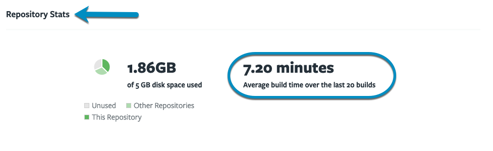

- [Can't build a Preview in the Tugboat UI](#cant-build-a-preview-in-the-tugboat-ui)
- [My Preview Build is stuck at...](#my-preview-build-is-stuck-at)
- [Troubleshooting a Preview Build failure](#troubleshooting-a-preview-build-failure)
- [Previews are not Building automatically](#previews-are-not-building-automatically)

### My Preview Build is stuck at...

Uh oh! Did your Preview Build get stuck?

- [Pending](#pending)
- [Building](#building)
- [Rebuilding](#rebuilding)
- [Refreshing](#refreshing)
- [Canceling](#canceling)

#### Pending

First, give a `pending` Preview Build/Rebuild/Refresh a few minutes. If it's
still not moving on, there are a few things you could do:

- Cancel the action, and then try to start it again;
- If Cancel isn't working in the web interface, you could use the
  [Tugboat CLI](../tugboat-cli/index.md) to cancel the action, and then try to
  start it again.

Give it some time, and if you're still having issues, contact us at
[Help and Support](../support/index.md).

#### Building

Has your Preview been building for a long time? There are a couple of things to
check:

Take a look at your Repository Stats to see how long your average build time is.
If your Preview has been building for less than that time, hang in there; if it
has been in `building` for significantly longer, it might be time to
troubleshoot.

When you're ready to troubleshoot, start by taking a
[look at the Preview's logs](#how-to-check-the-preview-logs). Logs should give
you some insight into where the Preview is in the build process. If you see that
the Preview build isn't progressing, checking out where it got stuck is a great
place to start [debugging the Config file](#debugging-configuration-files) and
figuring out what's causing the Preview build to hang.

If your builds are taking longer than expected, but there isn't an issue in your
config file causing problems, take a look at
[Optimize your Preview builds](../building-a-preview/optimize-preview-builds/index.md)
for a few things you might try:

- [Use Service Commands to create a Base Preview that does the heavy lifting](../building-a-preview/optimize-preview-builds/index.md#use-service-commands-to-create-a-base-preview-that-does-the-heavy-lifting)
- [Use the Auto Refresh Base Preview functionality to update large assets](../building-a-preview/optimize-preview-builds/index.md#use-the-auto-refresh-base-preview-functionality-to-update-large-assets)
- [Optimize Preview size](../building-a-preview/optimize-preview-builds/index.md#optimizing-preview-size)
- [Contact Tugboat support for help optimizing your Config file](../building-a-preview/optimize-preview-builds/index.md#contact-tugboat-support-for-help-optimizing-your-config-file)
- [Upgrade your project tier to a higher-performance tier](../building-a-preview/optimize-preview-builds/index.md#upgrade-your-project-tier-to-a-higher-performance-tier)

#### Rebuilding

Preview hung on `rebuilding`? Take a look at your Repository Stats to see how
long your average build time is. If your Preview has been building for less than
that time, hang in there; if it has been in `rebuilding` for significantly
longer, it might be time to troubleshoot.

When you're ready to troubleshoot, start by taking a
[look at the Preview's logs](#how-to-check-the-preview-logs). Logs should give
you some insight into where the Preview is in the rebuild process. If you see
that the Preview build isn't progressing, checking out where it got stuck is a
great place to start [debugging the Config file](#debugging-configuration-files)
and figuring out what's causing the Preview rebuild to hang.

{} If you're rebuilding a Preview that was generated without a
Base Preview, the rebuild process starts with the commands in `init`. If you're
rebuilding a Preview that was generated from a Base Preview, rebuild starts with
the commands in `build`. Which type of Rebuild you're doing should tell you
where you start looking for problems in the config file - during `init` or
skipping straight to `build` commands. For more info, see:
[The build process: explained](../building-a-preview/how-previews-work/index.md#the-build-process-explained).
{}

If your rebuilds are taking longer than expected, but there isn't an issue in
your config file causing problems, take a look at
[Optimize your Preview builds](../building-a-preview/optimize-preview-builds/index.md)
for a few things you might try:

- [Use Service Commands to create a Base Preview that does the heavy lifting](../building-a-preview/optimize-preview-builds/index.md#use-service-commands-to-create-a-base-preview-that-does-the-heavy-lifting)
- [Use the Auto Refresh Base Preview functionality to update large assets](../building-a-preview/optimize-preview-builds/index.md#use-the-auto-refresh-base-preview-functionality-to-update-large-assets)
- [Optimizing Preview size](../building-a-preview/optimize-preview-builds/index.md#optimizing-preview-size)
- [Contact Tugboat support for help optimizing your Config file](../building-a-preview/optimize-preview-builds/index.md#contact-tugboat-support-for-help-optimizing-your-config-file)
- [Upgrade your project tier to a higher-performance tier](../building-a-preview/optimize-preview-builds/index.md#upgrade-your-project-tier-to-a-higher-performance-tier)

#### Refreshing

Preview hung on `refreshing`? Take a look at your Repository Stats to see how
long your average build time is. If your Preview has been refreshing for less
than that time, hang in there; if it has been in `refreshing` for significantly
longer, it might be time to troubleshoot.

When you're ready to troubleshoot, start by taking a
[look at the Preview's logs](#how-to-check-the-preview-logs). Logs should give
you some insight into where the Preview is in the refresh process. If you see
that the Preview refresh isn't progressing, checking out where it got stuck is a
great place to start [debugging the Config file](#debugging-configuration-files)
and figuring out what's causing the Preview rebuild to hang.

#### Canceling

If you've decided to cancel a Preview Action, but the Preview is stuck on
`canceling`, there are a couple of things you can try:

1. Hang in and wait a bit longer.
2. Try canceling the Preview Action from the Tugboat CLI.
3. If you're still having issues, contact us at
   [Help and Support](../support/index.md).

### Troubleshooting a Preview Build Failure

If your Tugboat Preview has `failed` to build, it's time to take a
[look at the Preview logs](#how-to-check-the-preview-logs). The most common
cause of build failures is when one of the commands in the Tugboat
[configuration file](../setting-up-tugboat/index.md#create-a-tugboat-config-file)
exits with an error. If that is the case, it's time to start
[debugging the configuration file](#debugging-configuration-files).

If you're having problems figuring out why the Preview build `failed`, we're
happy to look into the problem with you to see whether we can help. We've gotten
good at spotting common config file issues, and we're happy to help.
[Let us know](https://tugboat.qa/support).

### Previews are not building automatically

Are you expecting a Preview to build automatically? Only Previews for pull
requests are built automatically. If Previews are not being built from your PRs,
check the
[Repository Settings](../setting-up-tugboat/index.md#repository-settings-optional),
and make sure "Build Pull Requests Automatically" is enabled.

{} The option to "Build Pull Requests Automatically" only
appears if you have linked your Tugboat repository with a git provider
repository via a
[git provider integration](../setting-up-tugboat/index.md#connect-with-your-provider).
If you haven't already connected to a git provider, you'll need to
[set up a git integration](../setting-up-tugboat/index.md#adding-a-link-to-a-git-provider),
and then
[delete the repository](../setting-up-tugboat/index.md#delete-the-repository)
from Tugboat and
[add it back to your project](../setting-up-tugboat/index.md#add-repos-to-the-project)
using the git provider integration. {}
