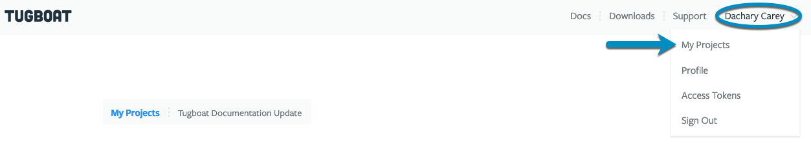

## To change the billing information for your Tugboat project:

1. Go to username -> [My Projects](https://dashboard.tugboat.qa/projects) at the upper-right of the Tugboat dashboard.
2. Select the project where you want to change the billing info.
3. Go to {}Project Settings{}.
4. Scroll down to {}Your Plan{}.
5. Click the {}Billing Information{} link.

From here, you can:

- Edit the email address associated with billing for the Tugboat project
- Edit the payment method
- View or print invoices

{}

Go to username -> [My Projects](https://dashboard.tugboat.qa/projects) at the upper-right of the Tugboat dashboard.

Select the project where you want to change the billing info.

Go to {}Project Settings{}.

Scroll down to {}Your Plan{}.

Click the {}Billing Information{} link.

From here, you can:

- Edit the email address associated with billing for the Tugboat project
- Edit the payment method
- View or print invoices

{}
