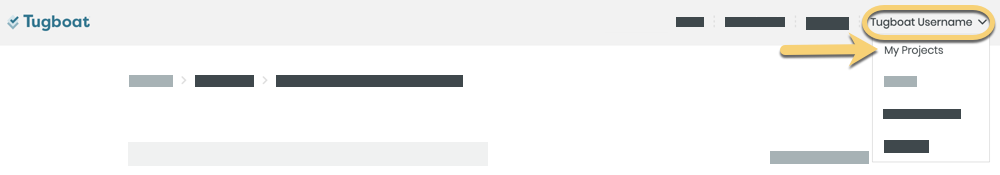
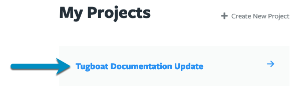

- [How does Tugboat pricing work?](#how-does-tugboat-pricing-work)
  - [Calculating project storage for Tugboat billing](#calculating-project-storage-for-tugboat-billing)
  - [How to view project storage](#how-to-view-project-storage)
- [View Tugboat pricing for your project](#to-view-tugboat-pricing-for-your-project)
- [Tugboat for Enterprise](#tugboat-for-enterprise)

### How does Tugboat pricing work?

Tugboat's pricing isn't based on your account, number of users, or on external
repositories; Tugboat is priced on a per-project basis.

When you
[Create a New Project](../setting-up-tugboat/index.md#create-a-new-project) in
Tugboat, you'll select a plan based on your
[Preview storage](#calculating-project-storage-for-tugboat-billing) and
[build performance](../building-a-preview/optimize-preview-builds/index.md)
needs. You can then
[link as many external repositories](../setting-up-tugboat/index.md#add-repos-to-the-project)
as you'd like to that project, and
[add as many users](../administering-tugboat-crew/index.md#add-a-user-to-a-project)
as you'd like, all under the same plan.

If you later find your project doesn't have enough storage, or your Preview
build performance isn't what you need it to be, you can always
[change your Tugboat project's performance tier](#change-your-tugboat-plan) -
without affecting your other Tugboat projects.

#### Calculating Project storage for Tugboat billing

[Project storage](#how-to-view-project-storage) is calculated by adding the size
of all of the Previews contained in a Tugboat project. This includes any
[Base Previews](../building-a-preview/work-with-base-previews/index.md#how-to-set-a-base-preview),
as well as additional Previews that have been built from the Base Previews.
Tugboat calculates Preview sizes across all repositories contained in a project
when determining project storage, which may be larger than what you see when
you're viewing an individual repository within Tugboat.

{} Curious about why a Preview is larger than your git
repository? The Preview size is the size of the entire container at the end of
the Preview build process. If your Preview build is pulling in large assets,
such as large databases or Service images, your resulting build size includes
those assets - not only the code from your linked git repo. If you want to
reduce your Preview size, take a look at our tips in:
[optimize your Preview builds](../building-a-preview/optimize-preview-builds/index.md).
{}

##### How to view project storage

You can view how much storage you've used by going to your Project Dashboard,
and looking at the Project Stats section:

1. Go to username -> [My Projects](https://dashboard.tugboat.qa/projects) at the
   upper-right of the Tugboat dashboard.
2. Select the project where you want to view disk space used.
3. Scroll down to **Project Stats**.

#### Visual Walkthrough

Go to username -> [My Projects](https://dashboard.tugboat.qa/projects) at the
upper-right of the Tugboat dashboard.

Select the project where you want to view disk space used.

Scroll down to **Project Stats**.

### To view Tugboat pricing for your project:

If you're a current Tugboat user, here's how to view the pricing for your
project:

1. Go to username -> [My Projects](https://dashboard.tugboat.qa/projects) at the
   upper-right of the Tugboat dashboard.
2. Select the project where you want to view and administer billing.
3. Go to **Project Settings**.
4. Scroll down to **Your Plan**.

From here, you'll see the pricing tiers available for your plan. You can
[change performance tiers](#change-your-tugboat-plan), or
[Delete the Project](#delete-your-project) if you're finished using Tugboat for
that project.

If you don't have a Tugboat project, you can view current Tugboat pricing here:
[Pricing](https://tugboat.qa/pricing/).

{} If you're looking for a self-hosted Tugboat, or an
enterprise version of the app, see:
[Tugboat for Enterprise](#tugboat-for-enterprise). {}

#### Visual Walkthrough

Go to username -> [My Projects](https://dashboard.tugboat.qa/projects) at the
upper-right of the Tugboat dashboard.

Select the project where you want to view and administer billing.

Go to **Project Settings**.

Scroll down to **Your Plan**.

### Tugboat for Enterprise

If you need an enterprise or self-hosted version of Tugboat, we've got
[Tugboat for Enterprise](https://tugboat.qa/enterprise/) for you! Tugboat's
enterprise version comes with significantly more Preview storage and RAM, and
can be hosted in Tugboat's Cloud or behind your firewall.

To view pricing and change your Tugboat enterprise plan,
[contact us](mailto:support@tugboat.qa?subject=Enterprise-Plans).
