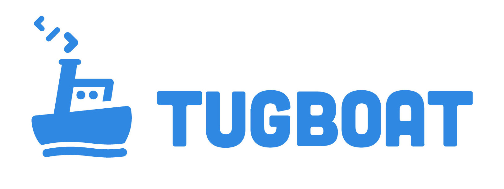

## Getting Started

If you're getting started setting up a new project on Tugboat, please read our
[Getting Started](getting-started/index.md) guide.

## Troubleshooting

If you're having trouble with Tugboat, please take a look at our
[Troubleshooting Guide](troubleshooting/index.md).

If you're still having trouble, please email
[support@tugboat.qa](mailto:support@tugboat.qa).

## Contributing

There is always room for improvement, and we are happy to accept your input. If
you find any typos, or inconstencies to this documentation, or just want to help
make it better, let us know! Email us at
[support@tugboat.qa](mailto:support@tugboat.qa)
