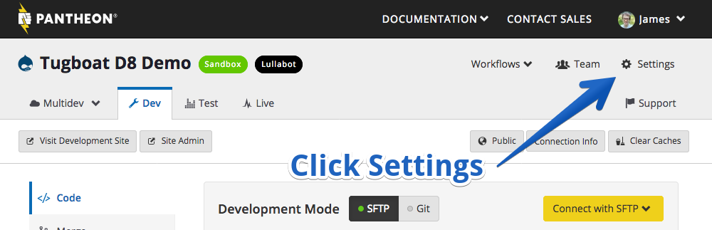
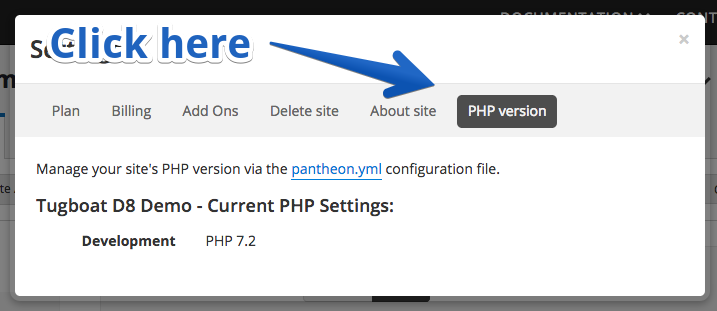

# 2. Add Tugboat Services

Now that we have a project for this Pantheon site, we need to choose the Tugboat
services that we will use. For most Pantheon based sites, you'll want an Apache
webhead with a MySQL database service.

There are several Apache webhead services to choose from, and before we can
determine which will be the best fit for your Pantheon site, you'll need to find
out what version of PHP your Pantheon site is using. To determine this value:

1. Log into the [Pantheon Dashboard](https://dashboard.pantheon.io)
1. Navigate to the project you are trying to connect with Pantheon
1. Click the Settings gear in the upper right

1. Once in Settings, you should see a PHP Version tab to the far right. After
clicking that, you should see the PHP Version.

> #### Warning::Terminus for PHP version
> While in theory you could use the `terminus site:info` command to determine
> the PHP version, we've found that may not give you accurate results. 

Now that we know what PHP version our Pantheon site is using, we can choose the
appropriate Tugboat service when adding our repository to Tugboat. If your
Pantheon site is using PHP 5.x, choose the apache-php-drupal service. If you
are using a 7.x version of PHP, choose the apache-php7-drupal service. Don't
worry if your Pantheon site is using, say 7.2, and not 7.0—we'll update it later
to the correct minor version of PHP as a part of [creating the build script](../add-build-script/index.md).

* apache-php-drupal (comes with php-5.5.x)
* apache-php7-drupal (comes with php-7.0.x)

For the purposes of our example, let's say that our Pantheon site is using PHP
7.2. So we will choose the `apache-php7-drupal` service. 

In addition, a MySQL or MariaDB database service needs to be selected

* mysql (mysql-5.5.x)
* mariadb (mariadb-5.5.x)

If you decide to use the Drupal template instead, the `apache-php7-drupal` and
`mysql` services are automatically selected, so that is what we will use for
this example.

The resulting set of services for the repository should look like the following:

#### Next: [Configure terminus](../configure-terminus/index.md)
