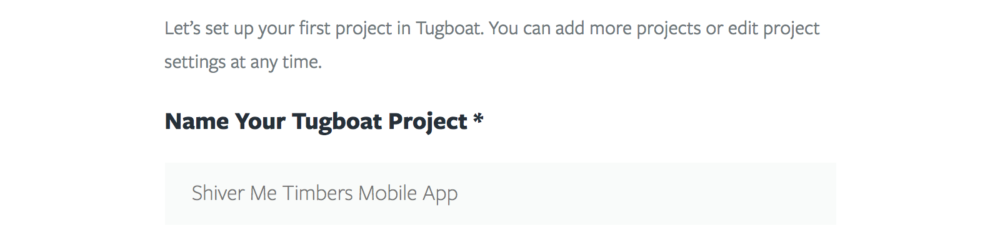

# Create a Project

When authenticating to Tugboat for the first time you will be presented with a
form to create your first Tugboat Project. A Tugboat Project can contain any
number of repositories that you want Tugboat to build previews for, and is tied
to a subscription model (free or premium). Additionally, you can invite users to
join a project. So it's helpful to think about structuring projects based on
these three questions:

1. What repositories are a part of this project? (Often this is just one)
2. Who will I want to be able to access the Tugboat dashboard for those
   repositories?
3. What subscription model will the project need? Or put another way, what sort
   of Tugboat resources do I expect this project to use?

Based on these answers, you may realize that you want to break things up into
more projects, or alternately combine several repositories into a single
project.

Now that you know what your project will consist of, you can give your Tugboat
Project a name.

Then, choose a repository that you want Tugboat to work with. If you choose to
skip this step, repositories can be added later from the [Project
dashboard](../../tugboat-dashboard/projects/index.md).

Tugboat needs to know which services your repository needs in order to run. We
provide a handful of common sets of services as a quick starting point. These
services can be modified later from the [Repository
Settings](../../tugboat-dashboard/repositories/settings/index.md).

Finally, select a pricing tier for your project. Use the feature matrix to
decide which tier best suits your needs. If in doubt, select the Free tier, and
upgrade as needed when you start to run into the limits.

Besides more available disk space, CPU, and memory, the ability to create Base
Previewsis a major bonus to selecting a paid tier. Base Previews allow Tugboat
to speed up build times and significanly reduces the amount of disk space a
given preview occupies.

After completing this form, you will be redirected to either the [Repository
dashboard](../../tugboat-dashboard/repositories/index.md) page or the
[Project dashboard](../../tugboat-dashboard/projects/index.md) page
depending whether you selected a repository. You can always add one or more
Repositories later from the Project Dashboard:

