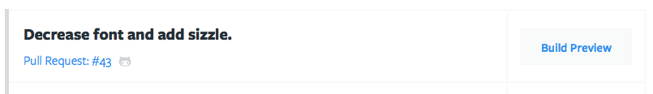

# Debugging Your Build Script

In this section we'll walk through the basic steps of debugging your Build
Script.

> #### Warning::Error: Makefile:x: \**\* missing separator. Stop.
>
> If you see an error like this in your Activity Log, you probably have **spaces
> instead of tabs** in your `Makefile`. Replace the indentation spaces with tabs
> and commit your script again.

## Initial Setup

If you haven't already, create a file named `Makefile` in the root of your Git
repository. Next, choose or create a branch to work within to get your build
script up and running. For some users, this will be the `master` branch, and
others may wish to create a development branch, depending on your
[Git workflow](https://www.atlassian.com/git/tutorials/comparing-workflows).

Once you have an empty Makefile and a branch selected, build a Preview for the
branch in Tugboat by clikcing the **Build Preview** button next to the branch.

The build will most likely not succeed, however now Tugboat has built your
containers enabling you to click into the Preview details landing page. From
there you can read the log files and gain terminal access into your webhead
(where your `Makefile` most likely lives in Tugboat).

## Common Workflow

With this setup out of the way, the common workflow for getting a build script
up and running is as follows:

* Read the log files for clues as to where the build script is failing.
* Open up a terminal and edit your Makefile: `nano /var/lib/tugboat/Makefile`
* Once your build script is working, run a `git diff` or `git diff Makefile` and
  copy those changes back into your repository.
* NOTE: Due to security reasons, you are unable to push changes to your
  repository from within the Preview. You must move your changes into your
  repository using copy/paste.
* Once the new Makefile has been committed to the reposutory, delete the Preview
  and build it again to ensure your project will build successfully.

## Tips

* You can run the Makefile from within the terminal window by calling `make
  tugboat-init` or `make tugboat-build` for instance.
* If there is an error on a given line, copy that command, launch terminal,
  paste it in and run it to get the exact output.
