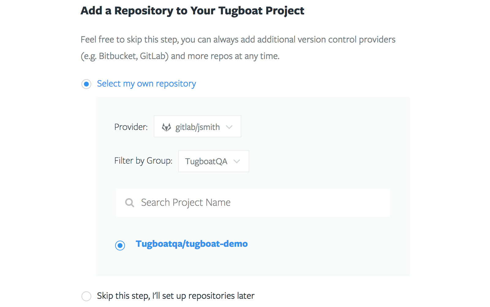
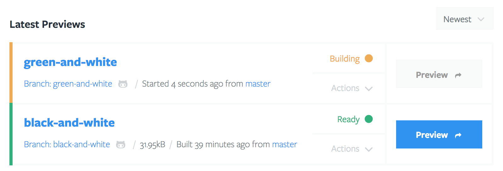

# Repositories

A Tugboat Repository is tied to a Git repository at one of the available git
providers. A repository can contain any number of previews serving the site in
the repository.

## Listing Your Repositories

Repositories are grouped by [Project](../projects/index.md). To see a list of
repositories in the same project, visit that project's dashboard.

## Adding a Repository

Repositories are added from a Project's dashboard. Any number of repositories
can be added to a project. A list of repositories available to you from your
authenticated git provider accounts is provided to select from. Additional
provider accounts can be linked to your tugboat account from your [user
profile](../profile).

## Repository Dashboard

The repository dashboard is where you can manage that repositories previews, see
usage statistics, and access its settings.

### Latest Previews

Latest Previews shows a list of all of the repository previews that Tugboat is
currently keeping track of. From here, you can quickly access the preview site,
perform actions on a preview, or visit the git provider's page that references
what the preview was built from.

### Base Previews

If your project subscription allows access to Base Previews, this is where they
are managed. The primary benefits to using a Base Preview include:

* **Faster Build Times** - A Base Preview provides future previews a starting
  point, so they do not need to build or import everything every time.
* **Reduced Disk Space Requirements** - Previews built from a Base preview only
  use the amount of disk space equal to what changed between it and its Base
  Preview.

See [Base Previews](/base-previews/index.md) for more details.

### Previews Available to Build

Tugboat can build previews from any branch, tag, or pull request in your git
repository. This section is where you can find all of the previews that Tugboat
can build for you. Once built, an available preview in this list moves up to the
Latest Previews section.

## Repository Settings

[Repository Settings](settings/index.md) can be accessed from either the
Repository Dashboard, or from the Project Dashboard where the repository
resides.

