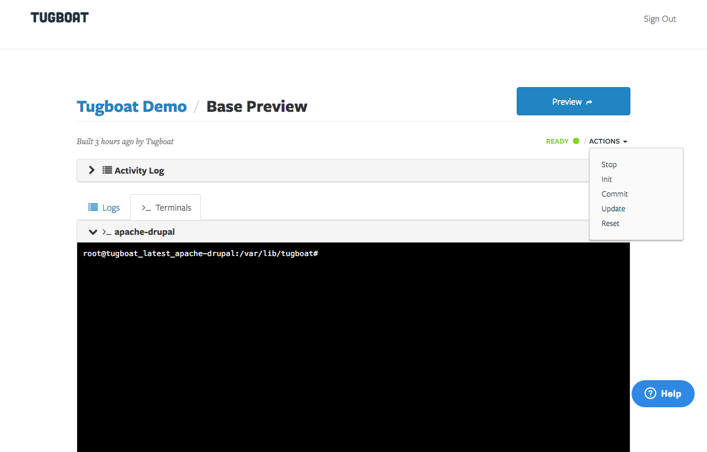

# Import MySQL Database

Open the termiinal to your webhead container from the Base Preview details page


Copy a mysqldump file to the container. This only works as a pull operation.

```sh
scp dev.example.com:database.sql.gz ./
```

Create a database in the mysql container

```sh
mysql -h mysql -u tugboat -ptugboat
create database tugboat;
```

And, import the database

```sh
zcat database.sql.gz | mysql -h mysql -u tugboat -ptugboat tugboat
```

Commit the changes you've just made to the Base Preview so that future builds
will also include those changes.


