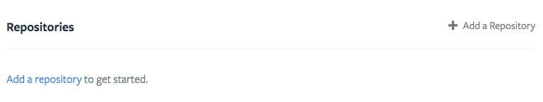

# FAQ

## What technologies can we use with Tugboat?
Tugboat supports pretty much anything that runs on linux. Here is a list of our current containers, 
but if you have a tech stack that needs more, we can add it. Just let us know.
* https://github.com/Lullabot/tugboat-registry

## What kinds of CMSes work on the platform?
We've mainly been using Drupal as the CMS of choice, but Tugboat is platform agnostic. As long as your software can be
built and run on linux, Tugboat can handle it.

## Will it work with Acquia Cloud?
Yes. We've used Tugboat for projects that run on Acquia cloud many times. While Tugboat itself runs on Linode servers,
your production code and database can still live on the Acquia Cloud servers.

## What is a Makefile target?
See [Makefile](/build-script/index.md/#makefile)

## How can I warm the cache of my previews?
You can just add something like this, either to your build script, or as part of the `tugboat-build` 
[Makefile](/build-script/index.md/#makefile) target.
    `curl http://localhost/`

## My environment is failing. What can I do?
See [Troubleshooting](/troubleshooting/index.md).

## How does Tugboat deal with email?
The Docker images from Lullabot's registry are pre-configured to use the host's
MTA using ssmtp. Custom images are encouraged to do the same. The MTA on a Tugboat
host captures all email coming from its Docker containers, and sorts them into
per-environment folders in the tugboat user's inbox. There is also an IMAPs
server running to provide access to these messages.

The credentials for the IMAP connection are stored as tugboat configuration
options named `imap_username` and `imap_password`. When either of these values
change, Tugboat generates a new password file that Dovecot reads for its
authentication. The password is stored in plaintext because it is already
accessible as plaintext through the Tugboat API.

* Host: the server hosting tugboat (example.tugboat.qa)
* Username: the value of the `imap_username` Tugboat configuration.
* Password: the value of the `imap_password` Tugboat configuration.

## How do I add my repository?
There are a few places in which you can add a repository to your tugboat Project. A repository
can be added when you create a new project or added to an existing project by clicking on the 'Add a repository'
link on the dashboard of your project.
 

See our [getting started](/getting-started/index.md) guide for additional information.

## How do I add my database?
A database can be added to your project either by installing it in the same container as your application via your
build script, or by adding it as a service in the repository settings page. Data can be imported as part of the build
script process. If the data resides on a remote server (e.g. not in your repository) each tugboat repository has a generated
SSH key visible in the repository settings. This key can be added to the remote server allowing your tugboat build
script to log in without a password and run whatever command may be necessary to dump/import your data into the database
server your preview will connect to. For an example see the [MySQL import example](/build-script/import_mysql_database.md)
in the examples section.

## What's a Base Preview?
A base preview is a starting point from which other previews are built. It's primary purpose is to speed up the build
time of previews. If your preview takes a long time to initialize but a shorter amount of time to update a base preview
may considerably speed up your builds. As an example if you have a large set of test data which you wish to load you could
see a substantial speed up in build times by creating a base preview in which that data is already loaded. When a new
preview is built, it will start with the base preview and run the tugboat-update target (rather than tugboat-init). See
[tugboat-update](/build-script/index.md/#makefile) in the makefile documentation for more information.

## What's a build script?
A build script (also referred to as a Makefile) is how you customize your tugboat preview.
Previews start as a bare bones Linux installation and a copy of your repository code. Anything you might do to get a 
local development environment up and running is likely something which should be in your build script. 
This might include things like installing dependencies for your application, creating/updating application configuration
files, populating a database with test data, etc. For more information see the [build scripts](/build-scripts/index.md)
section of this documentation.

## How do I build my first preview?
See our [getting started](/getting-started/index.md) guide for a walkthrough which includes
getting [your first preview](/getting-started/your-first-preview.md) up and running.

## Is there a limit to the number of repositories I can have?
There is no hard limit on the number of repositories a project can contain, however resource quotas such as disk space
are per project so this may impact the amount of previews which can be active at one time.

## How many users can I invite?
There is no limit to the number of users you can invite to your project.

## What can project admins do that invited users can't?
Project admins can add new repositories, manage project users and make billing/account tier changes.

## Can I have SSH access?
No, direct SSH access to previews is not provided. However shell access is provided to running previews
via our web shell interface [TuSH](/tugboat-dashboard/preview/dashboard/index.md/#tush).

## Do you provide production level hosting?
No, Tugboat containers are intended to be (relatively) short lived, and don't come with the sort of stability/support
guarantees needed to host a production application. It is also against our [Terms of Service](https://tugboat.qa/terms).

## If master is my Base Preview and I merge a Pull Request into that, will the Base Preview automatically update?
Currently no, you must manually update your base preview with changes are made to it.

## If my base preview is updated, will previews built from it automatically update with those changes?
Currently no, as Base Preview's are not updated automatically, no previews based on them will be updated automatically.

## I don't see a Service for X. Do you support it?
We are adding new services all the time, feel free to [email us](https://tugboat.qa/support) if there's something you'd
like to see supported that currently isn't. For more advanced users it is possible to install any service you might
require in the same container as your application this would require installing and configuring it yourself however. See
[examples](/build-script/examples.md) in the build script documentation.

## What Linux distribution does Tugboat run on? Do you support X?
Our containers are currently built on Ubuntu (14.04). We do not currently support any other Linux distros. 

## Do you support Windows?
Unfortunately no, at this time we do not support windows.

## Which repository providers do you support?
Currently Github, Bitbucket and Gitlab are supported. Self hosted git repositories are available as an option for self
hosted tugboat instances. Is there a provider you'd like to see added? [Contact us](https://tugboat.qa/support) and
we will look into it.

## Do you support self hosted git repositories?
Self hosted git repositories are available as an option for self hosted instances of Tugboat. 
[Contact us](https://tugboat.qa/support) to discuss pricing and setup.

## My Preview status says "Ready", but my Preview shows a blank screen. How do I fix this?
The preview status indicates that the preview built successfully (no errors in the build script). It doesn't necessarily
ensure that your build script is correct. For example your build script might set up a database but not provide
the correct password to some application config file. In this case the preview would build successfully but the
 application might not load. You can use [TuSH](/tugboat-dashboard/preview/dashboard/index.md/#tush) to view application/web server logs
 and diagnose any issues.

## What is the difference between a Project and a Repository?
A project is the "top level" concept in Tugboat. Users, Repositories and Previews belong to specific projects.
A Repository is a mapping to a git repository and is the source from which Previews are made.

## How do I know if I should add a Repository to my Project or start a new Project?
The choice is entirely yours to make, a project may have any number of repositories but keep in mind that disk space
quotas are on the Project level, this would mean that more repositories might create more previews and use more disk
space. It also may make sense to create multiple projects to better organize repositories into logical groups. 
