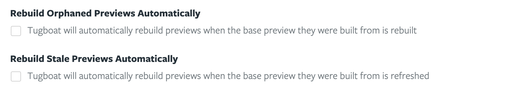

# Frequently Asked Questions

- [What technologies can I use with Tugboat?](#what-technologies-can-i-use-with-tugboat)
- [Does Tugboat work with Acquia Cloud?](#does-tugboat-work-with-acquia-cloud)
- [Does Tugboat work with Pantheon?](#does-tugboat-work-with-pantheon)
- [Do you provide production level hosting?](#do-you-provide-production-level-hosting)
- [Do you support self-hosted git repositories?](#do-you-support-self-hosted-git-repositories)
- [How many repositories can I add to a project?](#how-many-repositories-can-i-add-to-a-project)
- [I don't see a prebuilt service image that I need. Do you support it?](#i-dont-see-a-prebuilt-service-image-that-i-need-do-you-support-it)
- [Can I import an existing database into a preview?](#can-i-import-an-existing-database-into-a-preview)
- [Can I have SSH access to a preview?](#can-i-have-ssh-access-to-a-preview)
- [How does Tugboat deal with sending email?](#how-does-tugboat-deal-with-sending-email)
- [If I merge a pull request into a base preview's branch, will the base preview automatically update?](#if-i-merge-a-pull-request-into-a-base-previews-branch-will-the-base-preview-automatically-update)
- [If a base preview is updated, will previews built from it automatically update with those changes?](#if-a-base-preview-is-updated-will-previews-built-from-it-automatically-update-with-those-changes)
- [Why are Docker volumes not supported on Tugboat?](#why-are-docker-volumes-not-supported-on-tugboat)

---

### What technologies can I use with Tugboat?

Tugboat supports pretty much anything that runs on Linux. Look through our
[prebuilt service images](../reference/services/index.md) to see what we
currently have available. If something that you need is missing, let us know,
and we will work with you to get it added to the list.

### Does Tugboat work with Acquia Cloud?

Yes. Quite a few projects using Acquia Cloud have used Tugboat quite
successfully.

### Does Tugboat work with Pantheon?

Yes. We even have a [tutorial](../tutorials/pantheon/index.md) to show you how.

### Do you provide production level hosting?

No. Tugboat previews are intended to be short-lived, and do not come with the
sort of stability or support guarantees needed to host a production application.

### Do you support self-hosted git repositories?

Yes. You can connect to a generic Git provider from the
[project creation page](https://dashboard2.tugboat.qa/new-project).

### How many repositories can I add to a project?

There is no limit to the number of repositories you can add to a Tugboat
project. Limits are imposed on the number of previews that can be created in a
project at any given time, based on the disk quota of the project and how big
each preview is.

### I don't see a prebuilt service image that I need. Do you support it?

We add new [prebuilt service images](../reference/services/index.md) as users
need them. If there is something you need that we have not yet added,
[let us know](https://tugboat.qa/support), and we will work with you to try to
get it added to the list. Alternatively, you are free to choose a generic
service image, such as `debian` or `ubuntu` and install any packages you might
need.

### Can I use my own images in Tugboat?

We do support pulling Docker images from any registry that is
internet-accessible. If your registry requires authentication, you can set that
up in your Tugboat repository settings.

There are a couple of caveats to using your own images:

1. We do not support images that
   [define volumes](#why-are-docker-volumes-not-supported-on-tugboat)
2. We assume `sh` is available in the path, because Tugboat executes commands
   directly in the container with it
3. If you want your git repository cloned to your service container, we assume
   `git` is available

### Can I import an existing database into a preview?

Yes. In order seed a database, you will need to be able to access a copy of it
from your Tugboat previews. We generally recommend using SSH, but you could
accomplish this however works for you. We generate unique SSH keys for each
repository that is linked to Tugboat, which you can use to safely access remote
assets. See [this example](../examples/import-mysql-database/index.md) for how
you might do this with MySQL.

### Can I have SSH access to a preview?

No. Direct SSH access to a preview is not possible. However, shell access is
provided in both the web interface and the
[command line tool](../advanced/cli/index.md).

### How does Tugboat deal with sending email?

Tugboat makes a best effort to capture outbound email. Using the local
`sendmail` or the SMTP server at `$TUGBOAT_SMTP` will result in email being
captured by Tugboat. These captured emails are only saved for as long as the
Preview that sent them exists.

Tugboat does not attempt to capture any other outbound SMTP server connections,
so if you are concerned with sending emails to customers from a QA environment,
be sure to update your application configuration to use Tugboat's SMTP server.

### If I merge a pull request into a base preview's branch, will the base preview automatically update?

Yes. Base previews are automatically updated daily at 12am ET. This frequency
and time of day can be changed in a repository's settings. It can also be
disabled if you prefer to update your base preview manually.

### If a base preview is updated, will previews built from it automatically update with those changes?

By default, no. However, there are two repo configuration options that will
enable this functionality.

### Why are Docker volumes not supported on Tugboat?

Tugboat has a concept of [Base Previews](../concepts/base-previews/index.md).
Base Previews provide Tugboat with a starting point, from where it can build new
previews. The advantage of Base Previews is they drastically reduce preview
build times as well as the amount of space a preview occupies on disk. This is
because under the hood Tugboat is committing the entire state of the container
(including files, databases, etc), so all the new Preview needs to do is run the
build steps without importing a database or other required assets.

If you'd like to use your own Docker images, here's the repo we use to make an
image Tugboat compatible: https://github.com/TugboatQA/images
