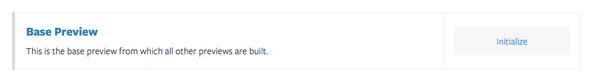
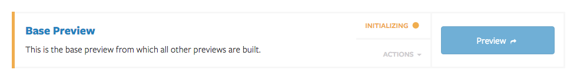
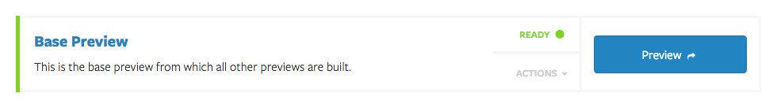
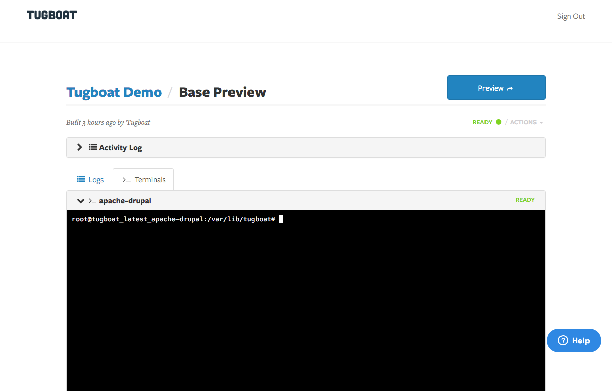

# Base Preview Setup

The Base Preview is the preview that Tugboat uses to build all of its other
previews. In order for Tugboat to be successful, this preview needs to be in
working order.

## Initialize

The Base Preview can be found on the Project Settings page.

Click the Initialize button, and wait for Tugboat to finish creating your Base
Preview.

If all goes well, your Base Preview should be ready in a few short minutes.

If the Base Preview fails to initialize, go back and double check your
[Tugboat Configuration](tugboat-configuration.md)

## Customize

Chances are, you will need to do some amount of customization in order to get
your Base Preview up and running correctly. Whether that means running a build
script to compile some Sass or importing a database.

To make your customizations, go to the Base Preview details page, and open a
terminal to your Webhead container (it will always be the container on the top)

From here you have root access to your base preview, so you can configure or
install anything you need. Anything you do here will be cloned into every other
preview that is built.

All of the images provided by Tugboat are based on Ubuntu 14.04.

Due to Tugboat's network configuration, any other assets that need to be copied
to your Base Preview, such as a database dump, or a set of static files, need to
be pulled from the preview. There is no way to remotely copy anything directly
to a Tugboat preview.

You can put these assets at a publicly available URL and get them with wget or
curl, or you can use scp. An SSH keypair is generated during initialization, and
can be found in /root/.ssh

## Commit

Once your Base Preview is running smoothly, you need to commit it, so Tugboat
can use it for building future previews. Committing the Base Preview simply
takes snapshot of what is currently running, and stores it as an image for quick
cloning.

Select Commit from the Actions menu to start the commit process.

### Pro-Tip:

If you installed any packages during your customization, you can save a bunch
of disk space by clearing the apt cache and tmp folders before committing. To do
so, run the following from the webhead terminal before committing

    apt-get clean && rm -rf /var/lib/apt/lists/* /tmp/* /var/tmp/*
