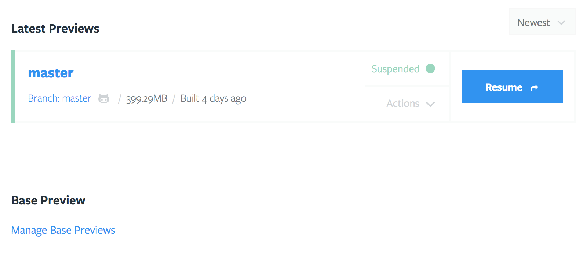

# Base Previews (Optional)

Briefly, Base Previews provide Tugboat with a starting point, from where it can build new Previews. The advantage of Base Previews is they drastically reduce Preview build times as well as the amount of space a Preview occupies on disk.

## How Base Previews Work

When a regular Preview is built, the [build script](/build-script/index.md) will often be used to pull in a database, image files, or other assets. This process can take a while. When the Preview has finished building, Tugboat takes a point-in-time snapshot of its disk image, so that it has a point of reference of where it can do things like let you quickly reset a Preview back to its original build state. It can also leverage this snapshot to create a Base Preview if instructed. 

When you flag a Preview as a Base Preview, then the Base Preview is automatically used as a starting point for all newly created Previews. None of the new Previews need to re-download a copy of your database, image files, or other assets. Base Previews reduce the amount of time required to generate a working Preview.

Another benefit of using a Base Preview is that any Previews built from it use considerably less disk space, allowing you to stretch your disk quota
significantly. Tugboat accomplishes this by only storing a binary difference
between the Base Preview and the new Preview. The new Preview only uses whatever space it needs that differs from its Base Preview. Often, this means a Base Preview might use 2-3GB of space, and a Preview built from it might only use 100-200MB.

## How to use a Base Preview

To create a Base Preview, choose a Preview that you want to use. The selected Preview is typically built from the `master` branch, or whichever branch in your repo corresponds with what you release to production. You will find the `Manage Base Previews` link on your [Repository Dashboard](/tugboat-dashboard/repositories/index.md).

From there, select the Preview you want to use as a Base Preview.

That Preview will be moved to the "Base Preview" section of the
Repository Dashboard.

That's it! From now on, new Previews will build from the image created when the Base Preview was built.

## Keeping Base Previews Updated

You will generally want to keep your Base Preview up to date with your latest codebase, and a fresh copy of your database, image files, and other assets. By default, Tugboat does this every night at 12 am ET. To change this, check the Repository Settings.

Tugboat performs the update by pulling the latest code from git for the branch or Tag the Preview was built from.  During the update, Tugboat calls the `tugboat-update` target of your [build script](/build-script/index.md). 

## Advanced Use Cases

Tugboat allows multiple Base Previews to be defined. The effect of doing this is that every Preview will generate the corresponding number of Base Preview derivatives. So, if you have three Base Previews defined, and submit a pull request for Tugboat to build a Preview, you will end up with three Previews for that pull request, each starting from a different Base Preview.

This feature allows you to test code, for instance, against different PHP versions, database content, etc.
