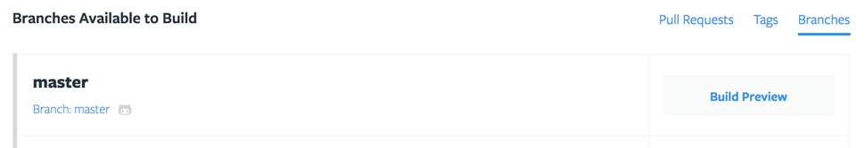
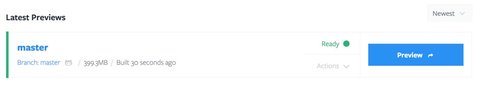
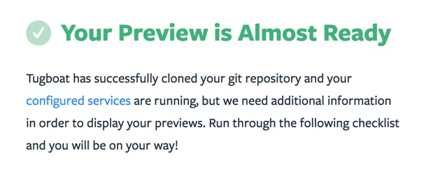
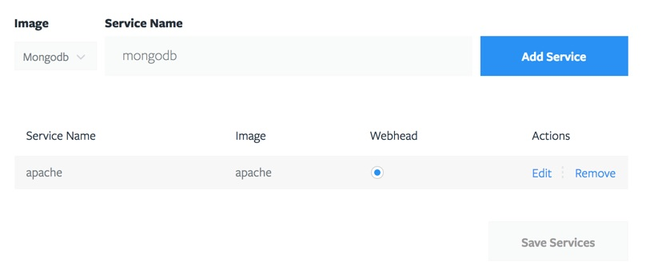

# Create a Preview

After creating a project and adding a repository, you are ready to start
building previews. A preview can be created from any Branch, Tag, or Pull
Request in the git repository. A good place to start is usually to build the
`master` branch, or maybe a development branch. From the [Repository
Dashboard](../tugboat-dashboard/repository/dashboard/index.md), click the
*Branches* tab, then click the *Build Preview* button next to the branch you
want to build.



When the preview finishes building, it will look like the following. Click the
*Preview* button to view the preview site.



Unless the repository is already set up to work with Tugboat, there's a good
chance you'll see a page with the following heading:



This means that Tugboat has deployed your code, but is missing some additional
information in order to make the site work correctly. The page you see provides
more information, but the two most common causes for this are

* The repository does not have any services configured Tugboat is unable to find
* your content

First, check the [Repository
Settings](../tugboat-dashboard/repository/settings/index.md) and verify that at
least one service is configured. A simple static site probably only needs a
simple web server like Apache or Nginx, but more advanced sites will likely
require additional services like MySQL, Redis, or CouchDB.

Next, make sure that the service serving your web content selected as the
"Webhead". This will usually be Apache or Nginx, but can be any service as long
as Tugboat can forward HTTP requests to it.



Finally, a [Build Script](../build-script/index.md) will likely be required to
put the finishing touches on letting Tugboat know how to access your site. Even
simple static HTML sites will likely need this to point Tugboat at the right
document root location.

Check the [Build Script](../build-script/index.md) documentation for more
details, but a simple build script is a file named `Makefile` in the root of
your git repository with the following content to link Tugboat to the right
document root

```
tugboat-init:
    ln -sf ${TUGBOAT_ROOT}/public_html /var/www/html
```

Check out our [Guides](guides/index.md) for more detailed information about
specific types of sites and how to set them up with Tugboat.
