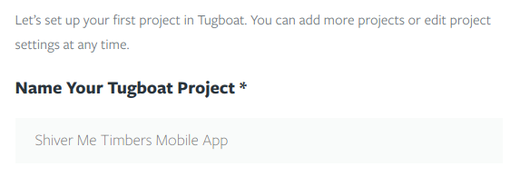
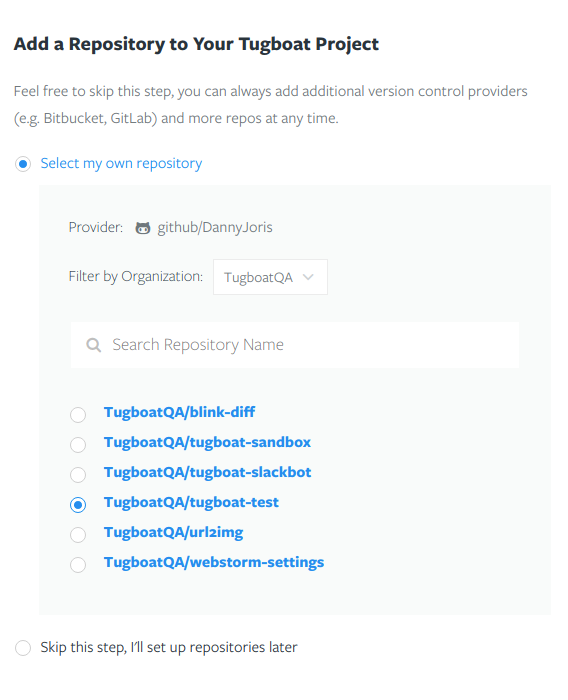
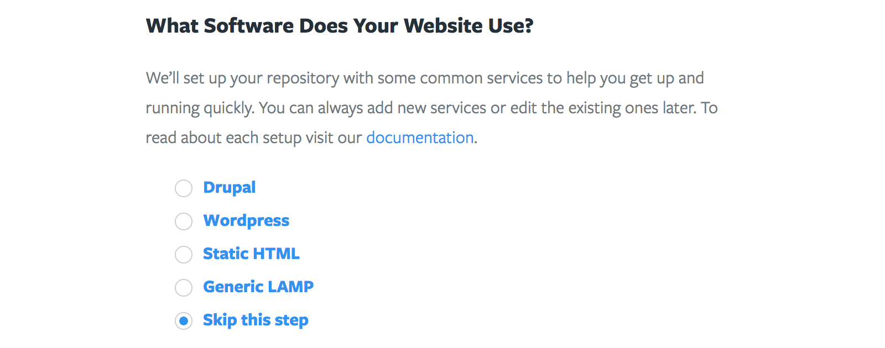
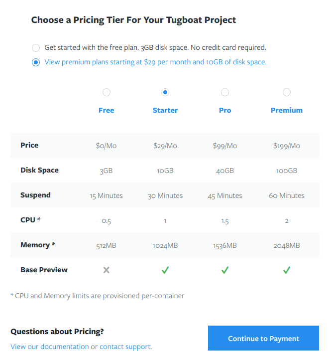

# Create a Project

When authenticating to Tugboat for the first time you will be presented with a
form to create your first Tugboat Project. To start, give your Tugboat Project a
name.

If you have a single repository you'd like to wire up with Tugboat, you can name
your Tugboat project after that repository. If it's more complicated than that,
read about [structuring Tugboat projects](structuring-projects/index.md).

After choosing a name, select the repository that you want Tugboat to work with.
If you choose to skip this step, repositories can be added later from the
[Project dashboard](../../dashboard/projects/index.md).

Tugboat needs to know which services your repository needs in order to run. We
provide a handful of common sets of services as a quick starting point. These
services can be modified later from the
[Repository Settings](../../dashboard/repositories/settings/index.md).

Finally, select a pricing tier for your project. Use the feature matrix to
decide which tier best suits your needs. If in doubt, select the Free tier, and
upgrade as needed when you start to run into the limits. Paid plans give you
more available disk space, CPU, and memory to generate Previews.

After completing this form, you will be redirected to either the
[Repository dashboard](../../dashboard/repositories/index.md) page or the
[Project dashboard](../../dashboard/projects/index.md) page depending on whether
you selected a repository. You can always more Repositories later from the
Project Dashboard:

