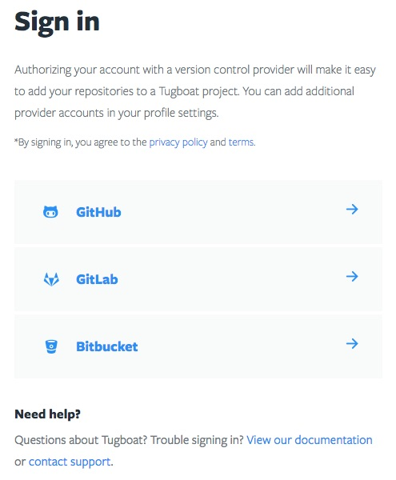
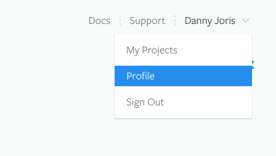

# Create a Tugboat Account

Creating a Tugboat account is done simply by authenticating with your Git hosting account. Authenticating this way allows Tugboat to build previews for any repository your account has access to. You can always authenticate to additional Git providers in your Tugboat profile settings.

## Sign in

## Authenticate Additional Git Providers (optional)

Authenticating additional Git providers is completely optional, but to do so navigate to your user profile when logged in.

In your user profile, the *Connected Accounts* section lists the Git providers your Tugboat account is connected to. Here you can connect or disconnect Git providers. When adding Repositories to your project you will have access to choose from any repository you have access to in these accounts. You connect to Github, Bitbucket or Gitlab, or multiple accounts from the same Git provider.

