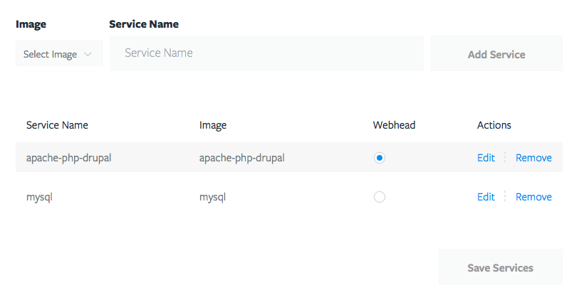

# Drupal

These instructions show how to configure Tugboat for a typical Drupal 7 or
Drupal 8 repository. Every Drupal site tends to have slightly different
requirements, so further customizations may be required. This should get you
started, though.

## Services

In order to serve a Drupal site, an apache webhead with PHP needs to be
selected. Tugboat provides services that also include Drush, which is commonly
required for server-side scripting. Both Drupal 7 and Drupal 8 work with PHP
5.5.9, so we will use that for this example.

In addition, a MySQL or MariaDB database service needs to be selected.



## Drupal Configuration

A common practice for managing Drupal's `settings.php` is to leave sensitive
information, such as database credentials, out of it and commit it to git. Then,
the sensitive information is loaded from a `settings.local.php` file that exists
only on the Drupal installation location.

This pattern works very well with Tugboat. It lets you keep a tugboat-specific
set of configurations in your repository where you can just copy it into place
with a build script.

For Drupal 7, add the following to the end of `settings.php`

```php
if (file_exists(DRUPAL_ROOT . '/' . conf_path() . '/settings.local.php')) {
  include DRUPAL_ROOT . '/' . conf_path() . '/settings.local.php';
}
```

For Drupal 8, add/uncomment the following at the end of `settings.php`

```php
if (file_exists($app_root . '/' . $site_path . '/settings.local.php')) {
  include $app_root . '/' . $site_path . '/settings.local.php';
}
```

## Build Script