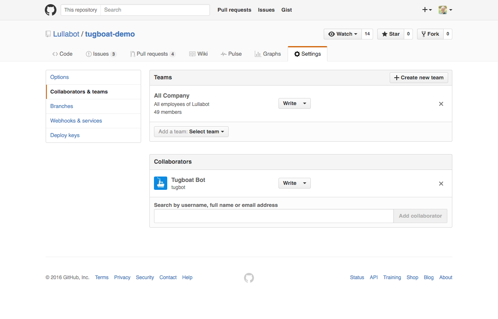
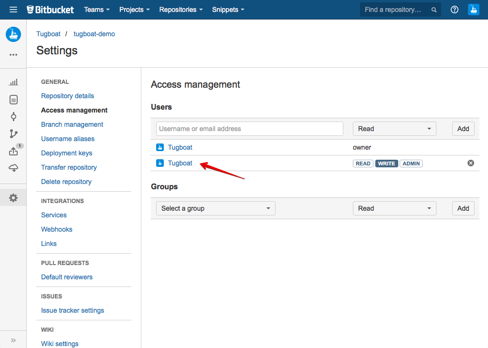

# Provider Access

In order for Tugboat to interact with your project, an account at your service
provider (GitHub, Bitbucket, etc) needs to be set up for Tugboat. The Tugboat
team will provide a dedicated, pre-configured account for you after signing up.
You will need to grant that account access to your project.

## GitHub

In your project settings, under "Collaborators & teams", add the user as a
collaborator. The user needs Write permissions, which is the default. The end
result should look like this

## Bitbucket

In your project settings, under "Access management", add the user. The user
needs Write access. The end result should look like this

