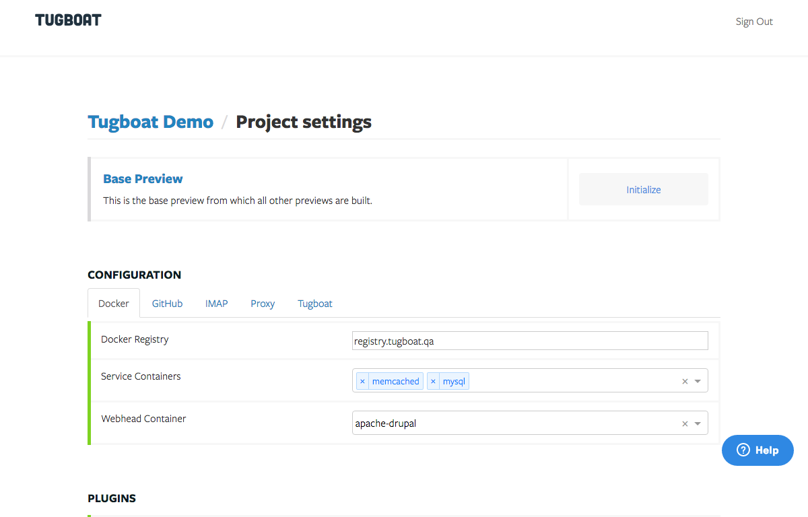
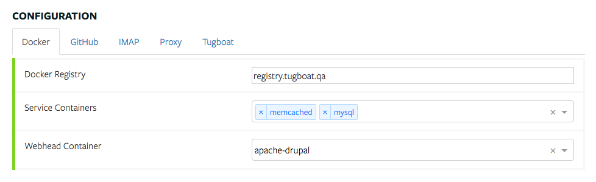
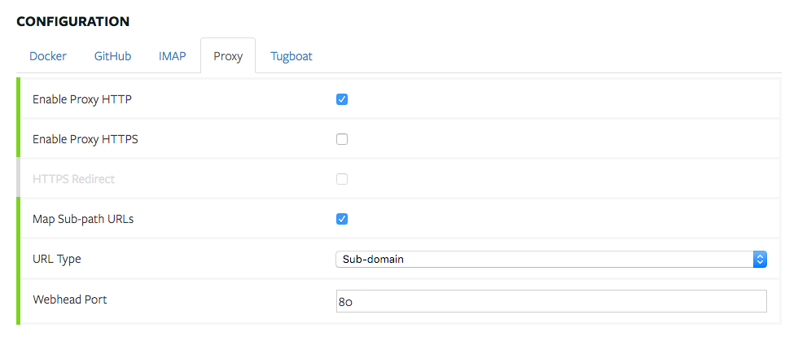

# Configure Tugboat

## Sign in to the Dashboard

The Tugboat Dashboard is located at https://dashboard.tugboat.qa. The first time
you log in, your account will be configured to access any Tugboat projects to
which have access through the service provider you authenticated with.
Select your new project, and click on "Project Settings" at the top. Here you
will find all of the configuration options for your project.

## Select your containers

The first configuration tab that you see is labeled "Docker". This is where you
tell Tugboat which containers your project needs. By default, Tugboat will pull
the Docker images for these containers from its own Docker registry
(registry.tugboat.qa). This is recommended for most projects.

### Webhead Container (required)

The Webhead Container is where your application actually lives, and is also
where it is served from. It is also where all build operations take place,
including any custom scripting. Because Tugboat only works with HTTP
applications, you should choose one of the apache or nodejs containers

### Service Containers (optional)

Service Containers are for any additional services that your application may
need. This commonly includes things like MySQL, MongoDB, Redis, etc. Think of
service containers as external servers that your application can connect to.

## Configure your Proxy

The Proxy tab is where you can configure how Tugboat routes HTTP requests to
each preview. Some settings here also influence how links to each preview are
structured.

### Enable Proxy HTTP/HTTPS

These options configure Tugboat to generate links using http:// and/or https://.
The default setting is to only generate http:// links, which will always work,
but are not secure.

Enabling the HTTPS proxy brings along a few caveats. Tugboat provides a wildcard
certificate for \*.tugboat.qa, which is used by default, and is free to use by
any Tugboat client. The catch is, that if you also use a Sub-domain URL Type
(see below), every preview will present a certificate warning because of a name
mismatch.

There are three workarounds for this problem.

1. Use a Sub-path URL Type (see below)

2. Provide us with a wildcard certificate for either the tugboat.qa subdomain
   assigned to your project, or to a subdomain that you control. We can adjust
   your Tugboat's configuration to use this certificate.

3. Just deal with the warnings, and click through them. Yes, this is annoying,
   but the connection is still encrypted, and it saves you the expense of a
   dedicated wildcard certificate.

We have plans to integrate Tugboat with [Let's Encrypt](https://letsencrypt.org)
which will eliminate the need for these workarounds.

### HTTPS Redirect

If both "Enable Proxy HTTP" and "Enable Proxy HTTPS" are enabled, this option
allows you to force a redirect from the HTTP proxy to the HTTPS proxy. In other
words, if you visit one of your previews using http://, Tugboat automatically
redirects you to https://

### URL Type

This option determines how the links to your previews are generated. There are
two options, Sub-domain and Sub-path.

#### Sub-domain

The default Sub-domain option should work for most projects. It can cause
problems with the HTTPS proxy (see above). It can also cause problems for
applications that use OAuth authentication, because the domain for each preview
is unique.

#### Sub-path

The Sub-path option puts every preview in a sub-path of the tugboat.qa subdomain
assigned to your project. For example, if your project was assigned the
subdomain of example.tugboat.qa, choosing "Sub-path" here would result in links
that look like http://example.tugboat.qa/pr1234-29375729du198bc.

Some applications (like Drupal) do not work well in sub-paths without extra
configuration. So, keep that in mind if you decide to try this option.

### Map Sub-path URLs

When using a Sub-path URL Type (above), this setting changes how the Tugboat
proxy forwards requests to your application. When this option is enabled,
requests for a preview are mapped to /. For example, a request for
http://example.tugboat.qa/pr1234-29375729du198bc/something would look like a
request for /something to your application.

When this option is disabled, requests are passed through as-is.

### Webhead Port

This is the port that your application is listening on in your webhead
container. Unless you are running a custom application listening on a
non-standard port, the default port 80 is probably what you want.
