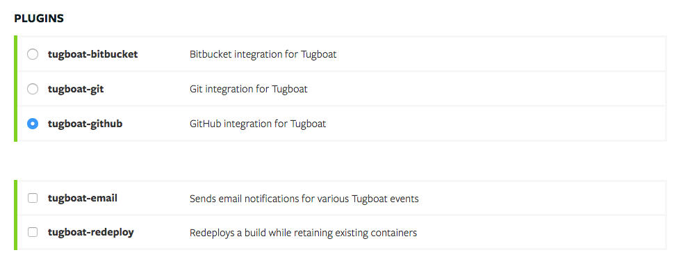

# Plugins

Tugboat provides a flexible plugin system. This allows Tugboat's normal workflow
to be modified. There are a handful of plugins available out of the box, which
can be seen on a project's setting page.

