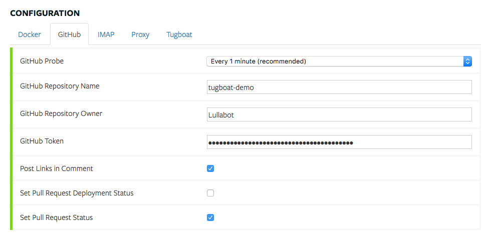
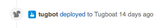
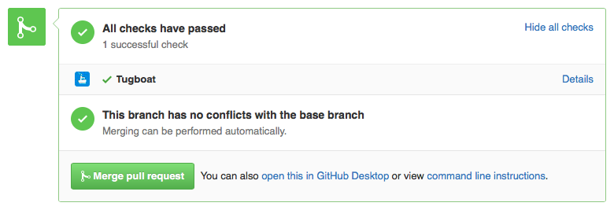

# GitHub

The GitHub plugin provides Tugboat integration with GitHub.

## Configuration

Enabling the GitHub plugin presents a GitHub tab in the project configuration.

### GitHub Repository Owner (required)

The owner of the project repository. For example, the owner of
https://github.com/Lullabot/tugboat-demo is "Lullabot"

### GitHub Repository Name (required)

The project repository. For example, the repo for
https://github.com/Lullabot/tugboat-demo is "tugboat-demo"

### GitHub Token (required)

The access token for an account that has access to the repository. Tugboat uses
this access token to interact with the GitHub API. Tokens can be generated at
https://github.com/settings/tokens, and in order to work properly with Tugboat
must have "repo" permissions.

### GitHub Probe

How often Tugboat probes GitHub for new Pull Request information. The
recommended interval is 60 seconds.

GitHub imposes a rate limit of 5,000 requests per hour
(https://developer.github.com/v3/#rate-limiting). Setting the probe interval to
the minimum 10 seconds uses 360 API requests per hour, which leaves plenty of
available requests for normal operation, but also adds additional load to your
Tugboat server that could be better utilized for building previews.

### Post Links in Comment

If this option is enabled, Tugboat posts a comment to a preview's pull request
when the preview is ready. This comment includes links to the preview.

### Set Pull Request Deployment Status

If this option is enabled, Tugboat uses GitHub's Deployment API, which posts
permanent events in a pull requests timeline that look like this

### Set Pull Request Status

If this option is enabled, Tugboat uses GitHub's Status API. The Status API is
a convenient way of seeing whether Tugboat is building a preview for a pull
request, and whether or not it was successful.

