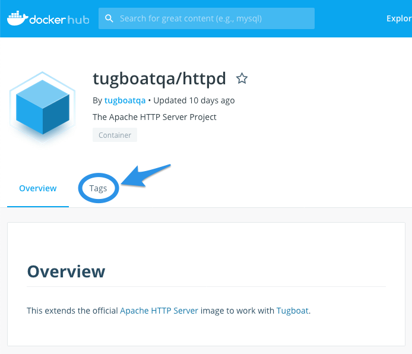

# Setting up Services in your Tugboat

First thing's first:
[in the context of Tugboat, what are Services, exactly?](#what-are-tugboat-services)

Once you understand that, take a look at:

**How to set up Services in Tugboat:**

1. [Name your Service](#name-your-service)
2. [Specify a Service image](#specify-a-service-image)
3. [Define a default Service](#define-a-default-service)
4. [Expose a Service HTTP Port](#expose-a-service-http-port)
5. [Set the Document Root Path](#set-the-document-root-path)

**Services options and reference**

- [Cloning Git repositories into your Services](#cloning-git-repositories-into-your-services)
- [Service Commands](#service-commands)
- [Running a Background Process](#running-a-background-process)
- [Service Attributes](#service-attributes)
- [Tugboat's Prebuilt Service images](#prebuilt-service-images)
- [Environment Variables](#environment-variables)
- [Custom Environment Variables](#custom-environment-variables)

Want to see an example of what Services might look like for your site? Take a
look at: [Services in action](#services-in-action).

## What are Tugboat Services?

A Tugboat Service plays the role of what a server might provide in a production
environment. A service can be a web server, a database server, a cache store,
etc. Services form the core of your
[Config file](../setting-up-tugboat/index.md#create-a-tugboat-config-file),
working together to build a [Preview](../building-a-preview/index.md).

Under the cover, Tugboat Services are Docker images. This tech gives you some
powerful functionality in building your services - i.e. specifying a specific
PHP version when serving Drupal sites, or using an image to mirror your
production services. For more info, check out:
[Specify a Service image](#specify-a-service-image).

For an example of what Services might look like in your site, check out:
[Services in action](#services-in-action).

## How to set up Services in Tugboat

1. [Name your Service](#name-your-service)
2. [Specify a Service image](#specify-a-service-image)
3. [Define a default Service](#define-a-default-service)
4. [Expose a Service HTTP Port](#expose-a-service-http-port)
5. [Set the Document Root Path](#set-the-document-root-path)

### Name your Service

The top level of your
[Config file](../setting-up-tugboat/index.md#create-a-tugboat-config-file) is a
`services` key whose value is a list of Services.

```yaml
services:
  service1:
  service2:
  service3:
```

Service names are arbitrary, but they act as the internal host name for the
Service. This is the name other Services in the Preview would use to refer to
the Service. As a result, there are a few rules you must observe when naming
Services:

- Service names may only include the characters `a-z`, `0-9`, and `-`.
- Service names are limited to 39 characters.

As an example, a set of Services that serve a PHP-based site with a MySQL
database and a Redis cache might be:

```yaml
services:
  apache:
  mysql:
  redis:
```

After you name the Service, you'll need to
[specify a Service image](#specify-a-service-image).

### Specify a Service image

Because Tugboat uses Docker under the hood, every Service in your config file
must use a
[valid Docker image address](https://docs.docker.com/engine/reference/commandline/pull/).

Here's what you need to know about working with Service images in Tugboat:

- [How to call a Service image from Docker Hub](#how-to-call-a-service-image-from-docker-hub)
- [Using Tugboat's prebuilt Docker images](#tugboats-prebuilt-docker-images)
- [Using Third-party Docker images](#third-party-docker-images)
- [Bring your own Docker image from another registry](#bring-your-own-docker-image-from-another-registry)
- [Using a Docker image to mirror your production services](#using-a-docker-image-to-mirror-your-production-services)
- [When does an image get pulled or updated?](#when-does-an-image-get-pulled-or-updated)

> #### Info::New to Docker images?
>
> Tugboat has abstracted away some of the technical aspects of working with
> Docker images, but if you're new to Docker, and want to understand more about
> Docker images,
> [check out Docker's documentation](https://docs.docker.com/v17.09/engine/userguide/storagedriver/imagesandcontainers/).

#### How to call a Service image from Docker Hub

Tugboat's default image registry is [Docker Hub](https://hub.docker.com/). When
you use an `image` key in the Service definition, Tugboat pulls the
corresponding image from Docker Hub.

- If you want to call a service image from another registry, see:
  [Bring your own Docker image from another registry](#bring-your-own-docker-image-from-another-registry).
- If you need to authenticate with Docker Hub to access an image contained in a
  private Docker repository, see:
  [Repository Settings -> Authenticate with a Docker Registry](../setting-up-tugboat/index.md#authenticate-with-a-docker-registry).

To call a Service image from Docker Hub, specify an `image` key in the Service
definition.

For example:

```yaml
services:
  apache:
    image: tugboatqa/httpd:2.4
  msyql:
    image: tugboatqa/mysql:5.6
```

To dissect the key value in our Apache image key example above, we're calling:

`tugboatqa` : Profile of the image provider on Docker Hub; in this case, it's
[TugboatQA](https://hub.docker.com/u/tugboatqa), the organization.  
`httpd` : This is the specific image we're calling; in this case, it's Tugboat's
version of the [Apache HTTP Server](https://hub.docker.com/r/tugboatqa/httpd).  
`2.4` : **OPTIONAL** version tag; in this case, we're calling for the specific
2.4 version of Tugboat's Apache HTTP server image. If you browse to Docker Hub's
[Tags page](https://hub.docker.com/r/tugboatqa/httpd/tags) for this image, you
can see a list of all the version tags available for Tugboat's Apache HTTP
Server image.

##### Image version tags

Use tags to indicate specific versions of an image, if needed. In
[our example above](#how-to-call-a-service-image-from-docker-hub), you'll note
versions `2.4` or `5.6` for the `httpd` and `mysql` images.

You can specify version tags in a few different ways:

- [Point-release version tags](#point-release-version-tags)
- [Major version tags](#major-version-tags)
- [Latest version tags](#latest-version-tags)

> #### Note:: You don't have to specify a version tag
>
> If you don't need a specific version of a Service image, you can leave the tag
> off the image call. When you don't specify a tag, you'll get the latest
> version of that image.

If you're not sure which version tag to use, you can always browse to the
service image on [Docker Hub](https://hub.docker.com/) and check out what tags
are available.



###### Point-release version tags:

Using specific version tags helps prevent breaking changes that come along with
incremental updates. In our example above, we've called `tugboatqa/mysql:5.6`
instead of `tugboatqa/mysql:5`.

###### Major version tags

If you want to make sure you're using a specific major version, but don't care
about point releases, specify something like `tugboatqa/node:8` to ensure you
always use the latest available minor release of node 8.x.

###### Latest version tags

In some cases, you're less likely to be worried about a specific version; for
example, it may not matter which version of memcached you use.

When you don't need to call for a specific version of a Service, using just the
image name without a tag (`tugboatqa/memcached`), or the `latest` tag
(`tugboatqa/memcached:latest`) will get you the most recent version of a Service
image.

#### Tugboat's prebuilt Docker images

Tugboat maintains several [prebuilt Docker images](#prebuilt-service-images).
These images are extensions of
[official Docker images](https://docs.docker.com/docker-hub/official_repos/)
that include tools and configurations that help them work well with Tugboat.

For a complete list of Tugboat's images and tags, find us on
[Docker Hub](https://hub.docker.com/u/tugboatqa/).

You can check out the scripts we used to create these images on
[GitHub](https://github.com/TugboatQA/images).

> #### Note::I don't see a Service image that I need...
>
> We add new [prebuilt service images](#prebuilt-service-images) as users need
> them. If there is something you need that we have not yet added,
> [let us know](https://tugboat.qa/support), and we will work with you to try to
> get it added to the list. Alternatively, you are free to choose a generic
> service image, such as `debian` or `ubuntu` and install any packages you might
> need.

#### Third-party Docker images

Theoretically, you can use any publicly available Docker image in your Tugboat
build. However, you may run into a limitation that can make third-party Docker
images problematic: Tugboat will not create a Service from an image that defines
any VOLUMES. For that reason, we recommend sticking with the images built
specifically for use with Tugboat.

If you'd like to use your own Docker images, this repo contains the scripts we
use to make an image Tugboat compatible: <https://github.com/TugboatQA/images>

> #### Info:: Why are Docker volumes not supported on Tugboat?
>
> Under the hood, Tugboat commits the entire state of the container (including
> files, databases, etc) to optimize Preview builds. This means that when
> building from a Base Preview, all the new Preview needs to do is run the
> `build` steps without importing a database or other required assets. (For more
> info, take a look at:
> [the build process: explained.](../building-a-preview/index.md#the-build-process-explained))
>
> Because of this, the concept of Docker volumes doesn’t really mesh with the
> way Tugboat uses images.

#### Bring your own Docker Image from another registry

If you want to use a Docker image from another registry, it's easy to do; you
just have to specify the alternate registry, since Tugboat pulls from Docker Hub
by default.

For a full breakdown of how to pull from a different registry, check out
Docker's Docs:
[Pull from a different registry](https://docs.docker.com/engine/reference/commandline/pull/#pull-from-a-different-registry).

_EXAMPLE PLACEHOLDER - BEN, PLEASE PROVIDE EXAMPLE_

An example of this in action at Tugboat might look like:

`$ docker pull myregistry.local:5000/testing/test-image`

#### Using a Docker image to mirror your production services

Using a Docker image to mirror your production services in Tugboat works the
same as pulling an image for any other Service in Tugboat. Simply follow the
[steps to set up Services in Tugboat](#setting-up-services-in-your-tugboat), and
specify your production image.

As you'll probably be pulling from a private repository, you may need to first:

1. [Authenticate with a Docker Registry](../setting-up-tugboat/index.md#authenticate-with-a-docker-registry)
   from Tugboat's
   [Repository Settings](../setting-up-tugboat/index.md#repository-settings-optional);
2. Take a look at
   [using third-party Docker images with Tugboat](#third-party-docker-images)
   for info about caveats, as well as links to scripts you could use to optimize
   your own image for Tugboat;
3. If you're pulling from a private Docker repository that isn't on Docker Hub,
   you'll need to follow the process in:
   [Bring your own Docker image from another registry](#bring-your-own-docker-image-from-another-registry).

> #### Note:: The same caveats apply regarding VOLUMES
>
> When using a Docker image to mirror your production services, keep in mind
> that Docker volumes aren't supported on Tugboat.

#### When does an image get pulled or updated?

Familiar with Docker, and looking for more specific information about when
images get pulled or updated in Tugboat? Here's what you need to know about
`docker pull` under the hood:

- [When does Tugboat pull a Docker image?](#when-does-tugboat-pull-a-docker-image)
- [When does Tugboat update a Docker image?](#when-does-tugboat-update-a-docker-image)

##### When does Tugboat pull a Docker image?

Tugboat doesn't pull the images in your config file every time you open a pull
request, or refresh a Preview; it only does a `docker pull` (under the hood)
when:

- You [build a Preview](../building-a-preview/index.md#how-to-build-a-preview)
  from scratch (without using a Base Preview)
- You [Rebuild](../building-a-preview/index.md#rebuild) a
  [Base Preview](../building-a-preview/index.md#set-a-base-preview)
- You
  [manually Rebuild a Preview that was built from a Base Preview - without using the Base Preview](../building-a-preview/index.md#building-a-preview-from-scratch-after-youve-set-a-base-preview)

Otherwise, Tugboat relies on the images you pulled when the Preview was first
created; [Preview Actions](../building-a-preview/index.md#preview-actions) like
[Refreshing a Preview](../building-a-preview/index.md#refresh),
[Cloning a Preview](../building-a-preview/index.md#clone), or
[automatically generating a Preview from a pull request](../building-a-preview/index.md#auto-generate-previews)
when you're using a
[Base Preview](../building-a-preview/index.md#set-a-base-preview) - those things
all keep the Docker images you referenced when you first built the Preview.

##### When does Tugboat update a Docker image?

Because Tugboat pulls your Docker images at the beginning of the Preview build
process, it won't `docker pull` an updated image unless you kick off the Preview
build process from scratch again.

For more info, see:
[Preview Actions that start at `init`](../building-a-preview/index.md#preview-actions-that-start-at-init).

> #### Hint:: Tugboat Preview isn't pulling your latest image tag?
>
> If your Tugboat Preview isn't pulling your latest Docker image tag, it might
> be because you're building from a Base Preview. If that's the case, you'll
> need to [Rebuild your Base Preview](../building-a-preview/index.md#rebuild),
> which executes an API call to `docker pull` under the hood to grab the image
> tag referenced in your
> [config file](../setting-up-tugboat/index.md#create-a-tugboat-config-file).
>
> If that still doesn't get you the image you expect, check your
> [config file](../setting-up-tugboat/index.md#create-a-tugboat-config-file) to
> see which [image tag](#image-version-tags) you're pulling; you may need to
> change the reference to latest, or a specific image tag, to get the result you
> want.

### Define a default Service

Every [Config file](../setting-up-tugboat/index.md#create-a-tugboat-config-file)
requires a default Service. The default Service is where HTTP requests are
routed when a [Preview's URL](../building-a-preview/index.md#share-your-preview)
is visited by a user.

If your Config file only has one Service, that Service automatically becomes the
default Service.

If your Config file contains multiple Services, you must designate one of them
as the `default`. Specify a default Service by adding a `default` key to the
Service, with a value of `true`.

```yaml
services:
  apache:
    image: tugboatqa/httpd:2.4
    default: true
  mysql:
    image: tugboatqa/mysql:5.6
```

> #### Note:: Default Service behaviors
>
> Setting a Service as the `default` - including when the Service is
> automatically designated `default` because it's the only Service - also
> implies that port 80 is exposed to the Tugboat Proxy, and that the git
> repository is cloned to /var/lib/tugboat.
>
> To override the Service HTTP port, see:
> [Expose a Service HTTP port](#expose-a-service-http-port)  
> To override the git repository clone destination, see:
> [Cloning Git repositories into your Services](#cloning-git-repositories-into-your-services)

### Expose a Service HTTP port

Every Service in a Preview gets a unique URL. That URL is accessible if:

- An HTTP service is running on the Service, AND;
- The port is exposed to the Tugboat Proxy.

To expose a port, include an `expose` key in the Service definition with the
port number that the HTTP service is listening on.

```yaml
services:
  node:
    image: tugboatqa/node:8
    expose: 3000
```

In this example, the Tugboat Proxy forwards requests to the service's URL
through to a nodejs service running on port 3000.

There are other options that affect how the proxy routing is handled. These
advanced options can usually be left to their default settings. Look through the
[Tugboat Configuration File](#service-attributes) reference for a complete list.

> #### Note:: Default Service port
>
> When a service is set as the `default`, port 80 is automatically exposed. You
> can override this by using the `expose` key to explicitly set an alternate
> port.

### Set the Document Root Path

Tugboat does not try to guess where your document root lives in your repository.
Likewise, it does not try to guess where a web server image expects to serve the
default document root from. This means you are responsible for making this link
in your
[configuration file](../setting-up-tugboat/index.md#create-a-tugboat-config-file)

Each web server image expects the document root to be in a different location.
This is a side effect of using the
[Official Docker Images](https://docs.docker.com/docker-hub/official_repos/).
The [images](#tugboats-prebuilt-docker-images) provided by Tugboat store this
document root location in an environment variable named `$DOCROOT` for
convenience.

Use this configuration to link the document root to a directory named `/docroot`
in your git repository. This works for the following images provided by Tugboat:
`tugboatqa/httpd`, `tugboatqa/nginx`, `tugboatqa/php:apache`

```yaml
services:
  apache:
    image: tugboatqa/httpd
    commands:
      init:
        - ln -snf "${TUGBOAT_ROOT}/web" "${DOCROOT}"
```

## Services options and reference

- [Cloning Git repositories into your Services](#cloning-git-repositories-into-your-services)
- [Service Commands](#service-commands)
- [Running a Background Process](#running-a-background-process)
- [Service Attributes](#service-attributes)
- [Tugboat's Prebuilt Service images](#prebuilt-service-images)
- [Environment Variables](#environment-variables)
- [Custom Environment Variables](#custom-environment-variables)

### Cloning Git repositories into your Services

When Tugboat runs, it clones your git repository into
[your `default` Service](#define-a-default-service). Optionally, you can also
clone a copy of your git repository into other Services.

To explicitly request that a Service has access to the git repository, specify
the `checkout` key in the Service definition. This is especially useful if there
are Service-specific scripts or test data files committed to your git
repository.

```yaml
services:
  apache:
    image: tugboatqa/httpd:2.4
    default: true
  mysql:
    image: tugboatqa/mysql:5.6
    checkout: true
```

In this example, both the `apache` and `mysql` services get a clone of the git
repository, checked out to the git branch, tag, commit, or pull request that the
preview is created for. The path where the git repository is cloned is available
in an [environment variable](#prebuilt-service-images) named `$TUGBOAT_ROOT`

### Service Commands

While technically optional, Service Commands are arguably the most powerful part
of the
[configuration file](../setting-up-tugboat/index.md#create-a-tugboat-config-file).
This is the set of commands that Tugboat runs in a Service container while
creating a Preview.

The service commands are separated into a set of stages: `init`, `update`, and
`build`. Each stage represents an optional set of commands that Tugboat should
run during that stage. For more info on the stages in the Preview build process,
check out:
[the build process: explained](../building-a-preview/index.md#the-build-process-explained).

It may help to think of the stages as groups of commands with a particular
purpose. While not enforced in any way, the stages roughly represent the
following purposes:

- **init** - Run commands that set up the basic Preview infrastructure. This
  might include things like installing required packages or tools, or overriding
  default configuration files.

- **update** - Run commands that import data or other assets into a Service.
  This might include things like importing a database, or syncing image files
  into a service.

- **build** - Run commands that build or generate the actual site. This might
  include things like compiling Sass files, updating 3rd party libraries, or
  running database updates that the current code in the preview depends on.

> #### Info::Command Context
>
> Each command is run in its own context, meaning things like `cd` do not
> "stick" between commands. If that behavior is required, an external script
> should be included in the git repository and called from the config file.

```yaml
services:
  apache:
    image: tugboatqa/httpd:2.4
    default: true
    commands:
      init:
        - apt-get install nodejs
        - ln -snf "${TUGBOAT_ROOT}" "${DOCROOT}"
      update:
        - rsync -av example.com:files/ "${DOCROOT}/files/"
        - chgrp -R www-data "${DOCROOT}/files"
      build:
        - npm install
  mysql:
    image: tugboatqa/mysql:5.6
    commands:
      update:
        - scp example.com:mysqldump.sql.gz /tmp/
        - zcat /tmp/mysqldump.sql.gz | mysql tugboat
```

Notice that each stage is optional for a given service. There may not be any
commands required for that service during some stage. When that is the case, the
stage can be excluded completely.

### Running a Background Process

A long-running background process in Tugboat needs some special care. If you try
to add a background-process to your
[config file](../setting-up-tugboat/index.md#create-a-tugboat-config-file) in
the conventional way, Tugboat will think the Preview has not finished building,
and it will be stuck in the "building" state until it eventually times out and
fails.

> #### Info:: Services stop after the Preview builds
>
> The reason Tugboat needs to wait for all of the `build` commands to finish is
> that we stop the Services after a Preview build is finished in order to take a
> snapshot.

Our [prebuilt images](#tugboats-prebuilt-docker-images) use
[runit](http://smarden.org/runit/) to start and manage background processes.

To add your own background process that starts when the Service starts, create a
directory in `/etc/service/yourprocessname` and a script at
`/etc/service/yourprocessname/run` to tell `runit` how to start your process.

For example, the following `run` script would start Apache:

```
#!/bin/sh
exec httpd-foreground
```

Below is an example of how you might configure a NodeJS process to start. Keep
in mind that `runit` will try to start the process as soon as the `run` script
is present in the Service directory. So, set it up after any other build steps
that it might depend on.

```yaml
services:
  node:
    image: tugboatqa/node:8
      commands:
        init:
          - mkdir -p /etc/service/node
          - echo "#!/bin/sh" > /etc/service/node/run
          - echo "npm start --prefix ${TUGBOAT_ROOT}" >> /etc/service/node/run
          - chmod +x /etc/service/node/run
```

### Service Attributes

The following attributes control how a Service is built:

| Key                            | Type    | Description                                         |
| :----------------------------- | :------ | :-------------------------------------------------- |
| [image](#image)                | String  | The Docker image to use for this Service            |
| [checkout](#checkout)          | Boolean | Whether to clone the git repository to this Service |
| [checkout_path](#checkoutpath) | String  | Where to clone the git repository                   |
| [depends](#depends)            | List    | List of other Services that this Service depends on |
| [commands](#commands)          | List    | List of commands to run for various build stages    |
| [visualdiffs](#visualdiffs)    | List    | List of visualdiffs to generate for the Service     |

The following attributes configure how Service URLs are generated

| Key                      | Type    | Description                                               |
| :----------------------- | :------ | :-------------------------------------------------------- |
| [aliases](#aliases)      | List    | A list of aliases to generate URLs for                    |
| [alias_type](#aliastype) | String  | What kind of aliases to generate                          |
| [subpath](#subpath)      | Boolean | Whether subpath URLs should be generated for this Service |

The following attributes configure how the Tugboat proxy routes HTTP requests to
the Service:

| Key                        | Type    | Description                                               |
| :------------------------- | :------ | :-------------------------------------------------------- |
| [expose](#expose)          | Integer | Which port the Service should expose to the Tugboat proxy |
| [default](#default)        | Boolean | Whether this is the default Service for a Preview.        |
| [http](#http)              | Boolean | Whether the Service should be available via HTTP          |
| [https](#https)            | Boolean | Whether the Service should be available via HTTPS         |
| [domain](#domain)          | String  | A custom domain for Tugboat to generate URLs with         |
| [subpath_map](#subpathmap) | Boolean | Whether to map the generated subpath to "/"               |

---

#### `alias_type`

- **Type:** String
- **Default:** `default`
- **Required:** No

What type of URL aliases to generate for the Service. Valid options are
`default` or `domain`. Alias URLs are generated in addition to the normal
Service URLs.

**`default`**

When `alias_type` is set to `default`, the alias URLs are constructed by
substituting the preview name in the Service URL with the values of `aliases`.
The values of `aliases` are sanitized based on the value of
[`subpath`](#subpath).

If `subpath` is `false`, alias values are sanitized to create a valid host name,
and is truncated to 30 characters, to make the host name a maximum of 63
characters. If `subpath` is `true`, the alias values are URL encoded.

If `aliases` is set to `['foo', 'bar']`, alias URLs look like the following

- https://foo-4vdrhxvyddvr5tne7zcr4y72vzowqohj.tugboat.qa
- https://bar-4vdrhxvyddvr5tne7zcr4y72vzowqohj.tugboat.qa

or

- https://previews.tugboat.qa/foo-4vdrhxvyddvr5tne7zcr4y72vzowqohj/
- https://previews.tugboat.qa/bar-4vdrhxvyddvr5tne7zcr4y72vzowqohj/

**`domain`**

When `alias_type` is set to `domain`, the alias URLs are constructing by
substituting the domain part of the Service URL with the values of `aliases`.
The alias values are sanitized to create a valid domain name. If `aliases` is
set to `['foo.com', 'bar.com']`, alias URLs look like the following

- https://pr123-4vdrhxvyddvr5tne7zcr4y72vzowqohj.foo.com
- https://pr123-4vdrhxvyddvr5tne7zcr4y72vzowqohj.bar.com

or

- https://foo.com/pr123-4vdrhxvyddvr5tne7zcr4y72vzowqohj/
- https://bar.com/pr123-4vdrhxvyddvr5tne7zcr4y72vzowqohj/

In order for these domains to resolve, a DNS entry must be added to the alias
domains as a `CNAME` to `previews.tugboat.qa`. A wildcard entry is required if
`subpath` is set to `false`.

---

#### `aliases`

- **Type:** List
- **Default:** _no default_
- **Required:** No

A list of aliases to generate URLs for. If set, additional alias URLs will be
generated for the service. These URLs can be used to route to different
endpoints inside of the Service, such as for a Drupal Multisite. How the alias
URLs are constructed depend on the value of [`alias_type`](#aliastype)

---

#### `checkout`

- **Type:** Boolean
- **Default:** `false` (`true` when `default: true` is set)
- **Required:** No

Whether or not this Service should have a copy of the git repository cloned into
it.

---

#### `checkout_path`

- **Type:** String
- **Default:** `/var/lib/tugboat`
- **Required:** No

Specifies the path where the git repository should be cloned if `checkout: true`
is set. If this path already exists, the clone will fail.

---

#### `commands`

- **Type:** List
- **Default:** _no default_
- **Required:** No

A set of commands to run during various points in a Preview's lifecycle. These
commands are divided into the following stages. Each stage consists of a list of
commands. Each command is run in its own context, so things like changing
directories does not "stick" between commands. If that behavior is required, an
external script should be called.

See also: [Service Commands](#service-commands) and
[Building a Preview -> The build process: explained](../building-a-preview/index.md#the-build-process-explained)

| Stage  | Description                                                                                            |
| :----- | :----------------------------------------------------------------------------------------------------- |
| init   | Commands that set up the basic Preview infrastructure, such as required packages or tools              |
| update | Commands that import data or other assets into a service, such as a database or image files            |
| build  | Commands that build or generate the site, such as compiling Sass or running database updates from code |
| ready  | Commands that indicate that a service is "ready", such as checking for a listening TCP port            |

The `init`, `update`, and `build` stages are related as follows:

- When a Preview is created, the commands in `init` are run, followed by the
  commands in `update`, and finally the commands in `build`.

- When a Preview is [refreshed](../building-a-preview/index.md#refresh), the
  commands in `update` are run, followed by the commands in `build`.

- When a Preview is created from a Base Preview, only the commands in `build`
  are run.

---

#### `default`

- **Type:** Boolean
- **Default:** `false` (`true` if only one service is defined)
- **Required:** Yes, if more than one service is defined.

Whether this is the [default Service](#define-a-default-service) for a Preview.
The default Service is where incoming HTTP requests to the preview URL are
routed. Setting this to true also implies `expose: 80` and `checkout: true`
unless those attributes are explicitly set otherwise.

---

#### `depends`

- **Type:** List
- **Default:** _no default_
- **Required:** No

Defines the order in which commands are executed between the defined Services.
If one Service has a dependency on another, it will wait for that Service's
commands to run before running its own commands. If not set, there is no
guaranteed order in which Services will execute their commands relative to other
Services.

---

#### `domain`

- **Type:** String
- **Default:** _no default_
- **Required:** No

A custom domain to use when generating URLs for the Service. If `example.com` is
used, for example, URLs for the service will resemble
`http://pr123-token.example.com` or `http://preview.example.com/pr123-token/`,
depending on the other configuration values. Note that using a custom domain
will result in browsers issuing SSL/TLS certificate warnings when combined with
`https: true`.

---

#### `expose`

- **Type:** Integer
- **Default:** _no default_ (`80` when `default: true` is set)
- **Required:** No

If this Service should be publicly accessible via HTTP/HTTPS, this is the port
that the Tugboat Proxy will forward incoming requests to.

---

#### `http`

- **Type:** Boolean
- **Default:** `false`
- **Required:** No

By default, Tugboat only generates HTTPS URLs and forces a redirect to HTTPS.
Setting this value to `true` changes this behavior to allow access to this
Service's URL directly via HTTP on port 80.

---

#### `https`

- **Type:** Boolean
- **Default:** `true`
- **Required:** No

When `true`, this Service's URL is public accessible via HTTPS on port 443. In
order to disable HTTPS for a Service URL, `https` must be set to `false`, and
`http` must be set to `true`. If both `https` and `http` are set to `true`,
you’ll get both `http` and `https` links.

---

#### `image`

- **Type:** String
- **Default:** _no default_
- **Required:** Yes

The Docker image to use for this Service. Tugboat maintains a set of images on
[Dockerhub](https://hub.docker.com/u/tugboatqa). These images all extend the
official docker images, and are configured to work well with Tugboat. See also:
[Specify a Service image](#specify-a-service-image).

---

#### `subpath`

- **Type:** Boolean
- **Default:** `false`
- **Required:** No

When `true`, the URL generated for this Service will be a subpath of the root
Preview domain instead of a subdomain. Using a subpath URL is not common, but
can solve problems with testing advertisements or using OAuth

| subpath | URL Example                                                        |
| :------ | :----------------------------------------------------------------- |
| `true`  | https://preview.tugboat.qa/pr123-4vdrhxvyddvr5tne7zcr4y72vzowqohj/ |
| `false` | https://pr123-4vdrhxvyddvr5tne7zcr4y72vzowqohj.tugboat.qa          |

---

#### `subpath_map`

- **Type:** Boolean
- **Default:** `true`
- **Required:** No

When `true`, and `subpath: true` is set, URLs are rewritten by the Tugboat Proxy
to replace the Preview-specific path with `/` before being forwarded to the
Service. When `false`, URLs are passed through as-is.

---

#### `visualdiffs`

- **Type:** List
- **Default:** _no default_
- **Required:** No

A set of visual diffs that should be generated for the Service. These visual
diffs are generated automatically when a Preview is created with a
[base preview](../building-a-preview/index.md#set-a-base-preview). They are then
updated when the Preview is [refreshed](../building-a-preview/index.md#refresh)
or [rebuilt](../building-a-preview/index.md#rebuild).

The visual diffs are specified by providing a list of _relative URLs_ to the
Service. Each item in this list can be either a string, such as `/blog`, or a
map overriding the following screenshot options:

| Option    | Default    | Description                                                                                                                                              |
| :-------- | :--------- | :------------------------------------------------------------------------------------------------------------------------------------------------------- |
| url       | _none_     | The relative URL to create the visual diff for. This option is required                                                                                  |
| aliases   | `:default` | Only create visual diffs for these [Service aliases](#aliases). The special `:default` alias can be used to also generate a visual diff without an alias |
| timeout   | `30`       | How long to wait for a page to be ready when taking a screenshot, in seconds. Minimum: `1`, Maximum: `300`                                               |
| waitUntil | `load`     | Which event to wait for before creating a screenshot of a page.                                                                                          |
| fullPage  | `true`     | Disable this to use an alternate screenshot method that is more friendly to elements that have `vh` CSS styles                                           |

The `waitUntil` option can be one of the following events. If a list of events
is given, the screenshot is created after all of the listed events have fired

| Event            | Description                                                                |
| :--------------- | :------------------------------------------------------------------------- |
| load             | Fires when the `load` event is fired                                       |
| domcontentloaded | Fires when the `DOMContentLoaded` event is fired                           |
| networkidle0     | Fires when there are no more than 0 network connections for at least 500ms |
| networkidle2     | Fires when there are no more than 2 network connections for at least 500ms |

The visual diff URLs can optionally be grouped by [Service alias](#aliases),
which is convenient when aliases have different URL structures. Group URLs by
nesting them in a map with the name of the alias they belong to. The special
`:default` alias can be used to create a group of URLs that should not use an
alias.

### Prebuilt Service images

Tugboat maintains several Docker images. These images are extensions of
[official Docker images](https://docs.docker.com/docker-hub/official_repos) and
include tools and configurations that help them work well with Tugboat. All of
these images are available on [Docker Hub](https://hub.docker.com/u/tugboatqa/).
The source code used to generate these images is available on
[GitHub](https://github.com/TugboatQA/images).

It is best practice to use the most specific tag available for a given image to
prevent any unforeseen upstream changes from affecting your Previews. For
example, instead of `tugboatqa/mysql:5`, it is generally better to use
`tugboatqa/mysql:5.6`.

That said, sometimes the version of a Service doesn't really matter much. For
example, it may not matter which version of memcached you use, and you can be
sure you always have the most recent version available by specifying
`tugboatqa/memcached` or `tugboatqa/memcached:latest`. See also:
[Image version tags](#image-version-tags)

| Image                             | Usage                                  |                                                                |
| :-------------------------------- | :------------------------------------- | -------------------------------------------------------------- |
| [Alpine](#alpine)                 | `image: tugboatqa/alpine:[TAG]`        | [Tags](https://hub.docker.com/r/tugboatqa/alpine/tags/)        |
| Apache                            | `image: tugboatqa/httpd:[TAG]`         | [Tags](https://hub.docker.com/r/tugboatqa/httpd/tags/)         |
| CentOS                            | `image: tugboatqa/centos:[TAG]`        | [Tags](https://hub.docker.com/r/tugboatqa/centos/tags/)        |
| CouchDB                           | `image: tugboatqa/couchdb:[TAG]`       | [Tags](https://hub.docker.com/r/tugboatqa/couchdb/tags/)       |
| Debian                            | `image: tugboatqa/debian:[TAG]`        | [Tags](https://hub.docker.com/r/tugboatqa/debian/tags/)        |
| [Elastic Search](#elastic-search) | `image: tugboatqa/elasticsearch:[TAG]` | [Tags](https://hub.docker.com/r/tugboatqa/elasticsearch/tags/) |
| [MariaDB](#mysqlmariadbpercona)   | `image: tugboatqa/mariadb:[TAG]`       | [Tags](https://hub.docker.com/r/tugboatqa/mariadb/tags/)       |
| Memcached                         | `image: tugboatqa/memcached:[TAG]`     | [Tags](https://hub.docker.com/r/tugboatqa/memcached/tags/)     |
| MongoDB                           | `image: tugboatqa/mongo:[TAG]`         | [Tags](https://hub.docker.com/r/tugboatqa/mongo/tags/)         |
| [MySQL](#mysqlmariadbpercona)     | `image: tugboatqa/mysql:[TAG]`         | [Tags](https://hub.docker.com/r/tugboatqa/mysql/tags/)         |
| Nginx                             | `image: tugboatqa/nginx:[TAG]`         | [Tags](https://hub.docker.com/r/tugboatqa/nginx/tags/)         |
| Node                              | `image: tugboatqa/node:[TAG]`          | [Tags](https://hub.docker.com/r/tugboatqa/node/tags/)          |
| [Percona](#mysqlmariadbpercona)   | `image: tugboatqa/percona:[TAG]`       | [Tags](https://hub.docker.com/r/tugboatqa/percona/tags/)       |
| [PHP](#php)                       | `image: tugboatqa/php:[TAG]`           | [Tags](https://hub.docker.com/r/tugboatqa/php/tags/)           |
| Redis                             | `image: tugboatqa/redis:[TAG]`         | [Tags](https://hub.docker.com/r/tugboatqa/redis/tags/)         |
| Solr                              | `image: tugboatqa/solr:[TAG]`          | [Tags](https://hub.docker.com/r/tugboatqa/solr/tags/)          |
| Ubuntu                            | `image: tugboatqa/ubuntu:[TAG]`        | [Tags](https://hub.docker.com/r/tugboatqa/ubuntu/tags/)        |
| Varnish                           | `image: tugboatqa/varnish:[TAG]`       | [Tags](https://hub.docker.com/r/tugboatqa/varnish/tags/)       |

---

### Additional Information

#### Alpine

The Alpine image is extremely minimal by nature. Unlike the other images, it
does not have any extra tools installed except those required to use git with
SSH.

#### Elastic Search

The 2.x tags of this image extend the official Elast Search image on
[Docker Hub](https://hub.docker.com/_/elasticsearch/). These images are based on
Debian.

The newer tags of this image extend the official Elastic Search images
maintained by [Elastic.co](https://www.docker.elastic.co/). These images are
based on CentOS.

#### MySQL/MariaDB/Percona

The MySQL, MariaDB, and Percona images are configured the same way. Each have a
default database named `tugboat` as well as a user named `tugboat` with a
password of `tugboat`. The `tugboat` user has full access to the `tugboat`
database. In addition, the `root` database user does not have a password, but
can only be used to connect to the database from the MariaDB or MySQL service.

This means that in order to do any root-level database operations, they must be
done by the commands defined for the MySQL or MariaDB service.

```yaml
services:
  mysql:
    image: tugboatqa/mysql
    commands:
      init:
        - mysql -e "CREATE DATABASE foo;"
```

#### PHP

##### PHP Extensions

The PHP images provided [upstream](https://hub.docker.com/_/php/) do not use
apt-get to install PHP extensions. Instead, there are helper scripts that let
you install additional extensions as required. The images provided by Tugboat
attempt to balance installing the most commonly used extensions with reserving
as much disk space as possible. If an extension that you need is not installed,
use `docker-php-ext-configure`, `docker-php-ext-install`, and
`docker-php-ext-enable` in your Service commands.

```yaml
commands:
  init:
    # Install and enable the redis extension
    - pecl install redis
    - docker-php-ext-enable redis
```

More information about these helper scripts can be found in the
[upstream documentation](https://github.com/docker-library/docs/blob/master/php/README.md#how-to-install-more-php-extensions).

##### Apache Modules

In order to keep the service containers as lean as possible, only the most basic
apache modules are enabled in the PHP/Apache images. To enable a missing module,
add it with a service command

```yaml
commands:
  init:
    # Enable mod_rewrite and mod_headers
    - a2enmod rewrite headers
```

### Environment Variables

Tugboat injects the following environment variables into every Service. These
variables are available for the entire lifetime of a Service. This includes both
build-time as well as run-time. So, they can be used in Build Scripts as well as
run-time configuration files, etc.

- **`TUGBOAT_DEFAULT_SERVICE`** - The friendly name of the default Service of
  the current Preview.

- **`TUGBOAT_DEFAULT_SERVICE_ID`** - The ID of the default Service of the
  current Preview.

- **`TUGBOAT_DEFAULT_SERVICE_TOKEN`** - The authentication token for the default
  Service of the current Preview.

- **`TUGBOAT_DEFAULT_SERVICE_URL`** - The full URL for the default Service of
  the current Preview. This is also the default URL for the Preview itself.

- **`TUGBOAT_DEFAULT_SERVICE_URL_HOST`** - The "host" part of the URL for the
  default Service of the current Preview.

- **`TUGBOAT_DEFAULT_SERVICE_URL_PROTOCOL`** - The "protocol" part of the URL
  for the default Service of the current Preview.

- **`TUGBOAT_DEFAULT_SERVICE_URL_PATH`** - The "path" part of the URL for the
  default Service of the current Preview.

- **`$TUGBOAT_DOMAIN`** - The root domain of the current Tugboat Preview

- **`$TUGBOAT_PREVIEW_ID`** - The ID of the current Preview.

- **`$TUGBOAT_PREVIEW`** - The friendly name of the current Preview.

- **`$TUGBOAT_PROJECT_ID`** - The ID of the project that the current Preview
  belongs to.

- **`$TUGBOAT_PROJECT`** - The friendly name of the project that the current
  Preview belongs to.

- **`$TUGBOAT_REPO_ID`** - The ID of the repo that the current Preview belongs
  to.

- **`$TUGBOAT_REPO`** - The friendly name of the repo that the current Preview
  belongs to.

- **`$TUGBOAT_ROOT`** - The filesystem location where the git repository is
  cloned.

- **`$TUGBOAT_SERVICE_ID`** - The ID of the current service.

- **`$TUGBOAT_SERVICE`** - The friendly name of the current Service. This is
  also the hostname used to reference this Service container from other
  Services.

- **`$TUGBOAT_SMTP`** - The hostname of a Tugboat SMTP server that can be used
  to capture outbound email from the Preview.

### Exposed Service Variables

If a Service has an exposed HTTP port configured, the following variables are
also available with information about the Service's public URL

- **`$TUGBOAT_SERVICE_TOKEN`** - The authentication token for the Tugboat
  Service. This is used by the Tugboat HTTP proxy to grant access to a Service
  and is passed through mostly as an informational value. Additional
  verification could be done in the application if necessary.

- **`$TUGBOAT_SERVICE_URL`** - The full URL of the current Service.

- **`$TUGBOAT_SERVICE_URL_PROTOCOL`** - The "protocol" part of the current
  service's URL.

- **`$TUGBOAT_SERVICE_URL_HOST`** - The "host" part of the current service's
  URL.

- **`$TUGBOAT_SERVICE_URL_PATH`** - The "path" part of the current service's
  URL.

### Base Preview Environment Variables

If a Preview was built from a Base Preview, the following variables are also
available with information about the Base Preview.

- **`$TUGBOAT_BASE_PREVIEW`** - The friendly name of the Base Preview.

- **`$TUGBOAT_BASE_PREVIEW_ID`** - The ID of the Base Preview.

- **`$TUGBOAT_BASE_PREVIEW_TOKEN`** - The authentication token of the Base
  Preview's default Service.

- **`$TUGBOAT_BASE_PREVIEW_URL`** - The public URL for the Base Preview's
  default Service.

- **`$TUGBOAT_BASE_PREVIEW_URL_PROTOCOL`** - The "protocol" part of the Base
  Preview's default Service URL.

- **`$TUGBOAT_BASE_PREVIEW_URL_HOST`** - The "host" part of the Base Preview's
  default Service URL.

- **`$TUGBOAT_BASE_PREVIEW_URL_PATH`** - The "path" part of the Base Preview's
  default Service URL.

### Provider-specific Environment Variables

#### Bitbucket

These variables are injected into Tugboat Previews that are built from a
Bitbucket repository.

- **`$TUGBOAT_BITBUCKET_OWNER`** - The owner of the Bitbucket repository.

- **`$TUGBOAT_BITBUCKET_SLUG`** - The URL-friendly name of the Bitbucket
  repository. See
  https://confluence.atlassian.com/bitbucket/what-is-a-slug-224395839.html

These variables are only injected into Tugboat Previews that are built from a
Bitbucket pull request.

- **`$TUGBOAT_BITBUCKET_PR`** - The Bitbucket pull request number.

- **`$TUGBOAT_BITBUCKET_TITLE`** - The title of the Bitbucket pull request.

* **`$TUGBOAT_BITBUCKET_SOURCE`** - The name of the pull request source branch.

* **`$TUGBOAT_BITBUCKET_DESTINATION`** - The name of the pull request
  destination branch.

#### Git

These variables are injected into Tugboat Previews that are built from a raw git
repository.

- **`$TUGBOAT_GIT_REPO`** - The address of the git repository.

#### GitHub

These variables are injected into Tugboat Previews that are built from a GitHub
repository.

- **`$TUGBOAT_GITHUB_OWNER`** - The owner of the GitHub repository.

- **`$TUGBOAT_GITHUB_REPO`** - The name of the GitHub repository.

These variables are only injected into Tugboat Previews that are built from a
GitHub pull request.

- **`$TUGBOAT_GITHUB_PR`** - The GitHub pull request number.

- **`$TUGBOAT_GITHUB_TITLE`** - The title of the GitHub pull request.

* **`$TUGBOAT_GITHUB_HEAD`** - The name of the pull request head branch.

* **`$TUGBOAT_GITHUB_BASE`** - The name of the pull request base branch.

#### GitLab

These variables are injected into Tugboat Previews that are built from a GitLab
repository.

- **`$TUGBOAT_GITLAB_NAMESPACE`** - The namespace of the GitLab repository.

- **`$TUGBOAT_GITLAB_PROJECT`** - The project name of the GitLab repository.

These variables are only injected into Tugboat Previews that are built from a
GitLab merge request.

- **`$TUGBOAT_GITLAB_MR`** - The GitLab merge request number.

- **`$TUGBOAT_GITLAB_TITLE`** - The title of the GitLab merge request.

* **`$TUGBOAT_GITLAB_SOURCE`** - The name of the merge request source branch.

* **`$TUGBOAT_GITLAB_TARGET`** - The name of the merge request target branch.

#### Stash / Bitbucket Server

These variables are injected into a Tugboat Previews that are built from a Stash
or Bitbucket Server repository.

- **`$TUGBOAT_STASH_PROJECT`** - The project where the repository lives.

- **`$TUGBOAT_STASH_SLUG`** - The URL-friendly name of the repository. See
  https://confluence.atlassian.com/bitbucket/what-is-a-slug-224395839.html

These variables are only injected into Tugboat Previews that are built from a
Stash or Bitbucket Server pull request.

- **`$TUGBOAT_STASH_PR`** - The pull request number.

- **`$TUGBOAT_STASH_TITLE`** - The title of the pull request.

* **`$TUGBOAT_STASH_SOURCE`** - The name of the pull request source branch.

* **`$TUGBOAT_STASH_DESTINATION`** - The name of the pull request destination
  branch.

### Custom Environment Variables

Sometimes there are "secret" values or other data that you want to be made
available to a Preview, but you don't want to commit that data to git, and for
security reasons, you don't want to host it somewhere that Tugboat can grab it.
These secret values usually include things like API keys to 3rd party services,
or values used to encrypt session cookies that need to be unique to Tugboat but
shared between your Previews.

Tugboat provides a convenient way of injecting these values into a Preview's
services via custom environment variables. These variables can be found on the
[Repository Settings](../setting-up-tugboat/index.md#repository-settings-optional)
page.


Like the other [environment variables](#environment-variables) that Tugboat
provides, the variables entered here are available to your Previews both while
they are building as well as while they are running.

#### Storing Complex Data

Environment variables are good at storing simple string values. However, what if
you need to store something more complex, like an encoded JSON string, or the
contents of an arbitrary file? One way of accomplishing that is to base64 encode
the value, and then decode the value with a
[configuration file command](#service-commands).

```sh
$ cat file | base64
Q2h1Z2dhIENodWdnYSBUdWdib2F0IQo=
```

Store that value into an environment variable. Then, extract it to a file you
can use in your Preview with something like the following:

```sh
echo $VAR | base64 -D > /tmp/file
```

## Services in action

Now that we've gone through all the components you'll need to set up Services
for your Tugboat, let's take a look at an example
[config file](../setting-up-tugboat/index.md#create-a-tugboat-config-file) so
you can see Services in action. This config file is for a
[Drupal 8](../starter-configs/drupal8/index.md) site, but you can check out our
[starter configuration files](../starter-configs/index.md) to see if we've got a
code example to kick-start your setup.

```yaml
services:
  # What to call the service hosting the site.
  php:
    # Use PHP 7.x with Apache to serve a Drupal 8 site
    image: tugboatqa/php:7-apache

    # Set this as the default service. This does a few things
    #   1. Clones the git repository into the service container
    #   2. Exposes port 80 to the Tugboat HTTP proxy
    #   3. Routes requests to the preview URL to this service
    default: true

    # Wait until the mysql service is done building
    depends: mysql

    # A set of commands to run while building this service
    commands:
      # Commands that set up the basic preview infrastructure
      init:
        # Install opcache and enable mod-rewrite.
        - docker-php-ext-install opcache
        - a2enmod headers rewrite

        # Install drush-launcher
        - wget -O /usr/local/bin/drush
          https://github.com/drush-ops/drush-launcher/releases/download/0.6.0/drush.phar
        - chmod +x /usr/local/bin/drush

        # Link the document root to the expected path. This example links /web
        # to the docroot
        - ln -snf "${TUGBOAT_ROOT}/web" "${DOCROOT}"

      # Commands that import files, databases,  or other assets. When an
      # existing preview is refreshed, the build workflow starts here,
      # skipping the init step, because the results of that step will
      # already be present.
      update:
        # Use the tugboat-specific Drupal settings
        - cp "${TUGBOAT_ROOT}/.tugboat/settings.local.php"
          "${DOCROOT}/sites/default/"

        # Generate a unique hash_salt to secure the site
        - echo "\$settings['hash_salt'] = '$(openssl rand -hex 32)';" >>
          "${DOCROOT}/sites/default/settings.local.php"

        # Install/update packages managed by composer, including drush
        - composer install --no-ansi

        # Copy the files directory from an external server. The public
        # SSH key found in the Tugboat Repository configuration must be
        # copied to the external server in order to use rsync over SSH.
        - rsync -av --delete user@example.com:/path/to/files/
          "${DOCROOT}/sites/default/files/"
        - chgrp -R www-data "${DOCROOT}/sites/default/files"
        - find "${DOCROOT}/sites/default/files" -type d -exec chmod 2775 {} \;
        - find "${DOCROOT}/sites/default/files" -type f -exec chmod 0664 {} \;

        # Alternatively, another common practice is to use the
        # stage_file_proxy Drupal module. This module lets Drupal serve
        # files from another publicly-accessible Drupal site instead of
        # syncing the entire files directory into the Tugboat Preview.
        # This results in smaller previews and reduces the build time.
        - drush -r "${DOCROOT}" pm-download stage_file_proxy
        - drush -r "${DOCROOT}" pm-enable --yes stage_file_proxy
        - drush -r "${DOCROOT}" variable-set stage_file_proxy_origin
          "http://www.example.com"

      # Commands that build the site. This is where you would add things
      # like feature reverts or any other drush commands required to
      # set up or configure the site. When a preview is built from a
      # base preview, the build workflow starts here, skipping the init
      # and update steps, because the results of those are inherited
      # from the base preview.
      build:
        - drush -r "${DOCROOT}" cache-rebuild
        - drush -r "${DOCROOT}" updb -y

  # What to call the service hosting MySQL. This name also acts as the
  # hostname to access the service by from the php service.
  mysql:
    # Use the latest available 5.x version of MySQL
    image: tugboatqa/mysql:5

    # A set of commands to run while building this service
    commands:
      # Commands that import files, databases,  or other assets. When an
      # existing preview is refreshed, the build workflow starts here,
      # skipping the init step, because the results of that step will
      # already be present.
      update:
        # Copy a database dump from an external server. The public
        # SSH key found in the Tugboat Repository configuration must be
        # copied to the external server in order to use scp.
        - scp user@example.com:database.sql.gz /tmp/database.sql.gz
        - zcat /tmp/database.sql.gz | mysql tugboat
        - rm /tmp/database.sql.gz
```
