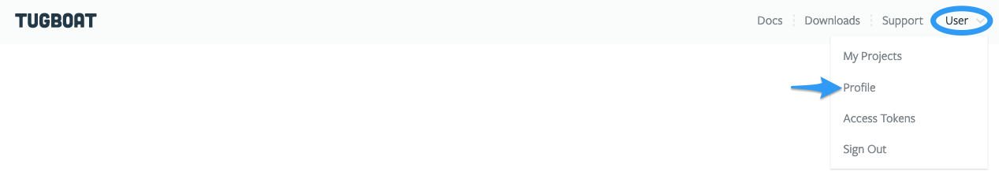
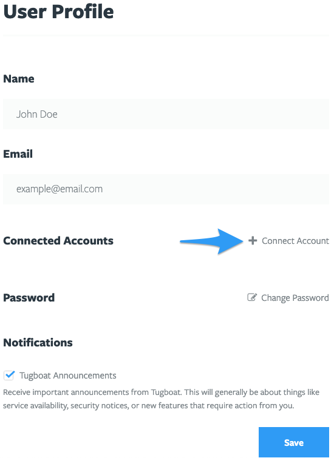
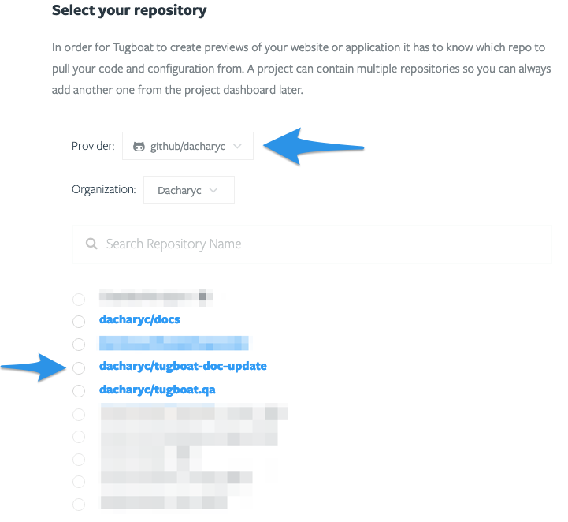
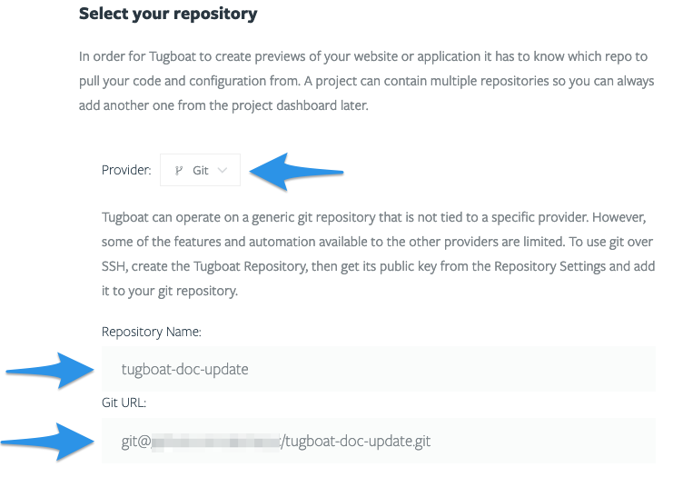
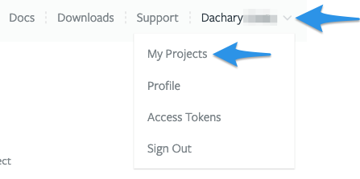
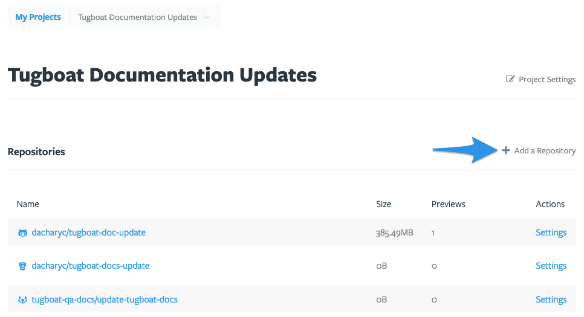
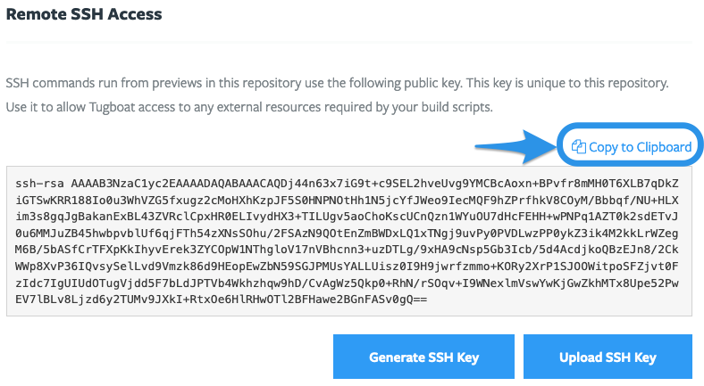
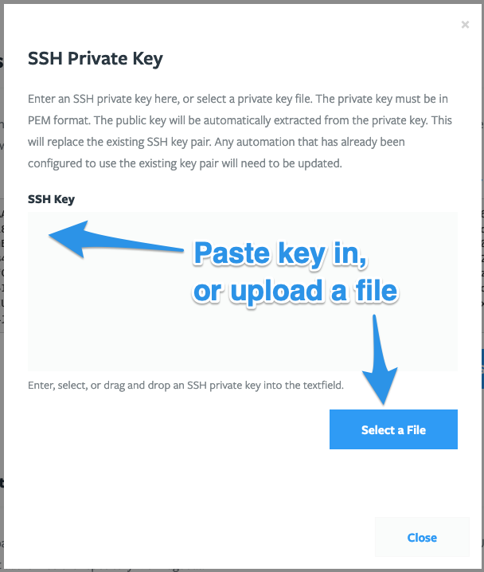
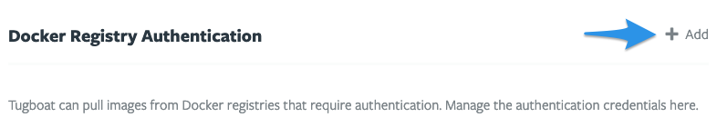
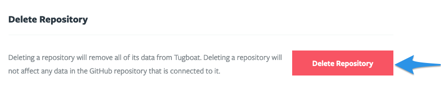

# Setting up your Tugboat

- [Connect with your provider](#connect-with-your-provider)
- [Create a new project](#create-a-new-project)
- [Add repos to the project](#add-repos-to-the-project)
- [Select repo settings (optional)](#repository-settings-optional)
- [Create a Tugboat Config file](#create-a-tugboat-config-file)

> #### Hint::Video Overview
>
> If you want to learn more about setting up Tugboat and get a feel for the
> overall workflow, watch our
> [Getting Started with Tugboat video](https://www.youtube.com/watch?v=HYTsrm5ORmU)
> on YouTube.

## Connect with your provider

- [Generic git server](#generic-git-server)
- [GitHub](#github)
- [GitLab](#gitlab)
- [BitBucket](#bitbucket)
- [Add a link to another git provider](#adding-a-link-to-a-git-provider)

### Generic Git Server

If you're not using GitHub, GitLab, or BitBucket, you can use a generic git
server with Tugboat. You'll [sign in to Tugboat](https://dashboard.tugboat.qa/)
using an email address, and when you go to add a repo to your Tugboat project,
you can link to a Git URL.

> #### Warning::Authenticate with a git provider to use auto-build Preview functionality
>
> If your repo isn't connected via Tugboat's GitHub, GitLab, or BitBucket
> authentication, you won't have the integration features to automatically build
> Previews from Pull Requests, and other related functionality. If you add
> GitHub, GitLab, or BitBucket authentication later, you'll need to delete your
> generic git server from your project, and add it again to use it.

### GitHub

- [How to connect your Tugboat to GitHub](#how-do-i-link-my-tugboat-to-github)
- [Using the GitHub integration](#using-the-github-integration)

#### How do I link my Tugboat to GitHub?

1. Go to [Sign In](https://dashboard.tugboat.qa/) and select GitHub
2. Enter your GitHub Username and Password (or Create an Account), complete
   Two-Factor Authentication
3. Authorize Tugboat

That's it! Your Tugboat account is now linked to GitHub, and you'll now have
access to add your repos to your Tugboat project and enjoy all the benefits of
GitHub integration.

#### Using the GitHub integration

The GitHub integration gives your Tugboat the following features, which you can
access in your Project -> Repository Settings:

- **Build Pull Requests automatically** On by default; Tugboat automatically
  creates a Preview when a GitHub pull request is opened.
- **Rebuild updated Pull Requests automatically** On by default; Tugboat
  automatically rebuilds a Preview when the corresponding pull request is
  updated.
- **Delete Pull Request Previews automatically** On by default; Tugboat
  automatically deletes a Preview when its pull request is merged or closed.
- **Set Pull Request status** On by default; Tugboat updates the pull request
  status to reflect the state of its Preview.
- **Set Pull Request deployment status** Off by default; Tugboat adds a
  deployment update to the pull request when a Preview is built.
- **Post Preview links in Pull Request comments** Off by default; Tugboat adds a
  comment to a pull request with links to its Preview. The comment author is the
  person who authenticated the git repo to Tugboat; to change this, see:
  [Add a Tugboat Bot to your team](../administering-tugboat-crew/index.md#add-a-tugboat-bot-to-your-team).
- **Build Previews for forked Pull Requests** Off by default; Tugboat builds
  Previews for pull requests made to the primary repo from forked
  repositories. \***\*There are security implications from using this
  setting:\*\*** any secrets in your Preview will be accessible by the owner of
  the forked repository.

You can also specify the account from which comments are posted to GitHub in
this section. For info on customizing this, see:
[Add a Tugboat Bot to your team](../administering-tugboat-crew/index.md#add-a-tugboat-bot-to-your-team).

### GitLab

- [How to connect your Tugboat to GitLab](#how-do-i-link-my-tugboat-to-gitlab)
- [Using the GitLab integration](#using-the-gitlab-integration)

#### How do I link my Tugboat to GitLab?

1. Go to [Sign In](https://dashboard.tugboat.qa/) and select GitLab
2. Enter your GitLab Username and Password (or Register)
3. Authorize Tugboat

That's it! Your Tugboat account is now linked to GitLab, and you'll now have
access to add your repos to your Tugboat project and enjoy all the benefits of
GitLab integration.

#### Using the GitLab integration

The GitLab integration gives your Tugboat the following features, which you can
access in your Project -> Repository Settings:

- **Build Merge Requests automatically** On by default; Tugboat automatically
  creates a Preview when a GitLab merge request is opened.
- **Rebuild updated Merge Requests automatically** On by default; Tugboat
  automatically creates a Preview when the corresponding merge request is
  updated.
- **Delete Merge Request Previews automatically** On by default; Tugboat
  automatically deletes a Preview when its merge request is merged or closed.
- **Set Merge Request build status** On by default; Tugboat updates the merge
  request build status to reflect the state of its Preview.
- **Post Preview links in Merge Request comments** Off by default; Tugboat adds
  a comment to a merge request with links to its Preview. The comment author is
  the person who authenticated the git repo to Tugboat; to change this, see:
  [Add a Tugboat Bot to your team](../administering-tugboat-crew/index.md#add-a-tugboat-bot-to-your-team).
- **Build Previews for forked Merge Requests** Off by default; Tugboat builds
  Previews for merge requests made to the primary repo from forked
  repositories. \***\*There are security implications from using this
  setting:\*\*** any secrets in your Preview will be accessible by the owner of
  the forked repository.

You can also specify the account from which comments are posted to GitLab in
this section. For info on customizing this, see:
[Add a Tugboat Bot to your team](../administering-tugboat-crew/index.md#add-a-tugboat-bot-to-your-team).

### BitBucket

- [How to connect your Tugboat to BitBucket](#how-do-i-link-my-tugboat-to-bitbucket)
- [Using the BitBucket integration](#using-the-bitbucket-integration)

#### How do I link my Tugboat to BitBucket?

1. Go to [Sign In](https://dashboard.tugboat.qa/) and select BitBucket
2. Enter your BitBucket Email and Password (or Sign up for an account)
3. Grant Access to Tugboat

That's it! Your Tugboat account is now linked to BitBucket, and you'll now have
access to add your repos to your Tugboat project and enjoy all the benefits of
BitBucket integration.

#### Using the BitBucket integration

The BitBucket integration gives your Tugboat the following features, which you
can access in your Project -> Repository Settings:

- **Build Pull Requests automatically** On by default; Tugboat automatically
  creates a Preview when a BitBucket pull request is opened.
- **Rebuild updated Pull Requests automatically** On by default; Tugboat
  automatically rebuilds a Preview when the corresponding pull request is
  updated.
- **Delete Pull Request Previews automatically** On by default; Tugboat
  automatically deletes a Preview when its pull request is merged or closed.
- **Set Pull Request status** On by default; Tugboat updates the pull request
  status to reflect the state of its Preview.
- **Post Preview links in Pull Request comments** Off by default; Tugboat adds a
  comment to a pull request with links to its Preview. The comment author is the
  person who authenticated the git repo to Tugboat; to change this, see:
  [Add a Tugboat Bot to your team](../administering-tugboat-crew/index.md#add-a-tugboat-bot-to-your-team).
- **Build Previews for forked Pull Requests** Off by default; Tugboat builds
  Previews for pull requests made to the primary repo from forked
  repositories. \***\*There are security implications from using this
  setting:\*\*** any secrets in your Preview will be accessible by the owner of
  the forked repository.

You can also specify the account from which comments are posted to BitBucket in
this section. For info on customizing this, see:
[Add a Tugboat Bot to your team](../administering-tugboat-crew/index.md#add-a-tugboat-bot-to-your-team).

### Adding a link to a git provider

Need to add a git provider to your Tugboat account? No problem! Whether you
created your initial Tugboat account with an email and now want to add a git
provider, or whether you're adding your second or third git provider - you can
easily connect your Tugboat account with additional git providers.

1. Click the User drop-down in the upper right-hand corner of the Tugboat
   dashboard, and select **Profile**;
2. Click the **+ Connect Account** link;
3. Select the git provider whose account you'd like to connect;
4. Follow the instructions to connect to
   [GitHub](#how-do-i-link-my-tugboat-to-github),
   [GitLab](#how-do-i-link-my-tugboat-to-gitlab) or
   [BitBucket](#how-do-i-link-my-tugboat-to-bitbucket).

Click the User drop-down in the upper right-hand corner of the Tugboat
dashboard, and select **Profile**.

Click the **+ Connect Account** link.

Select the git provider whose account you'd like to connect.

## Create a new project

Once you've connected Tugboat to your preferred git provider, it's time to
create a new project!

- [How to create a project](#how-to-create-a-project)
- [Things to know about Tugboat projects](#things-to-know-about-tugboat-projects)
- [Add repos to the project](#add-repos-to-the-project)

Once you hit the **Create Project** button, it's anchors away!

### How to create a project

The first time you sign into Tugboat, you'll go directly to the Create New
Project screen.

After you've already got projects, you can add new ones by going to the Tugboat
Dashboard and selecting **Create New Project**.

### Things to know about Tugboat projects

When you're creating a project, there are a few things to keep in mind:

- A Tugboat project is a collection of any number of repos across git providers
- Tugboat's pricing tiers and billing are specified on the project level, not
  the number of repositories
- Users are managed on a per project basis

With this in mind, you may find yourself sailing on stormy seas if you're
building a lot of Previews (or resource-intensive Previews) on a low-level
project tier. If that's the case, consider structuring your projects by putting
repos requiring resource-intensive Preview builds in their own projects, while
other repos' Preview builds proceed in a different project without performance
hits.

Deciding which users need to be able to access which projects can help you
figure out how you want to organize, too. For example, let's say you are
building a recipe site that consists of a backend Drupal repository and a
frontend React repository. If the entire development team should have access to
both repositories within Tugboat, you probably should create a single project
for both repositories in Tugboat.

On the other hand, let's say you have a simple WordPress blog that is managed by
an outside vendor. Also, you have a separate and unrelated Node.js application
that is a "top secret" internal project your company is working on. It may be
best to create two separate projects so that you can manage permissions for each
of the projects independently.

### Add repos to the project

Once you've decided how you want to structure your project, add the relevant
repos to your project.

When you're creating a project, you'll simply select your repository host from
the Provider drop-down, and click the radio button next to the repo you want to
add.

Alternately, if you're using a generic git server, select Git as the provider,
and enter your repo name and Git URL.

If you want to add repos to a project you've already created:

1. Go to username -> My Projects at the upper-right of the Tugboat screen;
2. Select the project where you want to add the repo;
3. Go to Add a Repository.

From there, you'll be back to the familiar 'select a provider and specify a
repo' screen.

Go to username -> My Projects at the upper-right of the Tugboat screen;

Select the project where you want to add the repo;

Go to Add a Repository.

> #### Info:: How many repositories can I add to a project?
>
> There is no limit to the number of repositories you can add to a Tugboat
> project. Limits are imposed on the number of Previews that can be created in a
> project at any given time, based on the
> [billing tier for your project and how big each Preview is](../tugboat-billing/index.md#how-does-tugboat-pricing-work).

## Repository Settings (optional)

After you've created a project, you might want to go in and tweak your Tugboat
repo settings. When you go into Repository Settings, you can:

- [Modify settings for your GitHub, GitLab, or BitBucket integration](#modify-settings-for-your-github-gitlab-or-bitbucket-integration)
- [Rebuild Orphaned Previews Automatically](#rebuild-orphaned-previews-automatically)
- [Rebuild Stale Previews Automatically](#rebuild-stale-previews-automatically)
- [Refresh Base Previews Automatically](#refresh-base-previews-automatically)
- [Specify Build Timeout](#specify-build-timeout)
- [Modify Environment Variables](#modify-environment-variables)
- [Set up Remote SSH Access](#set-up-remote-ssh-access)
- [Authenticate with a Docker Registry](#authenticate-with-a-docker-registry)
- [Delete the repo](#delete-the-repo)

Don't forget to hit the **Save Configuration** button after you've checked or
unchecked boxes to save your changes.

If you later need to change Repository Settings, you can do that anytime; see:
[Change Repository Settings](#change-repository-settings).

### Modify settings for your GitHub, GitLab or BitBucket Integration

When you're using the Tugboat integration with GitHub, GitLab or BitBucket,
you'll see provider-specific settings for each of your Tugboat repos. These
settings enable you to do things like automatically create a Preview when a Pull
Request or Merge Request is opened, or post a comment to a PR with links to its
Preview. For a full list of the provider-specific integration options, check
out:

- [Using the GitHub integration](#using-the-github-integration)
- [Using the GitLab integration](#using-the-gitlab-integration)
- [Using the BitBucket integration](#using-the-bitbucket-integration)

### Rebuild Orphaned Previews Automatically

When this option is selected, Tugboat automatically
[rebuilds Previews](../building-a-preview/index.md#rebuild) when the
[Base Preview](../building-a-preview/index.md#set-a-base-preview) they're built
from is rebuilt. This option is turned off by default.

### Rebuild Stale Previews Automatically

When this option is selected, Tugboat automatically
[rebuilds Previews](../building-a-preview/index.md#rebuild) when the
[Base Preview](../building-a-preview/index.md#set-a-base-preview) they're built
from is [refreshed](../building-a-preview/index.md#refresh). This option is
turned off by default.

To unpack this a little:

- When you're using a
  [Base Preview](../building-a-preview/index.md#set-a-base-preview):
- And the Base Preview is [refreshed](../building-a-preview/index.md#refresh)  
  (You may manually Refresh a Base Preview, or have Tugboat
  [refresh Base Previews automatically](#refresh-base-previews-automatically),
  for example, every day at 12am UTC.)
- The Base Preview kicks off the
  [build process](../building-a-preview/index.md#the-build-process-explained)
  from the `update` phase, and runs commands in both `update` and `build`;
- When the Base Preview refresh is complete, child Previews kick off a
  [build process](../building-a-preview/index.md#the-build-process-explained)
  from `build`, using the Base Preview as the starting point and bypassing
  commands in `init` and `update`.

### Refresh Base Previews Automatically

By default, Tugboat refreshes your Base Previews every day at 12am UTC. You can
de-select this checkbox to turn off automatic refresh, or you can specify your
preferred interval and time for the refresh to occur. Automatically refreshing
Base Previews is a great way to ensure your large assets, such as databases,
stay up-to-date, saving you time when you build a new Preview from a
recently-refreshed Base Preview.

### Specify Build Timeout

By default, Preview builds timeout at 3600 seconds. You can change the Preview
build timeout to your preferred interval.

### Modify Environment Variables

Here's where you can enter environment variables, like API keys or passwords,
that you wouldn't want to store in your repo. If you're looking for Tugboat's
environment variables to add to your Build Scripts or configuration files, check
out
[Reference -> Environment Variables](reference/environment-variables/index.md).

### Set up Remote SSH Access

SSH commands you run from Previews in this repository use the public key in your
repo settings. Each of your repositories linked to Tugboat have a unique SSH
key. Put this public key on the remote servers that your build scripts or
applications need to access.

- [Use the Tugboat SSH key](#use-the-tugboat-ssh-key)
- [Use your own SSH key](#use-your-own-ssh-key)
- [Delete an SSH key](#delete-an-ssh-key)

> #### Info:: SSH from Tugboat is outbound only
>
> You can't SSH into a Tugboat Preview; the SSH key here is all about outbound
> requests to remote resources. If you want to get _into_ a Tugboat Preview,
> shell access is provided in both the web interface and the
> [command line tool](../tugboat-cli/index.md).

#### Use the Tugboat SSH key

When you link a git repository to Tugboat, Tugboat automatically generates an
SSH key for that repo. You can access this key in
[Repository Settings](#change-repository-settings) -> **Remote SSH Access**. To
use the SSH key, simply copy it to your clipboard and put it where you need it!

> #### Info:: Tugboat-generated SSH keys
>
> Tugboat provides a private 4096 bit length RSA SSH key. What you see on the
> Repository Settings page is the public key from the pair.

If you want Tugboat to generate a new SSH key, press the **Generate SSH Key**
button. You'll see a dialogue box asking you to confirm that you want to
generate a new key, as this action can't be undone.

> #### Warning:: Generating a new SSH key erases the existing key
>
> If you have Tugboat create a new SSH key, this automatically erases the
> existing SSH key. If you're using this SSH key anywhere, you'll need to update
> that when you generate a new key.

#### Use your own SSH key

If you've got a specific SSH key you want to use, you can set that up in
[Repository Settings](#change-repository-settings) -> **Remote SSH Access**.
Press the **Upload SSH Key** button, and you'll be asked to enter a private key,
or select a private key file.

> #### Info:: Requirements for your SSH key
>
> The private key you provide here must be in PEM format. The public key will be
> automatically extracted from the private key you upload.

> #### Warning:: Uploading your SSH key erases the existing key
>
> If you upload your own SSH key, this automatically erases the existing SSH
> key. If you're using this SSH key anywhere, you'll need to update that when
> you upload the new key.

#### Delete an SSH key

Need to delete or get rid of an SSH key? Go to
[Repository Settings](#change-repository-settings) -> **Remote SSH Access** for
the repository whose key you want to delete, and press the **Generate SSH Key**
button. Generating a new key permanently erases the old key.

### Authenticate with a Docker Registry

If you want to pull images from Docker registries that require authentication,
you can manage your authorization credentials from within the repo settings.

### Delete the Repository

If you want to delete a repo from your Tugboat project, you'll go into the
Repository Settings for that repo and press the **Delete Repository** button.
Deleting a repo from Tugboat does not affect any data in the git provider repo
connected to it, nor does it delete the Tugboat project that contains the repo.

> #### Note::User Permissions
>
> Only Admin users have the **Delete Repository** option. For more on user
> permissions, see:
> [User permission levels explained](../administering-tugboat-crew/user-permission-levels-explained/index.md)
> .

### Change Repository Settings

Any time you need to make a change to Repository Changes, just:

1. Click your username in the upper right-hand corner, and go to Projects;
2. Click the **My Projects** link;
3. Select the project where you want to edit repository settings;
4. Scroll to the linked repository whose settings you want to change, and click
   the **Settings** link.

From here, you'll see all the Repository Settings you can modify. If you make
changes to the settings, don't forget to press the **Save Configuration**
button!

If you want to dive deeper into any of these settings, you can view the full
list of [Repository Settings](#repository-settings-optional) and drill down to
the setting you're curious about.

## Create a Tugboat Config File

The final step in setting up your Tugboat is committing a YAML Config file in
the source's git repository. Think of the Config file as the engine that powers
your Tugboat; here's where you specify the services you want to run when your
Tugboat Preview builds.

The Tugboat Config file should live at: `.tugboat/config.yml` in the branch,
tag, commit or pull request that is being built. The only exception is when
you're building from a Base Preview; in that case, the config.yml from the Base
Preview is used.

Creating the Config file can be a complex process, just like building a
Tugboat's engine from parts! To break things down for you, check out these docs:

- [Setting up Services in your Tugboat](../setting-up-services/index.md)
- [Starter Configuration files](../starter-configs/index.md) (configuration file
  code snippets with comments to help you get started)
- [Using the Tugboat Command Line Tool](../using-the-cli/index.md)
- [Service Attributes](../setting-up-services/index.md#service-attributes)
  (detailing the attributes you can use when building Services)
- [Debugging Config files](../troubleshooting/index.md#debugging-config-files)
