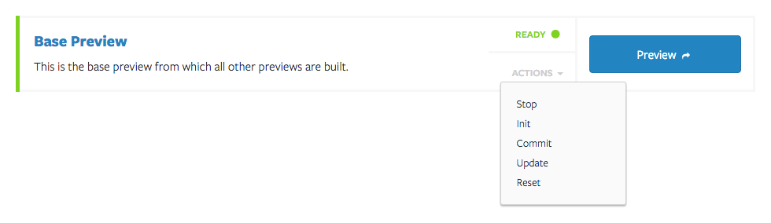
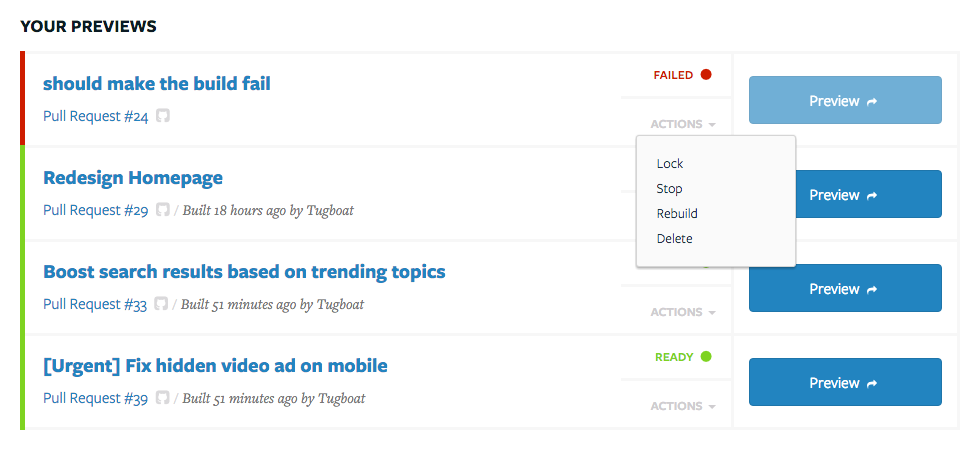
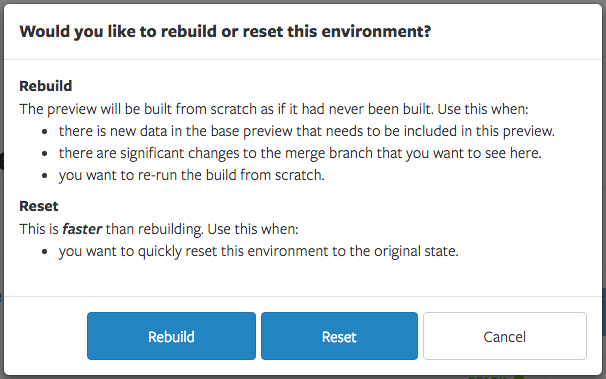
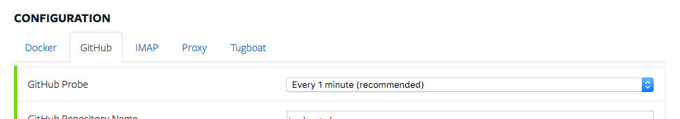

# Troubleshooting

## If a preview is failing to build

### 1. Check the logs

First check the logs to see why the preview is failing.

If you understand the error message, you may have code to fix before you can
rebuild this preview.

### 2. Update base environment and rebuild

Go to your project's Settings page, and select Update from the action menu for
your Base Preview.

Then try to rebuild the preview.

It's important to rebuild vs. reset in this instance so that the preview is
built from the newly updated base preview.

## Previews are not building automatically

Make sure that probe frequency is set to something other than "None"

