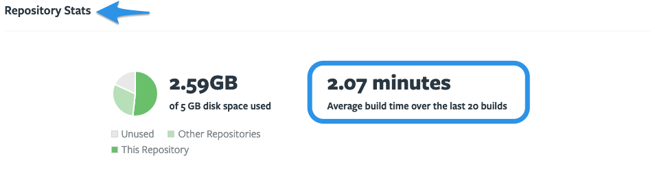
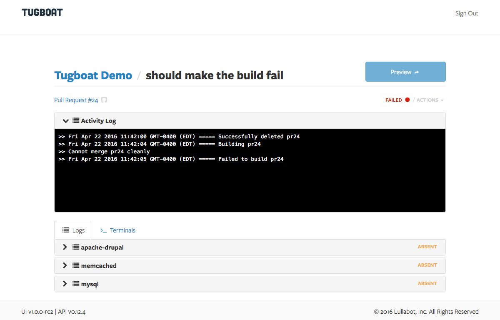
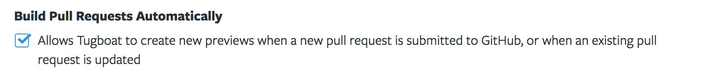
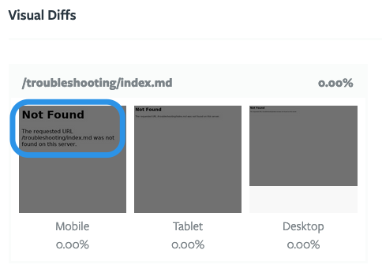
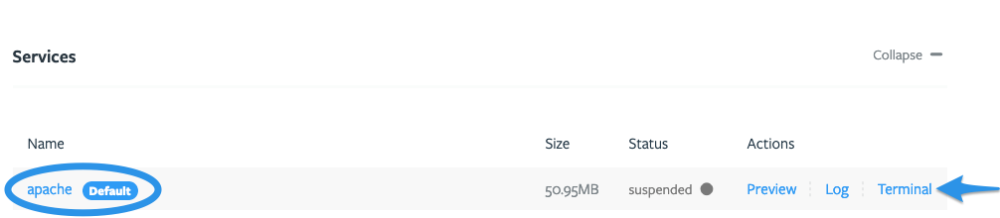
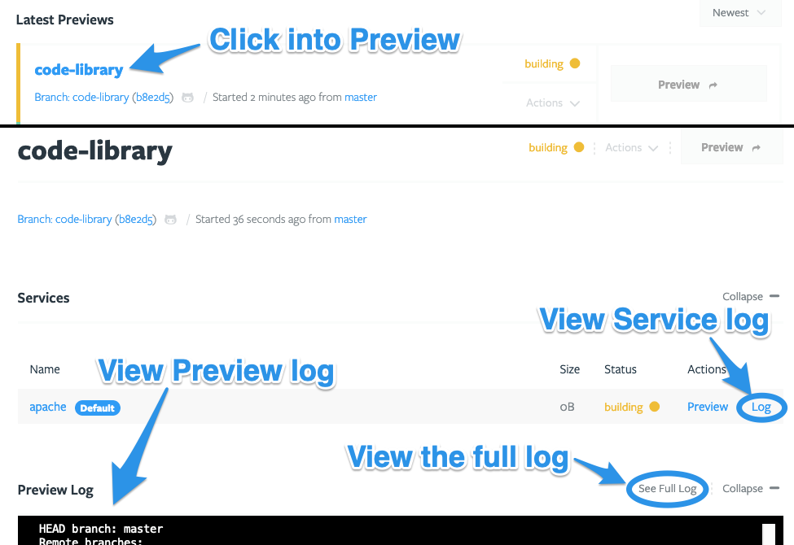

# Troubleshooting

- [My Tugboat Preview won't build](#tugboat-preview-wont-build)
  - [Can't build a Preview in the Tugboat UI](#cant-build-a-preview-in-the-tugboat-ui)
  - [Troubleshooting a Preview Build failure](#troubleshooting-a-preview-build-failure)
  - [Previews are not Building automatically](#previews-are-not-building-automatically)
- [My Tugboat Preview has built, but something isn't as I expect](#tugboat-preview-has-built-but-something-isnt-as-i-expect)
  - [A preview says it is "ready", but shows a blank page](#a-preview-says-it-is-ready-but-shows-a-blank-page)
  - [A Preview is pulling the wrong Docker image](#a-preview-is-pulling-the-wrong-docker-image)
  - [Something in my Preview isn't right](#something-in-my-preview-isnt-right)
  - [Troubleshooting Visual Diffs](#troubleshooting-visual-diffs)
- [I need to debug a Configuration file](#debugging-configuration-files)
  - [Process for debugging Tugboat config files](#process-for-debugging-tugboat-config-files)
  - [Tools for debugging Tugboat config files](#tools-for-debugging-tugboat-config-files)
  - [How to fix problem X in config file](#how-to-fix-problem-x-in-config-file)

---

## Tugboat Preview won't build:

- [Can't build a Preview in the Tugboat UI](#cant-build-a-preview-in-the-tugboat-ui)
- [My Preview Build is stuck at...](#my-preview-build-is-stuck-at)
- [Troubleshooting a Preview Build failure](#troubleshooting-a-preview-build-failure)
- [Previews are not Building automatically](#previews-are-not-building-automatically)

### Can't build a Preview in the Tugboat UI

If you're Building a Preview from a branch whose name includes a `/`, you may
get a JS `Uncaught Error` and be unable to build. Until this issue is addressed,
there are two workarounds:

1. Rename the branch without the slash.
2. Use the [Tugboat CLI](../tugboat-cli/index.md) to build the branch.

### My Preview Build is stuck at...

Uh oh! Did your Preview Build get stuck?

- [Pending](#pending)
- [Building](#building)
- [Rebuilding](#rebuilding)
- [Refreshing](#refreshing)
- [Canceling](#canceling)

#### Pending

First, give a `pending` Preview Build/Rebuild/Refresh a few minutes. If it's
still not moving on, there are a few things you could do:

- Cancel the action, and then try to start it again;
- If Cancel isn't working in the web interface, you could use the
  [Tugboat CLI](../tugboat-cli/index.md) to cancel the action, and then try to
  start it again.

Give it some time, and if you're still having issues, contact us at
[Help and Support](../support/index.md).

#### Building

Has your Preview been building for a long time? There are a couple of things to
check:

Take a look at your Repository Stats to see how long your average build time is.
If your Preview has been building for less than that time, hang in there; if it
has been in `building` for significantly longer, it might be time to
troubleshoot.



When you're ready to troubleshoot, start by taking a
[look at the Preview's logs](#how-to-check-the-preview-logs). Logs should give
you some insight into where the Preview is in the build process. If you see that
the Preview build isn't progressing, checking out where it got stuck is a great
place to start [debugging the Config file](#debugging-configuration-files) and
figuring out what's causing the Preview build to hang.

If your builds are taking longer than expected, but there isn't an issue in your
config file causing problems, take a look at
[Optimize your Preview builds](../building-a-preview/index.md#optimize-your-preview-builds)
for a few things you might try:

- [Use Service Commands to create a Base Preview that does the heavy lifting](../building-a-preview/index.md#use-service-commands-to-create-a-base-preview-that-does-the-heavy-lifting)
- [Use the Auto Refresh Base Preview functionality to update large assets](../building-a-preview/index.md#use-the-auto-refresh-base-preview-functionality-to-update-large-assets)
- [Optimize Preview size](../building-a-preview/index.md#optimizing-preview-size)
- [Contact Tugboat support for help optimizing your Config file](../building-a-preview/index.md#contact-tugboat-support-for-help-optimizing-your-config-file)
- [Upgrade your project tier to a higher-performance tier](../building-a-preview/index.md#upgrade-your-project-tier-to-a-higher-performance-tier)

#### Rebuilding

Preview hung on `rebuilding`? Take a look at your Repository Stats to see how
long your average build time is. If your Preview has been building for less than
that time, hang in there; if it has been in `rebuilding` for significantly
longer, it might be time to troubleshoot.


When you're ready to troubleshoot, start by taking a
[look at the Preview's logs](#how-to-check-the-preview-logs). Logs should give
you some insight into where the Preview is in the rebuild process. If you see
that the Preview build isn't progressing, checking out where it got stuck is a
great place to start [debugging the Config file](#debugging-configuration-files)
and figuring out what's causing the Preview rebuild to hang.

> #### Hint:: Rebuilding and Base Previews
>
> If you're rebuilding a Preview that was generated without a Base Preview, the
> rebuild process starts with the commands in `init`. If you're rebuilding a
> Preview that was generated from a Base Preview, rebuild starts with the
> commands in `build`. Which type of Rebuild you're doing should tell you where
> you start looking for problems in the config file - during `init` or skipping
> straight to `build` commands. _BEN IS THIS RELEVANT OR TRUE?_ For more info,
> see:
> [The build process: explained](../building-a-preview/index.md#the-build-process-explained).

If your rebuilds are taking longer than expected, but there isn't an issue in
your config file causing problems, take a look at
[Optimize your Preview builds](../building-a-preview/index.md#optimize-your-preview-builds)
for a few things you might try:

- [Use Service Commands to create a Base Preview that does the heavy lifting](../building-a-preview/index.md#use-service-commands-to-create-a-base-preview-that-does-the-heavy-lifting)
- [Use the Auto Refresh Base Preview functionality to update large assets](../building-a-preview/index.md#use-the-auto-refresh-base-preview-functionality-to-update-large-assets)
- [Optimizing Preview size](../building-a-preview/index.md#optimizing-preview-size)
- [Contact Tugboat support for help optimizing your Config file](../building-a-preview/index.md#contact-tugboat-support-for-help-optimizing-your-config-file)
- [Upgrade your project tier to a higher-performance tier](../building-a-preview/index.md#upgrade-your-project-tier-to-a-higher-performance-tier)

#### Refreshing

Preview hung on `refreshing`? Take a look at your Repository Stats to see how
long your average build time is. If your Preview has been refreshing for less
than that time, hang in there; if it has been in `refreshing` for significantly
longer, it might be time to troubleshoot.


When you're ready to troubleshoot, start by taking a
[look at the Preview's logs](#how-to-check-the-preview-logs). Logs should give
you some insight into where the Preview is in the refresh process. If you see
that the Preview refresh isn't progressing, checking out where it got stuck is a
great place to start [debugging the Config file](#debugging-configuration-files)
and figuring out what's causing the Preview rebuild to hang.

#### Canceling

If you've decided to cancel a Preview Action, but the Preview is stuck on
`canceling`, there are a couple of things you can try:

1. Hang in and wait a bit longer.
2. Try canceling the Preview Action from the Tugboat CLI.
3. If you're still having issues, contact us at
   [Help and Support](../support/index.md).

### Troubleshooting a Preview Build Failure

If your Tugboat Preview has `failed` to build, it's time to take a
[look at the the Preview logs](#how-to-check-the-preview-logs). The most common
cause of build failures is when one of the commands in the Tugboat
[configuration file](../setting-up-tugboat/index.md#create-a-tugboat-config-file)
exits with an error. If that is the case, it's time to start
[debugging the configuration file](#debugging-configuration-files).



If you're having problems figuring out why the Preview build `failed`, we're
happy to look into the problem with you to see whether we can help. We've gotten
good at spotting common config file issues, and we're happy to help.
[Let us know](https://tugboat.qa/support).

### Previews are not building automatically

Are you expecting a Preview to build automatically? Only Previews for pull
requests are built automatically. If Previews are not being built from your PRs,
check the
[Repository Settings](../setting-up-tugboat/index.md#repository-settings-optional),
and make sure "Build Pull Requests Automatically" is enabled.



> #### Hint:: Don't see the option to Build Pull Requests Automatically?
>
> The option to "Build Pull Requests Automatically" only appears if you have
> linked your Tugboat repository with a git provider repository via a
> [git provider integration](../setting-up-tugboat/index.md#connect-with-your-provider).
> If you haven't already connected to a git provider, you'll need to
> [set up a git integration](../setting-up-tugboat/index.md#adding-a-link-to-a-git-provider),
> and then
> [delete the repository](../setting-up-tugboat/index.md#delete-the-repository)
> from Tugboat and
> [add it back to your project](../setting-up-tugboat/index.md#add-repos-to-the-project)
> using the git provider integration.

## Tugboat Preview has built, but something isn't as I expect:

- [A Preview says it is "ready", but shows a blank page](#a-preview-says-it-is-ready-but-shows-a-blank-page)
- [A Preview is pulling the wrong Docker image](#a-preview-is-pulling-the-wrong-docker-image)
- [Something in my Preview isn't right](#something-in-my-preview-isnt-right)
- [Troubleshooting Visual Diffs](#troubleshooting-visual-diffs)

### A Preview says it is "ready", but shows a blank page

When a Preview says it is "ready", that means that it successfully ran the
[commands](../setting-up-services/index.md#service-commands) in your
[configuration file](../setting-up-tugboat/index.md#create-a-tugboat-config-file),
and none of those commands returned an error. It does not necessarily mean that
those commands did what you expected them to do. For example, your configuration
might set up a database, but not provide the correct password to some
application config file. In this case, the Preview would build successfully, but
the application might not load.

To troubleshoot where this might have gone wrong:

1. Double-check the commands in the
   [configuration file](../setting-up-tugboat/index.md#create-a-tugboat-config-file).
2. Check [the Preview's logs](#how-to-check-the-preview-logs) for any clues,
   and.
3. Make use of [Tugboat's terminal access](../tugboat-cli/index.md) to the
   Preview to do the same type of troubleshooting you would do if this happened
   on your local installation.

### A Preview is pulling the wrong Docker image

Have you updated the Docker image you want your Preview to use, but it still
appears to be pulling the old image? There are a couple of things that could be
in play here:

1. [Verify what version of the image you're calling](#verify-what-version-of-the-image-youre-calling)
2. [Not all Preview Actions call the Docker image again](#rebuild-the-preview-from-scratch)

#### Verify what version of the image you're calling

Maybe you thought you had left a version tag off, so you'd be getting the latest
Docker image, but you had actually called a
[specific version of the image](../setting-up-services/index.md#specify-a-service-image)
in the config file. (Or vice versa! Maybe your config file calls `latest` or
doesn't specify a version, but you actually need a specific image version.)
First thing's first; double-check whether you're calling a specific version of
the Docker image in your
[config file](../setting-up-tugboat/index.md#create-a-tugboat-config-file), and
update as necessary.

#### Rebuild the Preview from scratch

The more common issue is performing a
[Preview Action](../building-a-preview/index.md#preview-actions) that doesn't
actually call the Docker image specified in your config file.

If you're building a Preview from a PR, and you've got a Base Preview set in
your Tugboat project, the Preview from your PR only executes commands in the
`build` portion of the config file. Your Docker image is pulled before `init`.
For more info, see:
[When does Tugboat pull a Docker image](../setting-up-services/index.md#when-does-tugboat-pull-a-docker-image),
and
[When does Tugboat update a Docker image?](../setting-up-services/index.md#when-does-tugboat-update-a-docker-image)
Basically, this means building a Preview from a PR when you're using a Base
Preview will never pull a new Docker image.

The practical fix for this issue is to
[build the Preview from scratch, without using the Base Preview](../building-a-preview/index.md#building-a-preview-from-scratch-after-youve-set-a-base-preview).
If you want to change the Docker image in your Base Preview, so all new Previews
will build from the new image, you'll need to
[Rebuild](../building-a-preview/index.md#rebuild) the
[Base Preview](../building-a-preview/index.md#set-a-base-preview).

> #### Hint:: Automatically updating the Base Preview
>
> If you're using the
> [Repository Setting](../setting-up-tugboat/index.md#repository-settings-optional)
> to
> [Refresh Base Previews Automatically](../setting-up-tugboat/index.md#refresh-base-previews-automatically),
> this does _not_ update the Docker images used in your Preview. This only kicks
> off a [Refresh](../building-a-preview/index.md#refresh), which runs config
> file commands from both `update` and `build`. You need to manually Rebuild a
> Base Preview to pull a new Docker image.

### Something in my Preview isn't right

It's possible for a Preview to build, but to be missing something you expect to
see. This is similar to the
["Preview says it is "ready", but shows a blank page"](#a-preview-says-it-is-ready-but-shows-a-blank-page)
issue above; your Preview may not have failed during the build process, but it's
possible something in the configuration file didn't execute as you expected.

To troubleshoot where this might have gone wrong:

1. Double-check the commands in the
   [configuration file](../setting-up-tugboat/index.md#create-a-tugboat-config-file).
2. Check [the Preview's logs](#how-to-check-the-preview-logs) for any clues.
3. Make use of [Tugboat's terminal access](../tugboat-cli/index.md) to the
   Preview to do the same type of troubleshooting you would do if this happened
   on your local installation.

If you can't figure out why something isn't as you expect in your Preview, let
us know! Visit us at [Help and Support](../support/index.md); we're happy to
help.

### Troubleshooting Visual Diffs

- [Visual diffs aren't displaying, or aren't displaying as I expect](#visual-diffs-arent-displaying-or-arent-displaying-as-i-expect)
- [URL not found](#url-not-found)
- [There was a problem generating Visual Diffs for this preview.](#there-was-a-problem-generating-visual-diffs-for-this-preview)

#### Visual diffs aren't displaying, or aren't displaying as I expect

To configure which pages have visual diffs generated, you need to specify the
relative URLs of the pages in a `visualdiffs` key in the Service definition.
That information should be in the
[config file](../setting-up-tugboat/index.md#create-a-tugboat-config-file) of
the branch or PR that you're building, _not_ the Base Preview.

Some things you might try when troubleshooting a visual diff include:

- Confirm the _relative URL_ is correct;
- Consider overriding the default timeout option;
- Consider overriding the default WaitUntil option.

##### Overriding the default timeout option

```yaml
services:
  apache:
    visualdiffs:
      # Create a visualdiff of /blog, but override the default timeout option
      - url: /blog
        timeout: 10
```

##### Overriding the default waitUntil option

```yaml
services:
  apache:
    visualdiffs:
      # Create a visualdiff of /about, but override the default waitUntil option
      - url: /about
        waitUntil: domcontentloaded
```

If you've verified the relative URLs are correct, and that information is in the
config file of the branch or PR you're building, but you're still not seeing
what you expect to see, reach out to us at
[help and support](../support/index.md) - we're happy to take a look!

#### URL not found

If the URL you use when
[configuring your visual diffs](../visual-diffs/index.md#how-to-configure-visual-diffs)
doesn't match a _relative URL_ in your site, you may see visual diff panes
generate, but with "Not Found" message inside the images. If this happens,
[edit your config file](../setting-up-tugboat/index.md#create-a-tugboat-config-file)
to specify the _relative URLs_ of the pages you want to diff, and then
[Rebuild](../building-a-preview/index.md#rebuild) the Preview.



#### There was a problem generating Visual Diffs for this preview.

If there's an issue with the way your visual diffs key is configured, you may
get the "There was a problem generating Visual Diffs for this preview" error.
This could be because of the _relative URLs_ in your
[config file](../setting-up-tugboat/index.md#create-a-tugboat-config-file), or
it could be that you need to override
[the default timeout option](#overriding-the-default-timeout-option) or the
[default waitUntil option](#overriding-the-default-waituntil-option). If you've
tried those things, and are still having problems, reach out to us at
[help and support](../support/index.md) - we're happy to take a look!

## Debugging Configuration files

- [Process for debugging Tugboat config files](#process-for-debugging-tugboat-config-files)
- [Tools for debugging Tugboat config files](#tools-for-debugging-tugboat-config-files)
- [How to fix problem X in config file](#how-to-fix-problem-x-in-config-file)

### Process for debugging Tugboat config files

When you're not getting the Tugboat Preview Build you're looking for, there are
a few ways you might approach debugging your config files:

- [Debugging your first Tugboat build config file](#debugging-your-first-tugboat-build-config-file)
- [Debugging changes to your Tugboat config file](#debugging-changes-to-your-tugboat-config-file)

#### Debugging your first Tugboat build config file

When you're first getting Tugboat set up, here's how we recommend getting
started and debugging your initial config file:

1. Create a branch within your git repository for adding Tugboat, and put your
   [config file there](../setting-up-tugboat/index.md#create-a-tugboat-config-file).
2. [Build a Preview](../building-a-preview/index.md#how-to-build-a-preview) from
   that branch.
3. If you get an error while building the Preview, take a
   [look at the Preview log](#how-to-check-the-preview-logs).
4. Click **Full Log** to make sure you're viewing the entire log.
5. Review the log until you see where the Preview build failed.

In some cases, you'll be able to see the specific command where the Preview
build failed. When that's the case, click the **Terminal** link next to the
Service where the command error occurred, and you'll get a terminal directly
into that Service.



From here, you can go line-by-line through the commands in your config file to
see what happens when you're running them directly in the terminal. You may want
to pass a verbose flag to see more context about what's going on.

Common problems here include:

- Parse errors, missing quotes, incorrect escapes, etc.
- Missing apps
- Installs that didn't execute as expected

If you can't see the exact command where the Preview build failed, or if you're
not having any luck manually debugging your config file, reach out to us via
[Help and Support](../support/index.md) - we're happy to help!

#### Debugging changes to your Tugboat config file

If you're making changes to your Tugboat config file, the debugging process is
mostly the same as when you first set it up, but there are a few things you want
to do to make sure Tugboat is getting the changes as expected:

1. Create a branch within your git repository for your changes, and put your new
   [config file there](../setting-up-tugboat/index.md#create-a-tugboat-config-file).
2. Push the branch with your config file changes.
3. Go into Tugboat, and manually
   [build your Preview without a Base Preview](../building-a-preview/index.md#building-a-preview-from-scratch-after-youve-set-a-base-preview).

> #### Hint:: Building a Preview from a PR may not process changes in your config
>
> If you're using a Base Preview in your Tugboat project, subsequent Previews
> that are built from that Base Preview start with the commands in `build`,
> bypassing `init` and `update`. Changes you make to a config file's `init` or
> `update` commands won't be applied when automatically building a Preview from
> a PR. You'll need to manually rebuild a Preview from scratch if you're using a
> Base Preview in order to apply config file changes. For more info, see:
> [The build process: explained](../building-a-preview/index.md#the-build-process-explained).

From here, if your Preview build is failing, the process is the same as above:

1. Take a [look at the Preview log](#how-to-check-the-preview-logs).
2. Click **Full Log** to make sure you're viewing the entire log.
3. Review the log until you see where the Preview build failed.

In some cases, you'll be able to see the specific command where the Preview
build failed. When that's the case, click the **Terminal** link next to the
Service where the command error occurred, and you'll get a terminal directly
into that Service.


From here, you can go line-by-line through the commands in your config file to
see what happens when you're running them directly in the terminal. You may want
to pass a verbose flag to see more context about what's going on.

Common problems here include:

- Parse errors, missing quotes, incorrect escapes, etc.
- Missing apps
- Installs that didn't execute as expected

If you can't see the exact command where the Preview build failed, or if you're
not having any luck manually debugging your config file, reach out to us via
[Help and Support](../support/index.md) - we're happy to help!

### Tools for debugging Tugboat config files

In terms of tools, there are three ways to debug configuration files:

- [Terminal in Tugboat's Web UI](#debug-by-terminal-in-tugboats-web-ui)
- [Tugboat's CLI](#debug-via-tugboats-cli)
- [Push changes to git](#debug-via-pushing-changes-to-git)

And you'll definitely want to know
[how to check the Preview logs](#how-to-check-the-preview-logs).

#### Debug by terminal in Tugboat's web UI

When you're viewing a Preview in Tugboat's web UI, you'll have the option to
open a terminal directly into a Preview's Services:


From here, you can manually execute lines from your config file in order to
figure out exactly where the error is occurring. For more context when you're
viewing the results of the commands directly in the terminal, you may want to
pass the verbose flag.

#### Debug via Tugboat's CLI

If you've installed [Tugboat's CLI](../tugboat-cli/index.md), you can debug your
Preview build from the comfort of your own terminal. Type `tugboat help` for a
list of commands and options. Following our debug process above, you might:

```shell
tugboat log 5b04c7d14c3dad00016a2e80
tugboat ls services preview=5b04c7d14c3dad00016a2e80
tugboat shell 5d26155195433d189bdf9307
```

And once you've got a shell into the Service, you can go line-by-line debugging
your config file, the same as if you'd used the web UI to terminal into a
Service.

#### Debug via pushing changes to git

If you think you know where the problem is in your config file, you can always
make the changes, make a PR or push a branch to your git repo, and try again to
[build the Preview](../building-a-preview/index.md#how-to-build-a-preview).

The same caveats apply as in
[Debugging changes to your Tugboat config file](#debugging-changes-to-your-tugboat-config-file)
above; if you're making changes when a Tugboat project has a Base Preview,
you'll need to manually rebuild a Preview from scratch if you're using a Base
Preview in order to apply config file changes. For more info, see:
[The build process: explained](../building-a-preview/index.md#the-build-process-explained).

## How to check the Preview logs

You can click into the Preview's name to view the Preview's logs _and_ logs for
individual Services you're running on a Preview. Alternately, you could use the
[Tugboat CLI](../tugboat-cli/index.md) to view
[Preview logs](../tugboat-cli/index.md#view-preview-logs) and
[Service logs](../tugboat-cli/index.md#view-services-logs).



### How to fix problem X in config file

- [PHP out of memory issues](#php-out-of-memory-issues)
- [MySQL server has gone away](#mysql-server-has-gone-away)
- [cd isn't working](#cd-isnt-working)
- [Tugboat error messages](#tugboat-error-messages)
- [Running a background process "breaks" the build](#running-a-background-process)

#### PHP out of memory issues

If you're getting "PHP out of memory errors", you can manually set the memory
limit higher. If you're using one of the
[tugboatqa php images](../setting-up-services/index.md#tugboats-prebuilt-docker-images),
use something like this in your build script:

`echo "memory_limit = 512M" >> /usr/local/etc/php/conf.d/my-php.ini`

Or you might try something like this in your drupal settings.php:

`if (drupal_is_cli()) { ini_set('memory_limit', '-1');`

#### MySQL server has gone away

If you're getting a "MySQL server has gone away" error, you can resolve this by
increasing the packet size for MySQL:

_BEN CAN WE INSERT AN EXAMPLE FOR THIS?_

#### cd isn't working

Each [command](../setting-up-services/index.md#service-commands) is run in its
own context, meaning things like `cd` do not "stick" between commands. If that
behavior is required, include an external script in the git repository and call
it from the config file.

_BEN CAN WE INSERT AN EXAMPLE OF THIS?_

#### Tugboat error messages

- [1064: Command Failed](#1064-command-failed)
- [1074: Repo configuration does not allow building of pull requests from forks](#1074-repo-configuration-does-not-allow-building-of-pull-requests-from-forks)

##### 1064: Command Failed

This error typically occurs when a command in your config file can't be executed
as written. When a Preview build fails with this error:

1. [Check the Preview logs](#how-to-check-the-preview-logs) to see what command
   was running when the build failed.
2. If you don't spot an issue with the command,
   [terminal into the relevant Service](#debug-by-terminal-in-tugboats-web-ui)
   and try executing the command directly to get more context about what's
   happening.

If you're having trouble pinpointing the error, you may need to go back and
execute your config file commands line-by-line until you find the point at which
things stop working.

> #### Hint:: Check for these issues:
>
> A few common problems in config files include:
> [`cd` does not "stick" between commands](#cd-isnt-working) and
> [running a background process "breaks" the build](#running-a-background-process).
> Check out the troubleshooting docs for info on addressing these issues.

If you've gone through the debugging process and haven't been able to figure out
why your command is failing, reach out to us at
[help and support](../support/index.md) - we're happy to take a look!

##### 1074: Repo configuration does not allow building of pull requests from forks

If you're getting this error message, it's because you haven't enabled the
[repository setting](../setting-up-tugboat/index.md#repository-settings-optional)
to allow building pull requests from forks.

This setting is off by default, but when it's enabled, Tugboat builds Previews
for pull requests made to the primary repo from forked repositories. Turning on
this setting should correct this error.

> #### Warning:: There are security implications when using this setting.
>
> Any secrets in your Preview will be accessible by the owner of the forked
> repository.

#### Running a background process

If you try to add a background-process to your
[config file](../setting-up-tugboat/index.md#create-a-tugboat-config-file) in
the conventional way, Tugboat will think the Preview has not finished building,
and it will be stuck in the "building" state until it eventually times out and
fails.

For instructions on how to run a background within a Tugboat Preview, see:
[Setting up Services -> Running a Background Process](../setting-up-services/index.md#running-a-background-process).
