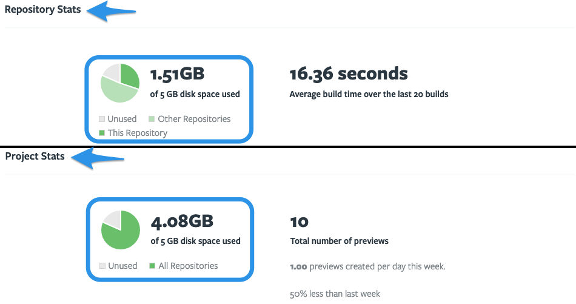
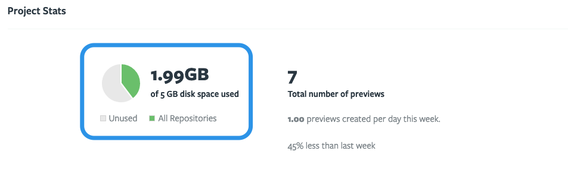
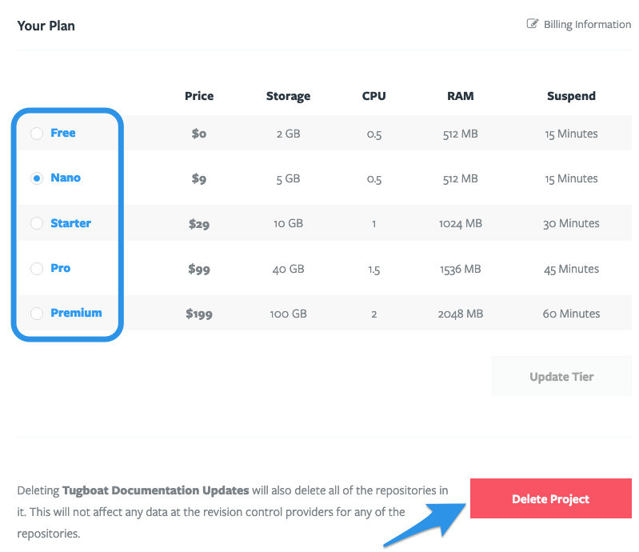
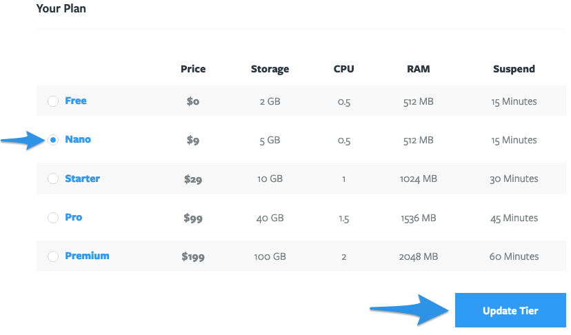
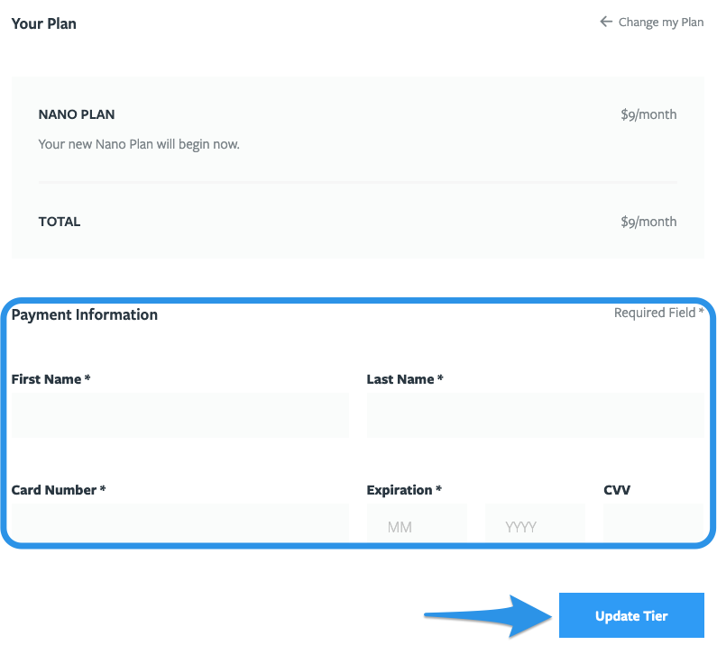
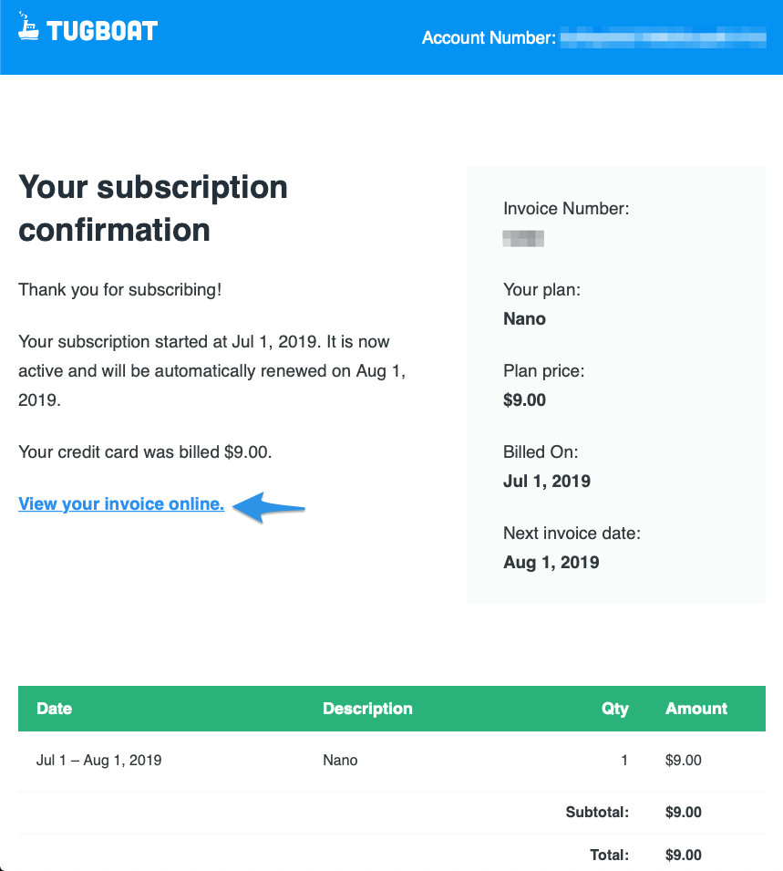
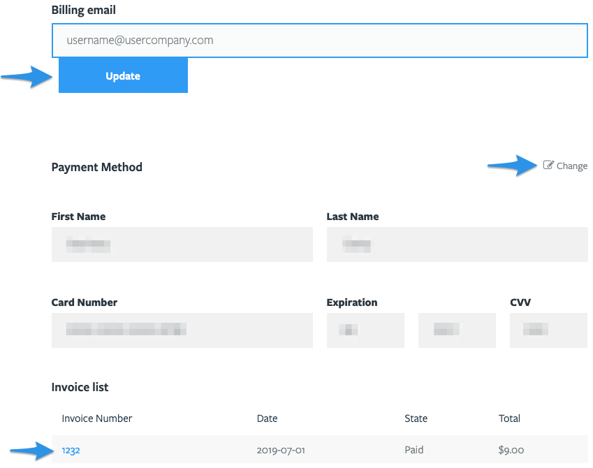

# Tugboat Billing

- [Tugboat pricing](#tugboat-pricing)
  - [How does Tugboat pricing work?](#how-does-tugboat-pricing-work)
  - [View Tugboat pricing for your project](#to-view-tugboat-pricing-for-your-project)
  - [Tugboat for Enterprise](#tugboat-for-enterprise)
- [Change your Tugboat plan](#change-your-tugboat-plan)
- [Change billing information](#change-billing-information)
- [Cancel billing](#cancel-billing)
  - [Change your Tugboat plan to the Free tier](#change-your-tugboat-plan-to-the-free-tier)
  - [Delete your project](#delete-your-project)

## Tugboat Pricing

- [How does Tugboat pricing work?](#how-does-tugboat-pricing-work)
  - [Calculating project storage for Tugboat billing](#calculating-project-storage-for-tugboat-billing)
  - [How to view project storage](#how-to-view-project-storage)
- [View Tugboat pricing for your project](#to-view-tugboat-pricing-for-your-project)
- [Tugboat for Enterprise](#tugboat-for-enterprise)

### How does Tugboat pricing work?

Tugboat's pricing isn't based on your account, number of users, or on external
repositories; Tugboat is priced on a per-project basis.

When you
[Create a New Project](../setting-up-tugboat/index.md#create-a-new-project) in
Tugboat, you'll select a plan based on your
[Preview storage](#calculating-project-storage-for-tugboat-billing) and
[build performance](../building-a-preview/index.md#optimize-your-preview-builds)
needs. You can then
[link as many external repositories](../setting-up-tugboat/index.md#add-repos-to-the-project)
as you'd like to that project, and
[add as many users](../administering-tugboat-crew/index.md#add-a-user-to-a-project)
as you'd like, all under the same plan.

If you later find your project doesn't have enough storage, or your Preview
build performance isn't what you need it to be, you can always
[change your Tugboat project's performance tier](#change-your-tugboat-plan) -
without affecting your other Tugboat projects.

#### Calculating Project storage for Tugboat billing

[Project storage](#how-to-view-project-storage) is calculated by adding the size
of all of the Previews contained in a Tugboat project. This includes any
[Base Previews](../building-a-preview/index.md#set-a-base-preview), as well as
additional Previews that have been built from the Base Previews. Tugboat
calculates Preview sizes across all repositories contained in a project when
determining project storage, which may be larger than what you see when you're
viewing an individual repository within Tugboat.

> #### Info:: Why is my Preview size "X"?
>
> Curious about why a Preview is larger than your git repository? The Preview
> size is the size of the entire container at the end of the Preview build
> process. If your Preview build is pulling in large assets, such as large
> databases or Service images, your resulting build size includes those assets -
> not just the code from your linked git repo.
>
> If you want to reduce your Preview size, take a look at our tips in:
> [optimize your Preview builds](../building-a-preview/index.md#optimize-your-preview-builds).

##### How to view project storage

You can view how much storage you've used by going to your Project Dashboard,
and looking at the Project Stats section:

1. Go to username -> My Projects at the upper-right of the Tugboat dashboard;
2. Select the project where you want to view disk space used;
3. Scroll down to **Project Stats**.

### To view Tugboat pricing for your project:

If you're a current Tugboat user, here's how to view the pricing for your
project:

1. Go to username -> My Projects at the upper-right of the Tugboat dashboard;
2. Select the project where you want to view and administer billing;
3. Go to **Project Settings**;
4. Scroll down to **Your Plan**.

From here, you'll see the pricing tiers available for your plan. You can
[change performance tiers](#change-your-tugboat-plan), or
[Delete the Project](#delete-your-project) if you're finished using Tugboat for
that project.

If you don't have a Tugboat project, you can view current Tugboat pricing here:
[Pricing](https://tugboat.qa/pricing/).

> #### Note:: Need an enterprise version of Tugboat?
>
> If you're looking for a self-hosted Tugboat, or an enterprise version of the
> app, see: [Tugboat for Enterprise](#tugboat-for-enterprise).

### Tugboat for Enterprise

If you need an enterprise or self-hosted version of Tugboat, we've got
[Tugboat for Enterprise](https://tugboat.qa/enterprise/) just for you! Tugboat's
enterprise version comes with significantly more Preview storage and RAM, and
can be hosted in Tugboat's Cloud or behind your firewall.

To view pricing and change your Tugboat enterprise plan,
[contact us](mailto:support@tugboat.qa?subject=Enterprise-Plans).

## Change your Tugboat plan

Changing your Tugboat plan is simple:

1. Go to username -> My Projects at the upper-right of the Tugboat dashboard;
2. Select the project where you want to change the plan;
3. Go to **Project Settings**;
4. Scroll down to **Your Plan**;
5. Click the radio button next to the new plan you want, and hit the **Update
   Tier** button.

You'll get info about your new plan, and if you're setting up a paid plan for
the first time, you'll be prompted to enter your payment information. Fill this
out, hit the **Update Tier** button again, and you'll be all set to enjoy your
new plan.

You'll get an email confirming your changes, with a link to an online invoice
you can download or print as needed.

> #### Note:: Tugboat for Enterprise
>
> If you're using Tugboat's enterprise plans,
> [reach out to us directly](mailto:support@tugboat.qa?subject=Enterprise-Plans)
> to change your plan.

## Change billing information

If you need to change the billing information for your Tugboat project:

1. Go to username -> My Projects at the upper-right of the Tugboat dashboard;
2. Select the project where you want to change the billing info;
3. Go to **Project Settings**;
4. Scroll down to **Your Plan**;
5. Click the **Billing Information** link.

From here, you can:

- Edit the email address associated with billing for the Tugboat project
- Edit the payment method
- View or print invoices

## Cancel billing

There are a few ways you can cancel billing for your Tugboat project:

- [Change your Tugboat plan to the Free tier](#change-your-tugboat-plan-to-the-free-tier)
- [Delete your project](#delete-your-project)

### Change your Tugboat plan to the Free tier

If you want to downgrade your Tugboat billing, but still keep using Tugboat, you
can change your Tugboat plan to the Free tier. Simply follow
[the instructions to change your Tugboat plan](#change-your-tugboat-plan), and
select the Free tier.

> #### Note:: things to keep in mind when downgrading
>
> If you downgrade your Tugboat plan, the changes will take effect when the
> currently paid cycle is complete. Whenever you view the **Your Plan** section
> of **Project Settings**, you'll see a banner containing the date that the
> change will take effect.
>
> If your [project storage](#calculating-project-storage-for-tugboat-billing) is
> over the limit of the lower-level tier, you won't be able to build any new
> Previews until you've freed up enough space to put you under that storage
> limit.

### Delete your project

If you don't need your Tugboat Previews anymore, or are finished using Tugboat
for a particular project, you can always delete your project:

1. Go to username -> My Projects at the upper-right of the Tugboat dashboard;
2. Select the project you want to delete;
3. Go to **Project Settings**;
4. Scroll down past **Your Plan**;
5. Click the red **Delete Project** button.

> #### Note:: deleting a project only applies to that project
>
> When you delete a Tugboat project, you're only deleting the Previews and
> Tugboat repositories for that project. This does not affect data in your git
> repositories. This also does not affect other Tugboat projects; if you have
> three projects in Tugboat, for example, and you delete one of them, you can
> still continue working in the other two projects.
