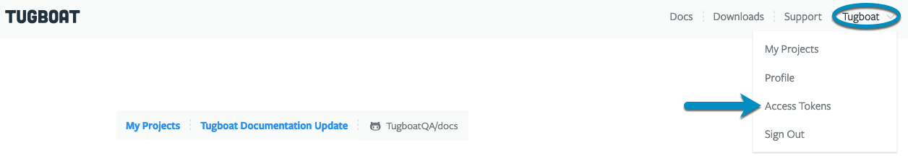
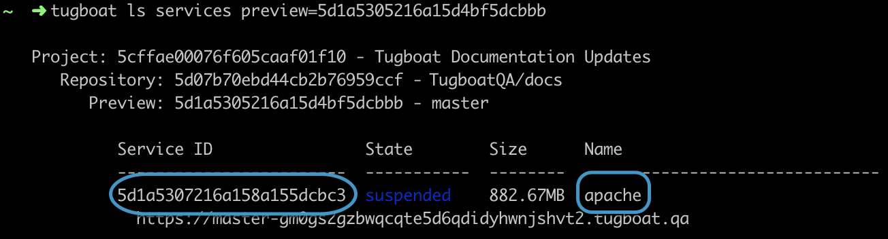

---
search:
  keywords: ["cli", "command-line"]
---

# Using the Tugboat Command Line Interface

The Tugboat [Command Line Tool](https://dashboard.tugboat.qa/downloads)
provides access to your Tugboat account from your local command line. It allows
you to perform all of the operations available through the web interface, as
well as other, more advanced features of Tugboat.

1. [Install the CLI](#install-tugboats-command-line-interface)
2. [Set an Access Token](#set-an-access-token)
3. [Review commands](#review-commands)

See also:
[running the CLI from inside a Tugboat Preview](#running-the-cli-from-a-tugboat-preview)

## Install Tugboat's Command Line Interface

The Tugboat Command Line Tool is available for Windows, MacOS, and Linux. In all
three cases, it is a stand-alone binary.

1. Download the CLI from
   [https://dashboard.tugboat.qa/downloads](https://dashboard.tugboat.qa/downloads).
2. Copy it to a location that the operating system can find in its execution
   path.

**Operating Systems**

- [Windows](#windows)
- [MacOS](#macos)
- [Linux](#linux)

### Windows

There is currently no installer included with the Windows version of the Tugboat
Command Line Tool. You'll either need to execute it from the directory where you
downloaded it, or copy it to a directory in the system PATH variable.

For the latter, create a new folder at `C:\Program Files\Tugboat`, and copy the
downloaded `tugboat.exe` to that folder. Then, add `C:\Program Files\Tugboat` to
your system PATH variable. A good article describing how to modify the PATH
variable for each version of Windows can be found at
[https://www.computerhope.com/issues/ch000549.htm](https://www.computerhope.com/issues/ch000549.htm)

### MacOS

Extract the downloaded `tugboat.tar.gz` file to `/usr/local/bin`

```sh
tar -zxf tugboat.tar.gz -C /usr/local/bin/
```

### Linux

Extract the downloaded `tugboat.tar.gz` file to `/usr/local/bin`

```sh
sudo tar -zxf tugboat.tar.gz -C /usr/local/bin/
```

## Set an Access Token

The first time you attempt to access a Tugboat resource in the Command Line
Interface, you'll be asked for an Access Token.

To set an Access Token:

1. In Tugboat's web interface, go to User Name -> Access Tokens, or
   [click this link](https://dashboard.tugboat.qa/access-tokens).
2. Click the **+ Generate New Token option**.
3. You'll be asked to give the Access Token a description; for example, "Command
   Line Tool"; enter a description and press the **Generate** button.
4. Make sure you save your Access Token somewhere safe, as you won't be able to
   see it again!
5. When you run the CLI, and attempt to access a resource, you'll be asked for
   an Access Token; paste it in and hit `Y` to remember it.

Now you're all set to use the Tugboat Command Line Interface!

#### Visual Walkthrough

In Tugboat's web interface, go to User Name -> Access Tokens, or
[click this link](https://dashboard.tugboat.qa/access-tokens).



Click the **+ Generate New Token** option.


You'll be asked to give the Access Token a description; for example, "Command
Line Tool"; enter a description and press the **Generate** button.


Make sure you save your Access Token somewhere safe, as you won't be able to see
it again!


When you run the CLI, and attempt to access a resource, you'll be asked for an
Access Token; paste it in and hit `Y` to have the CLI remember it.


## Review commands

Run `tugboat help` to see a list of commands you can execute. A few options
include:

**View info**

- [List Tugboat Repositories](#list-tugboat-repositories)
- [List Tugboat Previews](#list-tugboat-previews)
- [View the Services in a Preview](#view-the-services-of-a-preview)
- [View Preview logs](#view-preview-logs)
- [View Service logs](#view-services-logs)

**Administer Previews**

- [Build a new Preview](#build-a-new-preview)
- [Delete a Preview](#delete-a-preview)

**Shell into Services**

- [Start a shell on the default Service of a Preview](#start-a-shell-on-the-default-service-of-a-preview)
- [Start a shell on a Service](#start-a-shell-on-a-service)

### View info

### List Tugboat repositories

```sh
tugboat ls repos
```

### List Tugboat Previews

```sh
tugboat ls previews
```

### View the Services of a Preview

To view the services of a preview with an ID of `5b04c7d14c3dad00016a2e80`:

```sh
tugboat ls services preview=5b04c7d14c3dad00016a2e80
```

### View Preview logs

To view the logs for a Preview with an ID of `5b04c7d14c3dad00016a2e80`:

```sh
tugboat log 5b04c7d14c3dad00016a2e80
```

### View Services logs

To view the logs for a Service with an ID of `5d092b16bd44cb22a498be90` that's
running in a Preview:

```sh
tugboat log 5d092b16bd44cb22a498be90
```

### Administer Previews

### Build a new Preview

To build a new Preview from the master branch of a Tugboat Repository with an ID
of `5b02ed093558930001c04cfa`:

```sh
tugboat create preview master repo=5b02ed093558930001c04cfa
```

### Delete a Preview

To force the deletion of a Preview with an ID of `5b04c7d14c3dad00016a2e80`:

```sh
tugboat delete 5b02ed093558930001c04cfa -f
```

### Start a shell into Services on a Preview

- [Start a shell on the default Service](#start-a-shell-on-the-default-service-of-a-preview)
- [Start a shell on a Service that isn't the default](#start-a-shell-on-a-service)

#### Start a shell on the default Service of a Preview

To start a shell on the
[default Service](../setting-up-services/how-to-set-up-services/index.md#define-a-default-service)
of a Preview with an ID of `5b04c7d14c3dad00016a2e80`:

```sh
tugboat shell 5b04c7d14c3dad00016a2e80
```

#### Start a shell on a Service

To start a shell on Service that isn't the default:

1. Start by
   [viewing the Services of the Preview](#view-the-services-of-a-preview).
2. Find the Service where you want to start a shell.
3. Start the shell using the ID of the specific Service.

#### Visual Walkthrough

[View the Services of a Preview](#view-the-services-of-a-preview) via its ID; in
this case, `5d1a5305216a15d4bf5dcbbb`:

```sh
tugboat ls services preview=5d1a5305216a15d4bf5dcbbb
```

Find the Service ID for the Service where you want to start the shell; in this
case, I want the Service ID for the Service I've named `apache`:



Start the shell using the ID of the specific Service; in this example,
`5d1a5307216a158a155dcbc3`:

```sh
tugboat shell 5d1a5307216a158a155dcbc3
```

Now you've got shell access in that Service:


## Running the CLI from a Tugboat Preview

If you need to do something more complex in your Preview, like kicking off a
Tugboat build of a different repository, and grabbing the URL and other info you
need to link the two - you can install the Tugboat CLI _inside_ a Preview, and
execute the commands from inside the Preview.

_BEN DO WE HAVE AN EXAMPLE OF THIS?_
