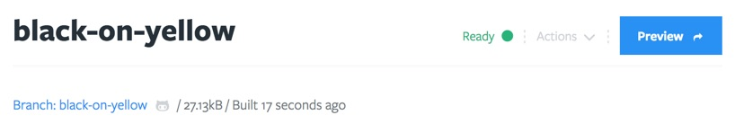
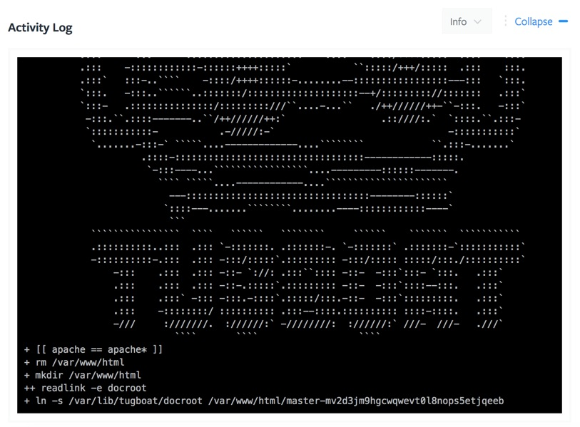

# Preview Dashboard

## Header

In the Header of the Preview dashboard you'll find the same information as the [Preview list](/tugboat-dashboard/preview/index.md#preview-overview) on the Repository dashboard: title, build info, current state, actions, and a Preview link, which opens the live Preview in a new browser tab.

## Services

This lists all the Services that are included in the Preview, along with their status. Both "View Log" and "Launch Terminal" opens new browser windows. As expected the first will show the log in real-time specific to the Service. Launching the terminal will launch a command line interface to make adjustments specifically to that Service.

An Apache log window:

## Logs

The activity log logs everything Tugboat does on the Preview. Any Tugboat updates, and output from build scripts will be visible here. You can filter the logs to only show errors, warnings, info, verbose, or debug messages.

## Screenshots

Every time a Preview builds, a screenshot will be generated. By default it generates it from the root path with a browser width of 1024. You can update these values and regenerate the screenshot.

The real value of screenshots happen when a Preview is built from a Base Preview. In this case it will generate a screenshot of the Preview, a screenshot of the Base Preview, and a visual diff between the two.

[//]: # "TODO: Screenshots of the screenshots"
