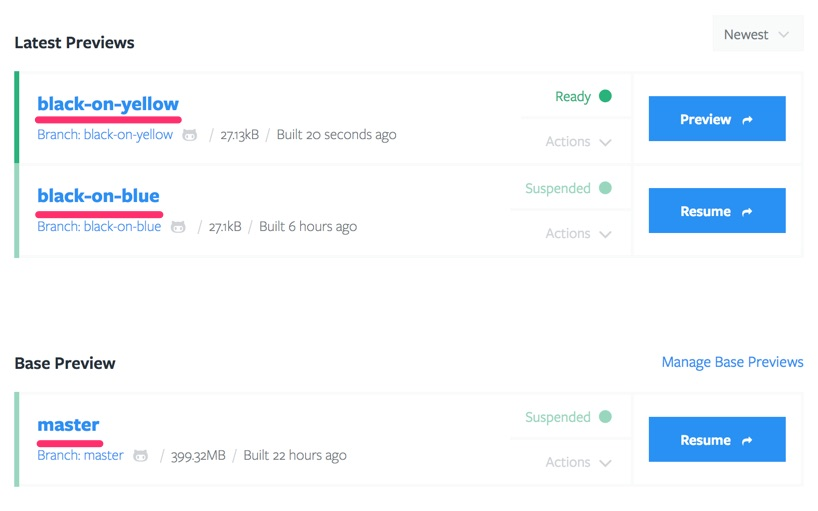

# Preview

This chapter will guide you through all things related to Previews.

## Preview Overview

All active Previews can be found in the Latest Previews (and Base Preview) section(s) on the [Repository Dashboard](/tugboat-dashboard/repository/dashboard/index.md). Clicking a Preview title will bring you to the [Preview dashboard](/tugboat-dashboard/preview/dashboard/index.md).

Alongside the title and build info, Previews show the [current state, actions](/tugboat-dashboard/preview/states-actions/index.md), and a Preview button which opens the live Preview in a new browser tab.

## Further Reading

* [Dashboard](/tugboat-dashboard/preview/dashboard/index.md)
* [States And Actions](/tugboat-dashboard/preview/states-actions/index.md)
