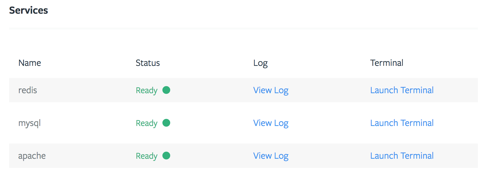
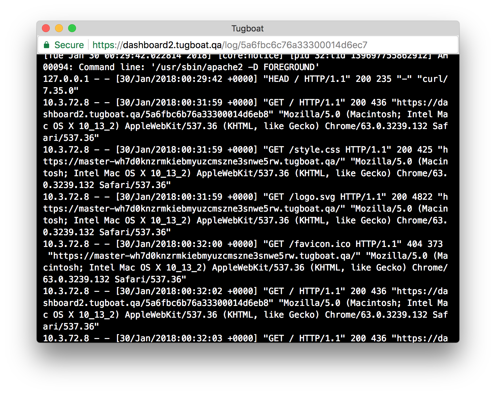
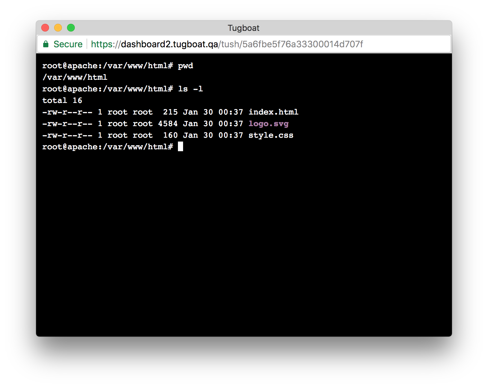
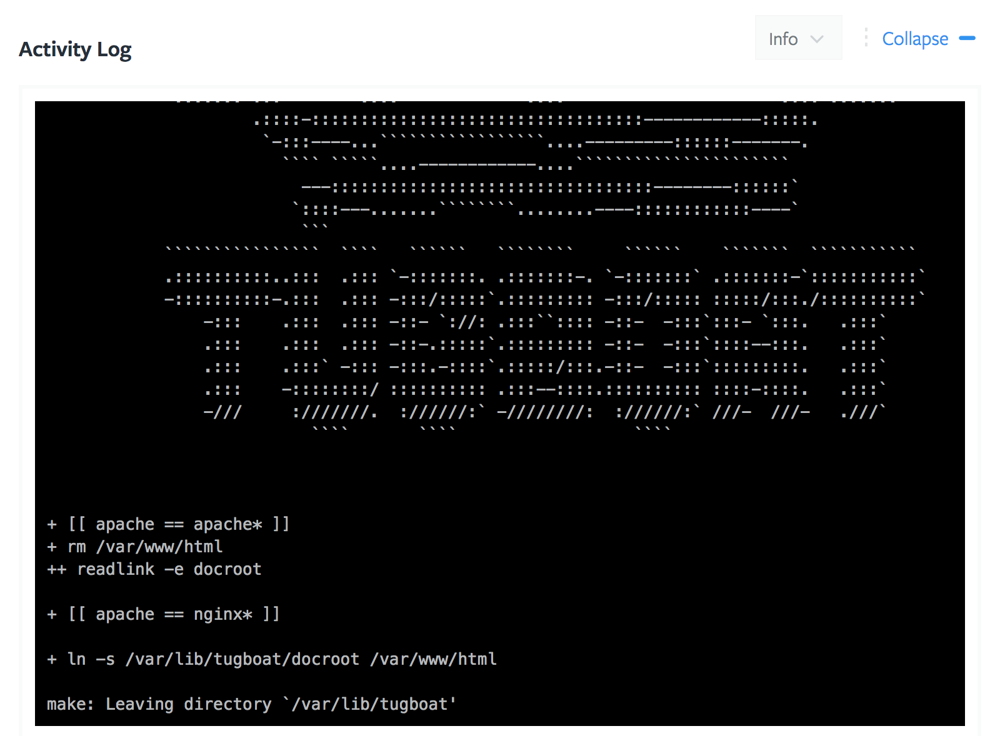
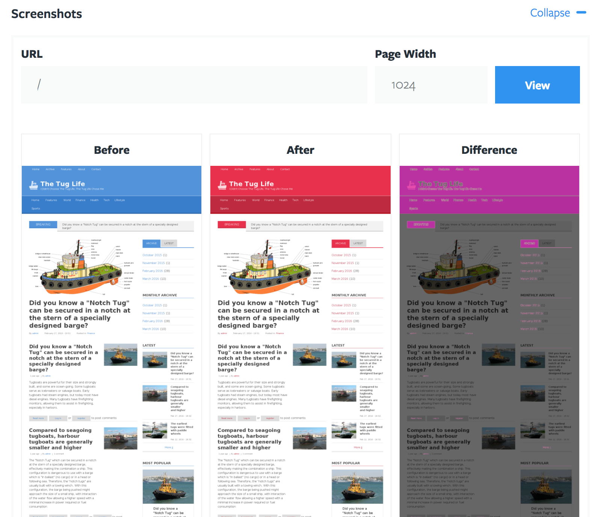

# Preview

A Tugboat Preview is the core of what Tugboat provides. It is a fully
functional, working website built from the contents of a git repository. It can
represent any one of a git branch, tag, or pull request. Every preview has its
own replica of the services configured for the Tugboat Repository that it
belongs to, and is completely isolated from any other Tugboat Preview.

Every preview also has its own unique URL which can be shared with anyone.

## Listing Your Previews

All Previews belong to some [Tugboat Repository](../repositories/index.md) and
can be listed on that Repository's dashboard. New previews can also be built
from the Repository's dashboard.

## Preview Dashboard

The Preview Dashboard is where you can access a Preview's detailed information.

### Services

This section shows the services connected to a preview, and allows a user to
interact with them by opening logs or launching a terminal

### Service Logs

The Service Logs show the logs provided from the given service. For example, an
apache service's access or error logs

### Terminal

The Terminal provides command line access to the given service. It is available
during most build phases, including "failed", and is incredibly useful for
debugging or making minor adjustments to an existing preview.

### Activity Log

The Activity Log keeps track of every operation that has been performed on the
preview. This includes internal Tugboat operations as well as output from your
[build script](../../build-script/index.md). This log can be filtered based on
different levels of verbosity.

### Screenshots

Every time a Tugboat Preview is created, Tugboat creates a screenshot of its
root URI. A screenshot of ay URI at any screen width can be requested using this
form.

In addition to seeing a simple screenshot, Tugboat can also generate visual
diffs of a page for previews that were created from a base preview. This tool is
incredibly useful for spotting small changes that would otherwise be difficult
to spot.

## Preview Actions

- **Cancel:** Cancels the currently running operation. This also deletes any
services currently associated with the preview, meaning the service logs and
access to terminals is not longer available.

- **Delete:** Delete a Tugboat preview. After a Preview is deleted the Pull
Request/Tag/Branch will then be listed again in the "Available to Build" section
below.

- **Lock:** Locking a Tugboat preview still allows full access to the live
preview, but prevents Tugboat from performing any further actions on it until it
is unlocked, including automatic updates from new commits. This is useful for
lengthier reviews or to prevent interruptions during a demo.

- **Rebuild:** Rebuild an existing Tugboat preview from scratch. Rebuild calls
`tugboat-init` in the [build script](../../build-script/index.md) if there is
no Base Preview, and `tugboat-build` if there is a Base Preview.

- **Refresh:** Refresh the codebase and external assets of a Tugboat preview.
Refreshing a preview pulls the latest code and allows a preview to update any
outside resources, such as a database. When a Preview is being refreshed, it
calls `tugboat-update` in the [build script](../../build-script/index.md).

- **Reset:** Resets a Tugboat preview to its last saved state. When a preview
has finished building, it creates a saved state of it. So if you make changes in
your preview, like changing data or files, a reset will restore the preview to
its last saved state without having to rebuild the entire preview.

- **Start:** Starts a stopped or suspended Tugboat preview. Starting a preview
starts all of its services back up, bringing it back online for normal use.

- **Stop:** Stops a running Tugboat preview. Stopping a preview stops all of its
services, taking it offline. This is useful for preventing access to a preview
that is not being actively reviewed.

- **Unlock:** Unlocks a locked Tugboat preview. Unlocking a preview allows
normal operations to resume, including automatic updates from new commits. This
may end up destroying any changes made to the preview, or could interrupt
someone actively reviewing or giving a demo on this preview.

## Preview States

Stable States:

- **Failed:** Something went wrong during the build. A good first step of action
would be to check the logs in the Preview Dashboard for more information.

- **Ready:** The preview was successfully built and is ready to be viewed. If a
preview is ready, but your site doesn't render as it should, it is possible that
your [build script](../../build-script/index.md) may still need some work.
When a preview state is "Ready", it means Tugboat built the environment and
services, and no errors were returned from any of the steps.

- **Stopped:** The preview cannot be viewed while stopped. Select "Start" from
the actions to start up the preview again.

- **Suspended:** Previews get placed in a suspended state after some time of
inactivity. The amount of time depends on the Project's subscription. Any HTTP
request to the preview will automatically start it up again. How long that takes
depends on how much time it takes for each of the services for the preview to
start.

- **Unavailable:** Something went wrong trying to load the preview. Try
triggering a reset from the actions.

- **Canceled:** The preview was canceled while building. Select "Rebuild" from
the actions to build the preview again from scratch.

Transition States:

- **Building:** Tugboat is building the Preview. This means setting up Services,
processing the [build script](../../build-script/index.md), etc.

- **Committing:** This is a state that relates to Services. When a Service is
committing, a snapshot is being created. If you make changes to any of your
Services (like modifying files or database values) and choose to "reset" your
preview later, your preview will be restored to this snapshot.

- **Deleting:** The Preview is being deleted. The Pull Request/Tag/Branch will
then be listed again in the "Available to Build" section below.

- **Refreshing:** The Preview is being refreshed. This is usually used with a
base preview. It pulls the latest code from git, and is often used to pull in
fresh data from an external database like the production server.

- **Resetting:** Resetting means that the preview is being restored the its last
saved state. Each time a preview builds it saves its state. Any changes you made
to the preview since it was built will be reset.

- **Starting:** A Preview is "starting" when it is manually started after being
stopped, or when it is coming out of a "Suspended" state.

- **Stopping:** A Preview is "Stopping" when it is manually triggered to stop.

- **Suspending:** A Preview is being Suspended. See "Suspended" above.

- **Waiting:** This is a state Services are in when they are waiting to be set
up, while a Preview is in the process of being built.

