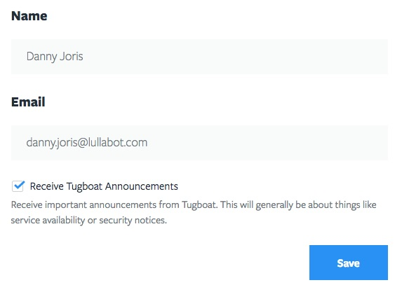

# User Profile

Your user profile can be accessed from the dropdown in the top right hand corner.

## Connected Accounts

When you initially signed in with your provider credentials, it created a Tugboat user profile and gave Tugboat access to the repositories available to this account. You can connect additional accounts to make its repositories available to your projects. This can be either from Gibhub, Bitbucket, Gitlab, or multiple accounts from the same provider.

Disconnecting a provider account from your Tugboat account means that you will no longer be able to add repositories to Tugboat from this provider account. This does not affect any existing Tugboat repositories linked to this account. They will remain available until they are deleted from Tugboat.

## Name, Email & Announcements

When your Tugboat account is initially created it uses the name and email address available from the provider account. You can change this later at any time. When you change your email address you will receive an email with a verification link.

You can also opt-in or out of important Tugboat email announcements. These will usually be related to service availablity or security notices.

