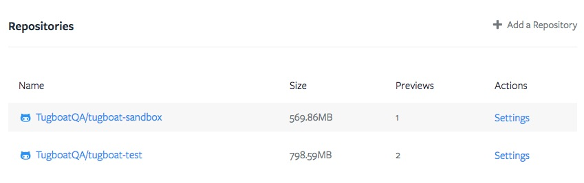
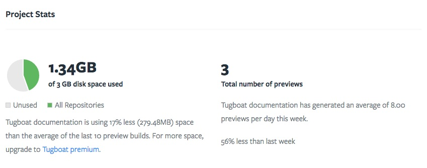

# Project Dashboard

## Repositories

The Repositories overview lists all Repositories added to your project. It links to all Repository Dashboard and Repository Settings Pages. The size data shows how much disk space all previews combined take up for that particular Repository.

This is also where you can add additional Repositories to your Project.

## Project Stats

The Project Stats is the place to keep track of your current usage across all Repositories compared to your subscription quota. Keep an eye on your quota so you can decide whether to clean up some older Previews or upgrade your subscription when your usage increases.

